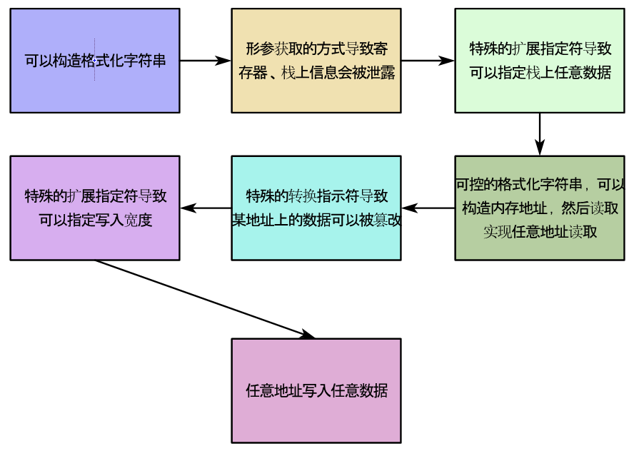

# 格式化字符串的介绍

C语言中函数接受形参的数量并不是必须固定的，也支持变化的形参数量，但可变参数要求函数至少指定一个参数。

C语言最为常见的使用可变参数的函数就是`printf`打印函数，它会接收格式化字符串作为固定参数，然后将格式化字符串与可变参数进行组合，最后将结果输出到标准输出`stdout`中。

```
int printf(const char* format, ...)
```

`stdin`、`stdout`、`stderr`属于标准输入输出，其中`stdin`的作用是响应键盘的输入，`stdout`、`stderr`将内容输出到屏幕，即它们对于Linux而言是外部设备，在秉承一切皆文件原则的Linux中，它们作为设备文件存在于`dev`目录下。

`stdout`和`stderr`的区别在于缓冲区，`stdout`只有当缓冲区满了及遇到换行符的情况下才会输出信息，而`stderr`则是直接输出。

```
ls /dev/ | grep std
stderr
stdin
stdout
```

对于已经打开的文件，Linux会给它们分配文件描述符，进程可以通过文件描述符对文件进行操作。`stdin`、`stdout`、`stderr`对于的文件描述符分别是0、1、2。

```
ls /proc/self/fd/
0  1  19  2  20  23  27  3
```

比如某个程序当中含有大量的`printf`函数，而你有时候不需要打印，更不需要将打印输出到屏幕上，那么就可以在函数的开头通过`stdout`的文件描述符1将`stdout`关闭（`close(1)`），那么就不会再看到输出了。

格式化字符串由普通字符和转换字符序列组成，普通字符会按原状进行输出，转换字符序列则会根据转换规则进行转换，然后将转换结果进行输出。在转换字符序列中转换指示符`%`是必备的，它标志着转换字符序列的开始，除此之外C语言还支持在转换指示符后添加扩展指示符，用于进一步指示参数的输出形式。

# 漏洞的利用

当格式化字符串中存在转换字符序列时，函数就需要根据调用协议从寄存器和栈上取出参数。根据转换字符序列转换，结果的来源可以分成根据参数位置上的数值进行转换和根据参数位置上数值指向的内存区域内的数值进行转换两类。

```
获取参数的方式：
前6个参数：rdi、rsi、rdx、rcx、r8、r9
第7个及以后的参数：栈
```

根据参数位置上的数值进行转换时，往往问题不会太大，最多是就是转换后
的结果看起来畸形，但是根据参数位置上数值指向的内存区域内的数值进行转换时，问题就很可能出现，比如因为参数位置上数值未必对应正确的内存地址，直接使用会导致错误发生。

## 信息的泄露

当格式化字符串可以被自定定义时，就可以构造转换字符序列，从寄存器和栈中读取数据。比如构造格式化字符串为`"%llx.%llx.`......`%llx.%llx"`时，就可以直接暴露信息，下面给出了示例。

```
构造的参数："%llx.%llx.......%llx.%llx
读取及输出：scanf("%s", buf);、printf(buf);

通过GDB查看printf函数调用时的寄存器信息：
(gdb) info registers rdi rsi rdx rcx r8 r9
rdi            0x7fffe50928e0      140737035970784
rsi            0xa                 10
rdx            0x0                 0
rcx            0x0                 0
r8             0xffffffff          4294967295
r9             0xffffffffffffff88  -120

前5个泄露信息（rdi被buf所在地址占用，所以从rsi开始）：
a.0.0.ffffffff.ffffffffffffff88

通过GDB查看printf函数调用时的栈信息
(gdb) x /20x $rsp
0x7fffc19d3ac0: 0xc19d3ce0      0x00007fff      0x7be111d4      0x000063c7
0x7fffc19d3ad0: 0x786c6c25      0x6c6c252e      0x6c252e78      0x252e786c
0x7fffc19d3ae0: 0x2e786c6c      0x786c6c25      0x6c6c252e      0x6c252e78
0x7fffc19d3af0: 0x252e786c      0x2e786c6c      0x786c6c25      0x6c6c252e
0x7fffc19d3b00: 0x6c252e78      0x252e786c      0x2e786c6c      0x786c6c25
(gdb) x /s $rsp+0x10
0x7fffc19d3ad0: "%llx.%llx.%llx.%llx.%llx.%llx.%llx.%llx.%llx.%llx.%llx.%llx.%llx.%llx.%llx.%llx.%llx.%llx.%llx.%llx.%llx.%llx.%llx.%llx.%llx.%llx.%llx.%llx.%llx.%llx.%llx.%llx.%llx.%llx.%llx.%llx.%llx.%llx.%llx.%llx."...

第6-13个泄露信息（对应rsp+0x10开始的位置）：
6c6c252e786c6c25.252e786c6c252e78.786c6c252e786c6c.6c252e786c6c252e.2e786c6c252e786c.6c6c252e786c6c25.252e786c6c252e78.786c6c252e786c6c.
```

如果构造`%llx`的数量足够打印完寄存器和构造的格式化字符串，那么`printf`函数还会继续打印金丝雀、返回地址等等，这些数据的泄露，是我们所期望的。

当构造大量的`%llx`时，还需要考虑变量的缓冲区是否可以容纳它们，如果缓冲区变量的空间有些小，不足够泄露金丝雀和所需内存地址时，岂不是无法对漏洞进行利用？

在扩展指示符中有一个特殊的存在，即`?$`，`?`代表一个数字，当该扩展指示符添加时，就会打印第`?`个参数，那么这个时候就不需要构造大量`%llx`对栈上信息进行泄露了。

目前的信息泄露已经可以指定任意位置了，那么位置上的数据从哪里来呢？

上面已经说明过，前六个是不太好控制的寄存器数据，中间一部分是格式化字符串的数据，后面又是不太好控制的栈数据。幸运的是，在泄露的区域内，存在一段可以很方便控制的区域，如果在这段区域内填充一个地址，然后利用扩展指示符`?$`读取指定位置的地址，就可以实现任意地址的读取。

## 信息的篡改

转换指示符中有一个特殊的存在，它不会指示数据的输出格式，而是会将当前成功写入的字符数量存储到某变量内，它提供了篡改数据的机会，该转换指示符就是`%n`。

```
printf("%.10u%n\n", 1, &i);
printf("i = %x\n", i);

输出结果：
0000000001 
i = a
```

我们知道，一个内存地址的数字往往是非常大的，为了让数据被篡改为内存地址，就需要输出足够多的字符，好在转换指示符前允许添加数字x，指示输出x个字符，那么这样就不需要构造很多字符了。当然如果不希望单次写入大小过多，也可以对数据进行拆分，然后通过宽度的扩展指示符逐部分进行写入。

```
hhn：单字节、hn：双字节、n：4字节、ln：8字节、lln：16字节
```

## 格式化字符串漏洞的总结

由于格式化字符串中转换指示符和扩展指示符的特性，使得可以对任意地址进行读取和写入。


