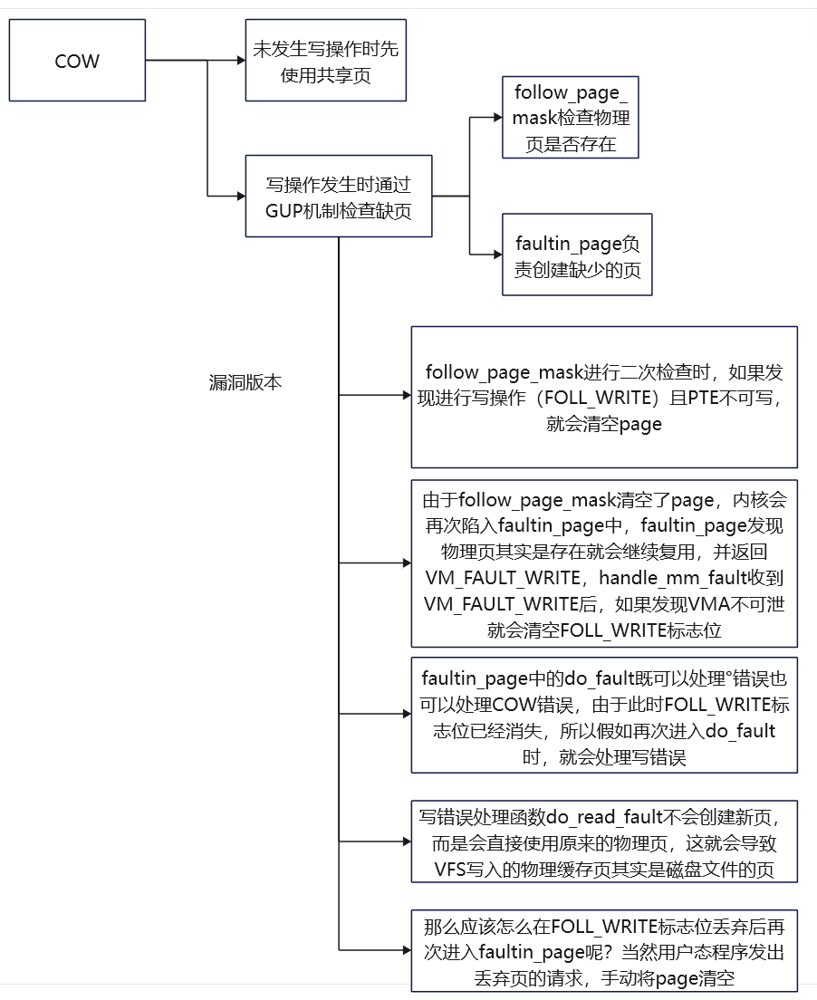

# 脏牛漏洞

从动态链接库加载机制时，我们就知道了一个事情，Linux会将需要初始化操作推迟到真正使用时才会初始化，而不是在准备阶段就直接进行所有的初始化操作。

这一点也体现在进程的使用过程当中。

首先，上面提到过进程创建时会先复制父进程的内容然后再进行修改，然后就是假如我们通过`strace`追踪进程时会发现，进程在创建过程中使用大量的`mmap`。

要知道数据间可能是重复，如果只是读取的话，还可以继续使用父数据的所在内存，在没有修改数据的情况下，就给重复数据分配新的内存会消耗不少时间，显然只有写操作发生时，才有必要给子数据分配新的内存。所以Linux将数据的复制操作推迟到实际修改时，这一机制也被称作是写时复制`COW Copy On Write`。

那么这个延迟的COW机制会不会导致竞态条件漏洞出现呢？

## COW的实现

COW在Linux内核中使用颇为广泛，比如进程的创建、内存映射文件、虚拟化等等场景中都会用到，这里着重以`fork`创建进程的场景进行分析。

`copy_process`函数用于处理克隆进程的操作，该函数内部会复制许多东西，内存数据是其中之一，`copy_mem`函数标志着复制内存数据的开始，`copy_mem`函数会先通过`CLONE_VM`标志位判断子进程是否和父进程共用内存空间，如果共用内存空间就不会对内存进行复制。

```
SYSCALL_DEFINE2 clone3
	-> kernel_clone
		-> copy_process
			-> copy_mm
```

需要复制内存时会通过`dup_mm`函数进行复制，首先会通过`allocate_mm`函数分配`struct mm_struct`结构体需要的内存空间，`struct mm_struct`结构体会用于内存管理。

对于版本较高的Linux内核而言，它已经不再使用红黑树作为内存结构管理的数据结构了，当前使用的数据结构叫做Maple树`ma`，`dup_mmap`函数会依赖该数据结构遍历父进程全部的VMA。

如果希望某部分内存不被复制，可以使用`VM_DONTCOPY`标志位标明，`dup_mmap`函数会自动略过带有该标志的内存区域。

```
dup_mm
	-> allocate_mm
	-> dup_mmap

dup_mmap {
	......
	MA_STATE(old_mas, &oldmm->mm_mt, 0, 0);
	MA_STATE(mas, &mm->mm_mt, 0, 0);
	......
	mas_for_each(&old_mas, mpnt, ULONG_MAX) {
		......
	}
	......
}
```

找到可用的VMA时先通过`vm_area_dup`函数根据旧VMA分配出新VMA，之后`vma_dup_policy`函数会将旧VMA使用的策略延续到新的VMA中。

```
mas_for_each
	-> vm_area_dup
	-> vma_dup_policy
	-> dup_userfaultfd
	-> anon_vma_fork
	-> copy_page_range
```

`dup_userfaultfd`函数会设置新VMA的`userfaultfd`，`userfaultfd`作用是帮助用户态程序处理页错误，用户态程序可以通过系统调用注册自己的处理方法。

```
cat /usr/include/asm/unistd_64.h | grep fault
#define __NR_userfaultfd 323
```

`anon_vma_fork`会根据旧VMA的匿名内存设置新VMA的匿名内存，匿名内存机制的作用是将用户空间的虚拟内存映射到物理内存上，与常见的通过文件映射的区别在于，匿名内存映射不会与任何文件产生关系。

```
mmap映射匿名内存的选项：
MAP_PRIVATE | MAP_ANONYMOUS
```

处理好VMA的属性信息后，`copy_page_range`函数会正式开始复制内存数据。`is_cow_mapping`函数会判断当前VMA非共享内存且可写，如果符合就会当前VMA支持COW机制，然后就会通过`pgd_offset`函数获取新旧VMA的PGD，从这里开始内核会逐级遍历页表，直到最低的1级页表PTE。

```
copy_page_range
	-> is_cow_mapping
		-> copy_p4d_range
			-> copy_pud_range
				-> copy_pmd_range
					-> copy_pte_range
```

处理PMD二级页表的`copy_pmd_range`函数中会先判断页表是否为SWAP页表、大页页表以及设备页表，如果是就对这些页表进行特殊处理。

反之如果是正常页表就会继续对一级页表进行处理。

```
copy_pmd_range
	-> is_swap_pmd || pmd_trans_huge || pmd_devmap
		-> copy_huge_pmd
	-> copy_pte_range
```

进入一级页表PTE后，`copy_pte_range`函数会针对当前PTE是否位于物理内存中，如果不在内存里面就会执行`copy_nonpresent_pte`函数，重新设置当前PTE。

反之则会进入`copy_present_pte`函数内部。

```
copy_pte_range
	-> 遍历pte
		-> copy_nonpresent_pte
		-> copy_present_pte
```

`copy_present_pte`函数首先会通过`vm_normal_page`接口获取物理页，如果物理页存在，那么就会进一步通过`PageAnon`判断是否为匿名页，如果是就会再检查该页是否已被固定，如果是就会立即通过`copy_present_page`函数进行实际的复制操作（大概率是不会执行的）。

接下来会判断VMA是否为私有可写的状态，且PTE是只读的。如果符合条件，就会设置父子进程的PTE为制度状态。

最后通过`set_pte_at`函数更新子进程的PTE。

```
copy_present_pte
	-> vm_normal_page
	-> page && PageAnon
		-> page_try_dup_anon_rmap
			-> copy_present_page、
	-> page
		-> get_page
		-> page_dup_file_rmap
	-> is_cow_mapping && pte_write
		-> ptep_set_wrprotect
		-> pte_wrprotect
	-> set_pte_at
```

从这里我们可以看到，复制进程内存的过程中大概率是不会产生内存数据的复制行为的，那么内存数据是怎么控制复制并写入的呢？

### 缺页异常

在上面提到过`xxx_wrprotect`函数会设置父子进程的PTE为只读状态，我们可能会疑惑，这样内存数据子进程是可能会修改的啊，设置成只读了还怎么改呢！

再仔细想一下，就应该这样啊！COW需要通知，收到通知后才会开始复制数据，向可写但只读的内存数据区域写入数据时，触发的缺页错误就是一种通知啊，而且这种通知还非常合理。

Linux内核处理缺页问题时，会先找到对应的PTE，然后再进行处理。

```
exc_page_fault
	-> handle_page_fault
		-> do_user_addr_fault
			-> lock_mm_and_find_vma
			-> handle_mm_fault
				-> __handle_mm_fault
					-> handle_pte_fault
```

一级页表PTE会在`handle_pte_fault`内查找。

找到PTE后，会先判断PTE是否为空，如果是空的，就会针对是否为匿名页两种情况进行处理。

当PTE存在时，会先通过`pte_present`检查PTE是否位于内存当中，如果不在，就说明PTE位于伪内存`swap`交换分区当中，那么就会处理`swap`中的信息。在这个时候如果发现`folio`非合并页`KSM Kernel Samepage Merging`且被独占，标志位中含有`FAULT_FLAG_WRITE`存在，那么就会将`FAULT_FLAG_WRITE`清空。

接着，会检查NUM，如果内存数据位于CPU的本地缓存中，且VMA是可以访问的，那么就会将PTE交给`do_numa_page`函数处理。

最后就是检查VMF的标志位看缺页异常是不是首次出现，如果是，就继续检查PTE是否可写，如果不可写就会进入COW的处理函数`do_wp_page`，反之则会重置`_PAGE_DIRTY`位。

```
handle_pte_fault
	-> !pmd_none
		-> pte_offset_map
	-> !vmf->pte
		-> vma_is_anonymous
			-> do_anonymous_page
		-> !vma_is_anonymous
			-> do_fault
				-> !(vma->vm_flags & VM_SHARED)
					-> do_cow_fault
						-> finish_fault
							-> do_set_pte
								-> write
									-> maybe_mkwrite
	-> !pte_present
		-> do_swap_page
			-> folio_test_ksm && (exclusive || folio_ref_count == 1)
				-> vmf->flags & FAULT_FLAG_WRITE
					-> ~FAULT_FLAG_WRITE
	-> pte_protnone && vma_is_accessible
		-> do_numa_page
	-> vmf->flags & (FAULT_FLAG_WRITE|FAULT_FLAG_UNSHARE)
		-> !pte_write
			-> do_wp_page
		-> vmf->flags & FAULT_FLAG_WRITE
			-> pte_mkdirty
```

从上面可以看到，有两个地方会进行COW处理，一是发现PTE不存在且非匿名页时会进入`do_fault`，`do_fault`函数发现VMA非共享状态时会处理COW，二是发现缺页异常非首次发生且触发原因是写操作时，就会进入`do_wp_page`函数。

`do_cow_fault`函数会分配新页并复制数据，而`do_wp_page`函数则会对共享页进行复制。

COW缺页的问题设置好后。内核会更新页表然后返回，进程继续执行时会发现内存页已经没有问题了，可以正常写入数据。

在`do_cow_fault`函数的最终阶段，`finish_fault`函数会设置PMD和PTE，并把信息更新到MMU，在`do_set_pte`函数设置PTE的过程中，我们可以看到各种`mkxx`和`addxxx`设置PTE信息，唯独写状态例外叫做`maybe_mkwrite`，写就写呗，什么叫做可能写？

查看`maybe_mkwrite`函数可以发现，PTE的写标志位原来需要根据VMA的状态进行设置，这样就明白了，它是要保证虚拟内存和物理内存在可写状态上保持一致。

```
static inline pte_t maybe_mkwrite(pte_t pte, struct vm_area_struct *vma)
{
	if (likely(vma->vm_flags & VM_WRITE))
		pte = pte_mkwrite(pte);
	return pte;
}

static inline pte_t pte_mkwrite(pte_t pte)
	{ pte_val(pte) |= _PAGE_WRITABLE; return pte; }
```

### 总结

COW机制通过标记共享内存区域为只读的方式作为通知信号，写操作触发缺页异常时，缺页处理函数发现可写私有页被尝试写入内容时就会判定为COW，COW机制此时会正式开始运转，先复制内存数据再进行修改。

## 用户态程序申请内存的方式

用户态申请内存的方式可以分成`LazyAlloc`、`PreAlloc`、`Ondemand`三类。

- `LazyAlloc`只会分配虚拟内存，当进程真正访问虚拟内存时才会分配物理内存，优点是内存资源可以得到合理的利用，缺点是首次访问内存时速度较慢。

- `PreAlloc`会在申请虚拟内存时就建立好物理内存的映射，采用这种方式申请内存，如果申请的内存不能被充分的利用起来，就会造成浪费。

- `Ondemand`是`LazyAlloc`和`PreAlloc`的折中方案，它的作用是在程序申请完内存后，控制内存的映射，严格来说它是一种申请内存管理方式变更的接口。

```
LazyAlloc的申请方式
	mmap不使用MAP_POPULATE标志
PreAlloc申请内存方式：
	mmap使用MAP_POPULATE标志
Ondemand设置内存的方式：
	ioctl、mlock、madivse
```

### madivse弃用内存

用户态程序获得可用的虚拟内存后，可以通过`madivse`系统调用向内核提供内存区域的处理建议。在C语言中，可以通过GLibC提供的`madivse`接口进行快速处理，第三个参数`advice`是处理建议的类型。

```
系统调用：
#define __NR_madvise 28
#define __NR_process_madvise 440

GLibC封装：
#include <sys/mman.h>
int madvise(void *addr, size_t length, int advice);
```

众多建议中有一个名为`MADV_DONTNEED`的选项，值得我们为了脏牛漏洞进行特别的关注。该选项的作用是告诉内核弃用指定区域的内存，内核收到该建议后，会对内存区域进行回收。

那么丢弃内存会起到什么作用呢？为什么脏牛漏洞因为它而产生呢？

## 内核你能访问吗！（GUP机制初探）

在Linux中缺页可能并没有想的那么严重，因为它可以被看作是内核分配物理内存的一种方式。看上去很完美了，但是啊，假设用户态程序申请了一段虚拟内存（尚未映射到物理内存），当用户态程序触发写操作时，首先面临不存在的物理内存页的角色是内核啊，内核既要处理不存在的物理页还要想其中写入数据。

假如你对内核开发有一些了解，就应该会知道作为内核即使拥有着高特权，也是不能直接操作用户空间中数据的，内核需要借助`copy_to_user`接口和`copy_from_user`接口与用户空间进行数据上的交互。

用户空间和内核空间之间访问越界的问题，是硬件实现监控的，在x86架构下该机制叫做`SMAP Supervisor Mode Access Preventio`，arm架构下该机制叫做`PAN Privilege Access Never`，Linux内核提供了接口用于开启或关闭这种机制。

```
x86：
	关闭SMAP：clac
	开启SMAP：stac

arm：
	关闭PAN：uaccess_save_and_enable(void)
	开启PAN：uaccess_restore(unsigned int flags)
```

内核需要安全的访问未映射物理内存的用户态虚拟内存，出于这种需求，内核创建了`GUP Get User Page`机制，它的作用是总是假设用户态内存是没有映射到物理内存上的。

在GUP机制的作用下，内核访问用户态虚拟的内存步骤就变成了先判断在处理，内核会通过`follow_page_mask`判断当前页是否已经完成映射，如果是就逐级查找页表进行处理，反之则触发缺页错误进程处理。

`faultin_page`函数准备进程缺页处理时，有一个很重要的错误，就是添加各种类型的缺页异常标志，比如如果发现发起者希望进行写操作，就会添加`FAULT_FLAG_WRITE`标志位，如果发现内存不是共享的，就添加`FAULT_FLAG_UNSHARE`标志位。

完成缺页处理后，如果已经正常处理，内核会再次回到`follow_page_mask`函数处执行。此时发现物理页后，就会开始逐级查找页表了。

```
get_user_pages
	-> __gup_longterm_locked
		-> __get_user_pages_locked
			-> __get_user_pages
				-> follow_page_mask
				-> page
					-> follow_p4d_mask 
						-> ......
							-> follow_page_pte
				-> !page
					-> faultin_page
						-> *flags & FOLL_WRITE
							-> fault_flags |= FAULT_FLAG_WRITE
						-> unshare
							-> fault_flags |= FAULT_FLAG_UNSHARE
						-> handle_mm_fault
				-> try [follow_page_mask] again?
```

内核显示通过GUP机制发现缺页会新分配物理页，然后通过`follow_page_mask`函数找到对应的PTE，在`follow_page_pte`函数处理的过程中，存在一种期望判断，它先判断发起者是不是进行写操作，再继续判断VMA是否可写，如果两者不一致就会将当前页清空。

```
-> follow_page_pte
	-> flags & FOLL_WRITE && !can_follow_write_pte
		-> page = NULL

can_follow_write_pte
	-> pte_write
		-> return true
	-> vma->vm_flags & VM_WRITE
	-> vma->vm_flags & VM_MAYWRITE
		-> return false
```

## 可利用缺口的产生

首先我们这里假设某进程通过`mmap`接口将只读文件`AAA`映射到虚拟内存上。

```
mmap
	-> PROT_READ, MAP_PRIVATE
```

`mmap`映射的参数如上所示，文件`AAA`以私有只读方式方式被映射到虚拟内存上。`MAP_PRIVATE`标志在这里起到了重要的作用的，首先它会让COW机制起作用，其次COW分出来的页都是匿名页，向内存中写入的内容不会同步到磁盘文件中去。

### 第一次检查缺页

由于物理内存页尚未分配，GUP机制会通过`follow_page_mask`触发缺页异常，随后进入`faultin_page`函数分配完物理页后，会再一次进行`follow_page_mask`函数的检查。

第一次缺页异常时，会通过`maybe_mkwrite`函数设置PTE的可写标志位，假如我们将文件`AAA`以只读的方式进行映射，那么PTE也会根据VMA设置成只读的。

### 第二次检查缺页 - 咦？没有漏洞啊

我们通过`kretprobe`截取`follow_page_pte`函数的返回地址和返回值，通过截取的返回值可以看到，`follow_page_mask`函数在第一次检查时并没有发现物理页，于是返回了0x0，但是当`faultin_page`分配物理页后，第二次通过`follow_page_mask`函数检查物理页时，就会找到物理页并返回一个正常的地址。

从目前的现状可以看出来一切正常，貌似并没有漏洞产生。

```
kretprobe截取到的返回值（共两次）：
第一次：follow_page_pte returned 0x0 and took 8767 ns to execute
第二次：follow_page_pte returned 0xffffe3ee00f03fc0 and took 2294 ns to execute
```

通过截取的返回地址与vmlinux中的行号信息进行匹配可以发现，`follow_page_pte`函数返回到检查是否需要`faultin_page`函数执行的判断逻辑，这里匹配行号靠的是地址信息。

一是地址都是以页作为基础单位，Linux中页大小一般是0x1000，所以内核的起始地址都是以0x1000作为结尾的，通过末尾的字节可以在`.debug_line`节中索引到源代码的行号。

二是可以直接计算出地址，Linux内核生成的过程中地址会直接规划出来，此时内核的真实地址标志是`0xffffffffa`，而`.debug_line`节中地址标志时`0xffffffff8`，经过一定的偏移，这是内核的ASLR机制导致的，通过`kallsyms`获取内核起始地址`_text`就可以得出地址的偏移值，然后再进行检索。

```
kretprobe截取到的返回地址：
return to address 0xffffffffa46bffe5

内核起始地址：
ffffffffa4400000 T _text

0xffffffffa46bffe5 - ffffffffa4400000 = 0x2bffe5

vmlinux读取.debug_line节（readelf -wL）：
mm/gup.c:
gup.c 1232  0xffffffff812bffe5

gup.c -> 1232 -> __get_user_pages
__get_user_pages
	-> !page || PTR_ERR(page) == -EMLINK
		-> faultin_page
```

X86架构下Linux内核的起始地址是`_text`，ARM架构下的地址符号叫做`_stext`，在内核二进制文件的链接过程中`vmlinux.lds.S`文件会对内核起始地址进行设置，设置的依据是`__START_KERNEL`，这个地址是提前设定好的。

```
. = __START_KERNEL;
.text :  AT(ADDR(.text) - LOAD_OFFSET) {
		_text = .;
		_stext = .;
} :text =0xcccc

CONFIG_PHYSICAL_START=0x100000
CONFIG_PHYSICAL_ALIGN=0x200000
#define __START_KERNEL_map	_AC(0xffffffff80000000, UL)
#define __PHYSICAL_START	ALIGN(CONFIG_PHYSICAL_START, CONFIG_PHYSICAL_ALIGN)
#define __START_KERNEL		(__START_KERNEL_map + __PHYSICAL_START)
```

### 为何正常？

要知道我们分配的VMA是只读的但希望进行的是写操作，按道理说第二次进入`follow_page_pte`函数时应该判断出异常并将`page`设置成空，但实际上并没有这么做，`can_follow_write_pte`函数一定存在大秘密。

```
follow_page_pte
	-> flags & FOLL_WRITE && !can_follow_write_pte
		-> page = NULL
```

`can_follow_write_pte`函数内部会先对PTE是否可写进行判断，如果可写就返回真，此时`follow_page_pte`就不会将`page`置空，如果PTE不可写就会继续往下走，这个时候会遇到`userfaultfd_pte_wp`函数，当函数发现`UFFD`标志位在VMA或PTE中不存在时就会返回假，进而导致`can_follow_write_pte`函数返回真。

```
can_follow_write_pte
	-> pte_write
		-> true
	......
	-> return !userfaultfd_pte_wp

userfaultfd_pte_wp
	-> return userfaultfd_wp(vma) && pte_uffd_wp(pte)
userfaultfd_wp
	-> vma->vm_flags & VM_UFFD_WP
pte_uffd_wp
	-> pte_flags(pte) & _PAGE_UFFD_WP
```

如果`UFFD`标志位存在，那么`can_follow_write_pte`函数就会返回假，让`follow_page_pte`函数将页置空，等待重回`handle_pte_fault`函数将处理权交给`handle_userfault`函数。

```
handle_pte_fault
	-> !vmf->pte
		-> vma_is_anonymous
			-> do_anonymous_page
				-> userfaultfd_missing
					-> handle_userfault
	-> vmf->pte
		-> vmf->flags & (FAULT_FLAG_WRITE|FAULT_FLAG_UNSHARE)
			-> !pte_write
				-> !unshare
					-> userfaultfd_pte_wp
						-> handle_userfault
```

### 被修改的只读内存

对于内核来讲，只要`__get_free_page`函数可以拿到地址，就会向指定的内存区域复制数据，至于只不只读的，一是匿名页，影响也只是对进程产生的，二是只读也只是内核的标记，内核说可以写就是可以写。

当`__get_user_pages`函数返回给`__access_remote_vm`函数非零值后，如果发现`wrtie`为1就会进入`copy_to_user_page`函数复制数据。

```
__access_remote_vm
	-> ret = get_user_pages_remote
		-> __get_user_pages_remote
			-> __get_user_pages_locked
				-> __get_user_pages
	-> ret > 0
		-> write
			-> copy_to_user_page
		-> !write
			-> copy_from_user_page
```

### 触发漏洞环境

从当前的内核的版本号中不难看出，脏牛漏洞实际上是已经被修复的。

```
uname -a
Linux debian 6.1.0-27-amd64 #1 SMP PREEMPT_DYNAMIC Debian 6.1.115-1 (2024-11-01) x86_64 GNU/Linux
```

为了复现脏牛漏洞，我们需要找到一个老环境，Ubuntu提供旧版本镜像的下载，我们可以选择14.04的版本进行复现。

```
https://old-releases.ubuntu.com/releases/

https://old-releases.ubuntu.com/releases/14.04.5/ubuntu-14.04.5-server-amd64.iso
```

含有脏牛漏洞的内核版本有很多，这里选择了14.04对应的4.4内核。

```
uname -a
Linux ubuntu14 4.4.0-31-generic #50~14.04.1-Ubuntu SMP Wed Jul 13 01:07:32 UTC 2016 x86_64 x86_64 x86_64 GNU/Linux
```

### 第三次缺页检查 - 内核4.x

Linux内核4.4中`follow_page_pte`函数针对写操作的判断有所不同，它会直接使用`pte_write`函数进行判断而非`can_follow_write_pte`函数，由于PTE目前是不可写的，会导致`page`被清空，导致第三次缺页检查发生。

而且Linux内核4.4中`faultin_page`函数对`handle_mm_fault`函数返回值的检查逻辑与6.x内核有些许不同，当`handle_mm_fault`函数成功处理`reuse`情况下（PTE存在需要复用）的COW后会返回`VM_FAULT_WRITE`，4.x内核中的`faultin_page`函数发现返回值是`VM_FAULT_WRITE`且VMA不可写时，就会清理`flags`标志位中的`FOLL_WRITE`。

```
follow_page_pte
	-> flags & FOLL_WRITE && !pte_write
		-> page = NULL

faultin_page
	-> ret = handle_mm_fault
	-> ret & VM_FAULT_WRITE && !(vma->vm_flags & VM_WRITE)
		-> *flags &= ~FOLL_WRITE
```

### 免检！ - 内核4.x

清除`FOLL_WRITE`标志位是一个非常危险的操作，要知道`flags`中记录着用户态程序的请求内容，当`write`函数发现用户态程序希望进行写操作，那么就会添加`FOLL_WRITE`标志位。

```
do_syscall_64
	-> ksys_write
		-> vfs_write
			-> file->f_op->write
				-> flags = FOLL_FORCE | (write ? FOLL_WRITE : 0)
```

带着`FOLL_WRITE`标志位的用户态程序请求就像一个黥面贼，这个黥面贼虽然受完刑被放出来了，但是脸上受过黥刑，每个人都可以通过脸上的标志`FOLL_WRITE`识别出来。

黥面贼在普通的地方逛游当然没有问题，但到有些地方就不行了，有人会通过黥面标记阻拦黥面贼，一般来说这个黥面是不会去掉的，但假如去掉了，黥面贼就彻底来去自如了，至于黥面贼会不会一直安安分分的过下去呢，那么就只有鬼知道了。

显然去除`FOLL_WRITE`标志位后，用户态再进行写操作就不会收到拦截了。

### 漏洞终浮现！ - 内核4.x

不过即使是缺少针对`FOLL_WRITE`的拦截，应该也不会直接构成内核漏洞啊，写的数据都是写在匿名页上，不会直接对磁盘上的文件产生影响，而且匿名页也只是对当前进程生效的，即使有漏洞也是程序使用了匿名页上的错误数据导致的。

假设情况是这样的，当前匿名页的父页是磁盘文件对应的物理页，匿名页被丢弃后，岂不是重新指回了磁盘文件对应的物理页，那么这个时候修改不就对磁盘文件生效了吗！

用户态程序指定`MADV_DONTNEED`行为时，内核触发下方展示调用链，最终的释放操作是通过`zap_pte_range`函数进行的。

```
sys_madvise - SYSCALL_DEFINE3 madvise
	-> do_madvise
		-> madvise_walk_vmas
			-> visit - madvise_vma_behavior
				-> case MADV_DONTNEED
					-> madvise_dontneed_free
						-> madvise_dontneed_single_vma
							-> zap_page_range_single
								-> unmap_single_vma
									-> unmap_page_range
										-> zap_p4d_range
											-> ......
												-> zap_pte_range
													-> pte_present
														-> ptep_get_and_clear_full
														-> tlb_remove_tlb_entry
```

### 第四次缺页检查 - 内核4.x

经过`zap_pte_range`函数操作后，`pte_present`函数再检查就不会再能找到物理页了，`follow_page_mask`函数会因为缺页再次失败，此时因为`FOLL_WRITE`标志位的缺失，`faultin_page`就不会再添加`FAULT_FLAG_WRITE`标志位，导致再进入`do_fault`函数时会因为缺失`FAULT_FLAG_WRITE`标志位不进行COW处理，转而进入`do_read_fault`函数。

```
faultin_page
	-> *flags & FOLL_WRITE
		-> fault_flags |= FAULT_FLAG_WRITE

do_fault
	-> !(vmf->flags & FAULT_FLAG_WRITE)
		-> do_read_fault
			-> __do_fault
	-> !(vma->vm_flags & VM_SHARED)
		-> do_cow_fault
			-> vmf = alloc_page_vma
			-> __do_fault
```

`do_read_fault`函数和`do_cow_fault`函数的区别在于，`do_cow_fault`函数会根据原物理页复制出来新的匿名页并返回，而`do_read_fault`函数则会继续使用原物理页。

### 数据如何写入磁盘文件？

回到`__access_remote_vm`函数后，因为`wrtie`仍为为1，所以就会进入`copy_to_user_page`函数向被映射文件对应的物理缓存页中写入数据。

正常情况下当用户态程序将文件映射后，先建立的就是虚拟地址空间VMA，VMA中`vm_file`记录着被映射的文件信息，通过`vm_file`中的`f_inode`成员，我们可以确定文件对应的节点。

用户态程序对文件的读写操作不会直接作用到文件中，而是会建立物理内存空间（也称页缓存），页缓存信息被记录在节点`f_inode`中的`i_mapping`的成员内，`i_mapping`设立的目的就是建立VMA和页缓存之间的联系。

`i_mapping`中的`i_mmap`成员维护着文件的VMA信息，`i_pages`成员则负责维护页缓存信息，页缓存通过`struct page`结构体描述，其中`mapping`成员指向`i_mapping`，此时就建立了页缓存与VMA直接的联系。

到这个时候，我们可以看出来页缓存、VMA、文件节点间是可以实现相互检索的闭环的。

```
struct vm_area_struct
	-> struct file *vm_file
		-> struct inode *f_inod
			-> struct address_space *i_mapping
				-> struct xarray i_pages
				-> struct rb_root_cached i_mmap

struct page
	-> struct address_space *mapping
```

执行写操作时，VFS层的写操作会先写完页缓存，再将执行权交给文件对应的文件系统，文件系统和磁盘间的数据传输通过`buffer_head`结构体管理，文件系统的写操作会通过`buffer_head`结构体将页缓存中的数据封装IO请求，当文件系统处理好IO请求时会将该请求发送给`BIO Buffer I/O`层，最后由BIO层完成磁盘文件修改操作。

```
struct buffer_head
	-> struct buffer_head *b_this_page
	-> struct page *b_page
	-> char *b_data
```

但是这里写入磁盘文件的方式有所不同，它是由`madivse`系统调用发起的，在`do_madvise`函数结束时，它会通过`blk_finish_plug`函数刷新缓存中的数据。

```
dump_stack+0x63/0x87
stack_dump_by_kprobe_pre+0x23/0xa90 [lde]
aggr_pre_handler+0x3f/0x80
? blk_finish_plug+0x1/0x40
kprobe_ftrace_handler+0xb4/0x110
? blk_finish_plug+0x5/0x40
ftrace_ops_recurs_func+0x5c/0xb0
? blk_finish_plug+0x1/0x40
blk_finish_plug+0x5/0x40
SyS_madvise+0x1a3/0x6f0
? blk_finish_plug+0x5/0x40
? kretprobe_trampoline_holder+0x9/0x9
? __schedule+0x359/0x980
? schedule+0x35/0x80
entry_SYSCALL_64_fastpath+0x16/0x75
```

## 总结


