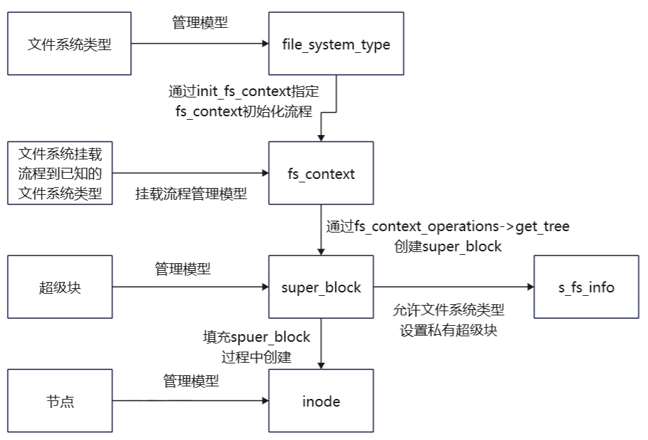
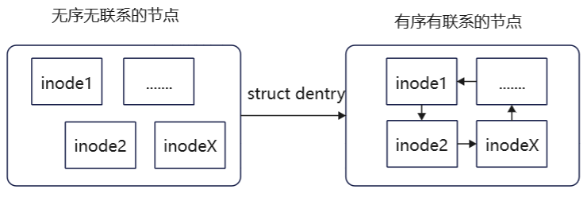

# 初探特权程序

Linux中的用户空间存在着各种各样的资源（比如内核映射的虚文件、etc目录下的配置文件等等），由于这些资源是非常重要的，不能让它们被随便访问。

用户作为程序的实际控制方存在，也是资源的实际访问提出方，用户的身份影响着程序的访问权限，那么应该如何给用户分配权，控制资源被安全的访问呢？

## 特权用户和特权资源的产生

当某一资源只希望被特定用户的访问，那么此时用户间就在权限层面产生了差异，我们可以将能访问同一资源的用户放入特权组内统一进行管理。

只有当资源的身份属于用户的可控制范围内时，资源才可以被操作。

在Linux存在着一个名为`cred`的结构体，它是记录着身份信息信息（ID为0时，一般都是对应着root用户）。

```
struct cred {
	......
	kuid_t		uid;		/* real UID of the task */
	kgid_t		gid;		/* real GID of the task */
	kuid_t		suid;		/* saved UID of the task */
	kgid_t		sgid;		/* saved GID of the task */
	kuid_t		euid;		/* effective UID of the task */
	kgid_t		egid;		/* effective GID of the task */
	kuid_t		fsuid;		/* UID for VFS ops */
	kgid_t		fsgid;		/* GID for VFS ops */
	......
}
```

在`cred`结构体中存在着带有`xxxid`字眼的成员，它们是进行身份匹配的关键，这些ID意思会在后面进行解释。

通过`ls`查看文件属性时，可以发现第一列是文件所有者拥有权限，第二列是与所有者同组用户拥有的权限，第三列是其他用户拥有的权限。

```
ls -lh /etc/ld.so.conf
-rw-r--r-- 1 root root 34 Apr 10  2024 /etc/ld.so.conf
| directory  | owner | group | other |
| -          | rw-   | r--   | r--   |
```

### UID和GID的产生

通过上面我们可以知道每个用户或用户组和可以被访问的资源都具有特定的权限，这一权限通过数字序号ID进行标识。

## 资源访问控制的细化

当用户拥有资源的访问权限时，还要面临一个问题，就是用户能怎么样控制资源，就好比一个人有了买到菜刀的权限，但他应该只用它来做菜，而不是四处砍人。

出于这一个访问控制细化的需求，资源的访问控制权限被分成了读、写、执行三类。

```
ls -lh /etc/ld.so.conf
-rw-r--r-- 1 root root 34 Apr 10  2024 /etc/ld.so.conf
|   | owner | group | other |
| d | rwx   | rwx   | rwx   |

d：是否为目录
r：读权限
w：写权限
x：可执行权限 / s：Set-UID程序
```

通过strace工具追踪ls命令可以发现，文件属性通过`statx`、`lgetxattr`、`getxattr`三个接口进行获取。

`statx`用户获取文件的基本属性，可以通过`struct statx`结构体查看具体的定义。

`lgetxattr`和`getxattr`用于获取文件的扩展属性（`xattr Extended attributes`），`lgetxattr`基于`getxattr`的扩展，用于检查软链接文件的属性。

```
statx(AT_FDCWD, "./Templates", ...)
lgetxattr("./Templates", "security.selinux", 0x55e9c62ab530, 255) = -1 ENODATA (No data available)
getxattr("./Templates", "system.posix_acl_access", NULL, 0) = -1 ENODATA (No data available)
getxattr("./Templates", "system.posix_acl_default", NULL, 0) = -1 ENODATA (No data available)

对应的系统调用号
#define __NR_statx 332
#define __NR_getxattr 191
#define __NR_lgetxattr 192
#define __NR_fgetxattr 193
```

### Linux内核对资源访问细化控制的实现

在Linux系统当中，所有的文件系统都是通过`file_system_type`结构体进行描述的，内核通过`file_system_type`中定义信息对文件系统进行管理。

所有文件系统在使用前都需要通过`register_filesystem`接口注册，完成文件系统的注册只是第一步，抽象出来的文件系统管理模型还需要具体的管理对象。

当具体的文件系统挂载到指定的文件系统类型时，内核会创建`fs_context`结构体处理文件系统的上下文信息，`file_system_type`结构体中实现`init_fs_context`接口负责具体的初始化工作。

```
do_new_mount
	-> fs_context_for_mount
		-> alloc_fs_context
			-> fs_context->file_system_type->init_fs_context
				-> fs_context->fs_context_operations = xxx
```

观察`fs_context`结构体不难发现，结构体中存在这一个名为`cred`的成员（由`cred`结构体描述），它记录着挂载者的用户身份信息。

```
fs_context
	-> cred

do_new_mount
	-> fs_context_for_mount
		-> alloc_fs_context
			-> fs_context->cred = get_current_cred
				-> current->cred

current是内核记录当前进程的变量
```

初始化完`fs_context`之后，会进行下一个重要的操作，这个操作就是创建`spuer_block`，在`fs_context`初始化的过程中，会初始化`ops`成员，该成员中的`get_tree`成员会指定初始化`spuer_block`的操作，`get_tree`成员一般一般由对应的文件系统类型提供实现。

值得一提的是，`fs_context`结构体只在挂载过程中有效，完成挂载操作后就会通过`put_fs_context`接口释放掉。

```
fs_context
	-> const struct fs_context_operations *ops;
fs_context_operations
	-> get_tree

do_new_mount
	-> vfs_get_tree
		-> fs_context->ops->get_tree
			-> get_tree_nodev(fs_context, xxx)
				-> xxx
```

超级块中存储着挂载文件系统的所需各种信息，描述了文件系统的特性和状态，内核通过超级块对已挂载的文件系统进行维护。

`fs_context`结构体通过根节点`root`创建超级块，除了公有的超级块外，Linux内核还允许文件系统建立一个私有的超级块`s_fs_info`。

```
do_new_mount
	-> vfs_get_tree
		-> super_struct sb = fs_context->root->d_sb;

私有超级块：
fs_context
	-> s_fs_info
super_block
	-> s_fs_info
```

`super_block`超级块作为文件系统元数据信息的抽象，负责管理着整个文件系统，在它当中`s_flags`和`s_iflags`两个成员分别用于标识文件系统特性和文件系统内部特性。

这两个标志位是影响文件系统权限的关键成员。

```
struct super_block {
	......
	unsigned long s_flags;
	unsigned long s_iflags;
	......
}

/* sb->s_flags */
#define SB_RDONLY       BIT(0)	/* Mount read-only */
#define SB_NOSUID       BIT(1)	/* Ignore suid and sgid bits */
......
#define SB_NOUSER       BIT(31)

/* sb->s_iflags */
#define SB_I_CGROUPWB	0x00000001	/* cgroup-aware writeback enabled */
#define SB_I_NOEXEC	0x00000002	/* Ignore executables on this fs */
......
#define SB_I_RETIRED	0x00000800	/* superblock shouldn't be reused */
```

比如下方，`sb_permission`函数会通过`sb_rdonly(sb)`接口检查文件系统是否为只读状态。

```
static inline bool sb_rdonly(const struct super_block *sb) { return sb->s_flags & SB_RDONLY; }

static int sb_permission(struct super_block *sb, struct inode *inode, int mask)
{
	if (unlikely(mask & MAY_WRITE)) {
		umode_t mode = inode->i_mode;

		/* Nobody gets write access to a read-only fs. */
		if (sb_rdonly(sb) && (S_ISREG(mode) || S_ISDIR(mode) || S_ISLNK(mode)))
			return -EROFS;
	}
	return 0;
}
```

当超级块建立好后，就可以操作文件系统内的各种文件了，文件系统的大小可说不准，想要找到其中的某某文件，就必须有个带路党来带路。

文件系统中通过`inode`节点记录文件的位置和属性信息，当系统要操作文件时，会通过`inode`节点找到文件在存储介质上的位置。

```
super_block
	-> struct dentry* s_root;
		-> struct inode *d_inode;
```

从上面可以看到，`inode`节点和`super_block`超级块之间出现一层`dentry`结构，它的存在并不是莫名奇妙的。

`struct dentry`中的`dentry`的全称是`direcrory entry`，`struct dentry`结构体中的`struct qstr d_name`成员记录了当前节点名（比如完整路径是`/tmp/aaa`，而`d_name`只记录`aaa`），父节点通过`struct dentry *d_parent`成员进行查找，子节点通过`struct list_head d_subdirs`成员进行查找，`struct inode* d_node`成员负责记录节点名对应的节点属性（`struct inode`结构体中也可以通过`i_dentry`成员找到自身对应`dentry`。）。

文件系统中的不同`inode`节点间可能是具有联系的，但`struct inode`结构体本身并没有对这种联系进行记录，于是记录节点间树状关系的任务就落到了`struct dentry`结构体的身上，从上面对`struct dentry`结构体的概要描述中也可以发现它是可以将节点串联在一起的。

当文件被操纵时，内核会使用`struct file`描述被打开文件的状态信息，`task_struct`结构体中的`files`成员存储着被打开的文件。

文件被打开后，内核会通过`alloc_fd`函数找到一个未使用的文件描述符（大于等于0的整数），程序可以通过文件描述符对文件进行操作。

```
struct task_struct
	->	struct files_struct files
		->	struct file __rcu * fd_array[NR_OPEN_DEFAULT];
```

在`struct inode`结构体中，可以看到其中`i_uid`和`i_gid`记录着节点所属的用户和组ID，`i_mode`记录了节点的属性（文件类型和访问权限），`i_ino`记录着节点索引编号。

```
文件类型：
套接字			#define S_IFSOCK 0140000
软链接文件		#define S_IFLNK	 0120000
普通文件		#define S_IFREG  0100000
块设备			#define S_IFBLK  0060000
目录			#define S_IFDIR  0040000
字符设备		#define S_IFCHR  0020000
管道设备		#define S_IFIFO  0010000
特权用户程序	#define S_ISUID  0004000

访问权限：
#define S_IRWXU 00700
#define S_IRUSR 00400
......
#define S_IWOTH 00002
#define S_IXOTH 00001

struct inode {
	umode_t i_mode;
	unsigned short i_opflags;
	kuid_t i_uid;
	kgid_t i_gid;
	......
	i_ino
	......
}
```

### 超级块和节点的补充

块和节点是真实存在在存储介质中的，`struct super_block`的作用是从存储介质中提取出块信息进行管理，`struct inode`的作用是从存储介质中提取出节点信息进行管理。

存储介质中存储的文件，其文件中的原始数据位于块内，文件的属性信息则位于节点中，通过节点可以索引到块的位置。

### 文件系统ID的产生

好吧，其实`fsuid`其实在这里并没有被用到，在后面我们可以看到`fsuid`一般是与`euid`保持一致的。

## 特权程序的产生

在某些情况下不能将资源看作一个整体，资源内的数据各用户隐私数据的集合（比如密码文件），用户访问密码文件后也可以看到其他用户的密码显然是不合适的。

也可以考虑在访问资源的层面进行进一步的控制，用户访问资源时只能看到与自身相关的数据，但这显然会大大增加操作系统的复杂度。

因此目前的操作系统选择了一种更加简单有效的访问控制规则，即特权程序。

特权程序可以看作是一个中立方，它拥有着用户不具备的额外权限，用户可以借助特权程序访问自身受限的资源。

这一点比较像用户到银行取钱，用户到了银行之后，虽然所有用户的钱是银行统一管理的，但是钱只能从自己的账户内取，但取钱是自己去银行仓库里面拿吗？肯定不是，需要借助ATM、前台客服这样的特权人员才可以将钱取到。

### 特权程序的分类

在Linux当中，特权程序分成守护进程和SetUID进程两大类，守护进程指的是特权用户运行的程序，SetUID进程指的是通过特殊比特位标记的程序，当内核运行程序时会检查该比特位，如果发现是SetUID程序就对它进行特别照顾。

与之类似的还有Set-GID程序，原理与Set-UID程序相同，只是对象从单个用户变成了整组。

### 有效ID和保留ID的产生

前面介绍过普通ID对用户和资源的所有者进行了区分，但用户A操作特权程序时会在程序运行期间获得特权程序所有者的权限，那么这个时候普通ID就不够用了。

内核添加了`euid`有效用户ID和`egid`有效用户组ID两种有效ID，有效ID专门用于运行期，帮助普通用户在运行期拿到特殊的权限。

对于Set-UID程序来讲，它的用户ID和有效ID是不一样的，在GLibC提供了一种名为`setuid`的函数，程序可以调用此接口将进程运行期的身份凭证`euid`改变，为了让`euid`可以恢复，所以设置了`suid`保留ID作为`euid`的副本。

### 特权程序的运行原理

从下面可以看到，`sudo`作为特权程序拥有着一个特殊的符号`s`，这与一般可执行文件所标记的`x`符号有所不同。

```
ls -lh /bin/sudo
-rwsr-xr-x 1 root root 276K Jun 27  2023 /bin/sudo

ls -lh /bin/ping
-rwxr-xr-x 1 root root 89K Nov 27  2022 /bin/ping
```

这个特殊的符号让Set-UID程序拥有了特权，帮助普通用户在运行期完身份的切换。每个用户都具有一个真实的用户ID，而在运行期则会使用有效用户ID，当用户运行普通程序时，其有效ID仍是真实ID，但当用户运行特权程序时，其有效ID则会变成程序所属者的真实ID,有效ID拥有什么权限，程序在运行期也就拥有什么权限。

`cred`结构体在描述进程的`task_struct`中会有一份记录。

```
struct stask_struct {
	......
	const struct cred __rcu		*ptracer_cred;
	const struct cred __rcu		*real_cred;
	const struct cred __rcu		*cred;
	......
}
```

在内核正式通过`exec_binprm`开始加载程序之前，`bprm_execve`函数会先通过`prepare_bprm_creds`准备待运行程序的权限。

`bprm`代表二进制程序，`struct linux_binprm`结构体存储着二进制文件加载时所使用的参数。

```
sysycall execve
	-> do_execve
		-> do_execveat_common
			-> bprm_execve
				|-> prepare_bprm_creds
				|-> exec_binprm
					-> search_binary_handler
						-> load_binary

prepare_exec_creds
	-> prepare_exec_creds
		-> prepare_creds
			|-> struct task_struct *task = current;
			|-> old = task->cred;
			|-> memcpy(new, old, sizeof(struct cred));
```

`prepare_creds`函数会根据当前进程先复刻出来一份身份凭证`cred`。

进入`exec_binprm`后，会调用一个有趣的函数`search_binary_handler`，它会在已注册的可执行文件类型链表`formats`中进行匹配，找到对应的可执行文件类型`struct linux_binfmt`。

```
list_for_each_entry(fmt, &formats, lh) {
	if (!try_module_get(fmt->module))
		continue;
	read_unlock(&binfmt_lock);

	retval = fmt->load_binary(bprm);

	read_lock(&binfmt_lock);
	put_binfmt(fmt);
	if (bprm->point_of_no_return || (retval != -ENOEXEC)) {
		read_unlock(&binfmt_lock);
		return retval;
	}
}
```

然后再通过`load_binary`调用`load_elf_binary`（这里以elf格式为例），除此之外，还有`binfmt_script`脚本文件、`binfmt_flat`等等。

```
static struct linux_binfmt elf_format = {
	.module		= THIS_MODULE,
	.load_binary	= load_elf_binary,
	.load_shlib	= load_elf_library,
#ifdef CONFIG_COREDUMP
	.core_dump	= elf_core_dump,
	.min_coredump	= ELF_EXEC_PAGESIZE,
#endif
};

load_elf_binary
	-> begin_new_exec
		-> bprm_creds_from_file
			|-> bprm_fill_uid
			|-> security_bprm_creds_from_file

bprm_fill_uid (...) {
	......
	uid = i_uid_into_mnt(mnt_userns, inode);
	gid = i_gid_into_mnt(mnt_userns, inode);
	......
	if (mode & S_ISUID) {
		bprm->per_clear |= PER_CLEAR_ON_SETID;
		bprm->cred->euid = uid;
	}

	if ((mode & (S_ISGID | S_IXGRP)) == (S_ISGID | S_IXGRP)) {
		bprm->per_clear |= PER_CLEAR_ON_SETID;
		bprm->cred->egid = gid;
	}
	......
}
```

当程序准备开始运行前，`bprm_fill_uid`函数会根据当前文件的信息更新身份凭证`cred`，当发现文件Set-UID位置被设置时，就会更新当前身份凭证中的`euid`为文件的`uid`。

当你观察`binfmt_script`脚本文件中的`load_binary`接口实现时，会发现它并没有去设置比特位，这是因为Set-UID机制只对二进制文件生效。

通过`bprm_fill_uid`完成身份凭证`cred`的设置后，内核会继续通过`security_bprm_creds_from_file`函数，将`suid`和`fsuid`更新成`euid`。

```
security_bprm_creds_from_file
	-> cap_bprm_creds_from_file
		|-> new->suid = new->fsuid = new->euid;
		|->	new->sgid = new->fsgid = new->egid;
```

在进程运行前的最后时刻，会通过`commit_creds`函数将刚刚生成的`cred`更新给当前进程。

```
begin_new_exec
	-> commit_creds
```

## 总结

在Linux的世界中资源被抽象成文件，由此衍生出了各类文件系统类型，Linux内核自然针对各种文件系统类型进行管理，保证文件系统挂载完成后可以提供块和节点信息让内核操纵。



节点代表着文件属性，节点间本身是没有联系的，为了维持文件间的树状关系，Linux内核创造出了`struct dentry`结构体进行管理。



不同资源间是存在差异的，为了应对这种权限上的差别，Linux允许资源间设立自己的“山大王”，“山大王”有权拒绝外来者访问资源。并且Linux还给资源添加了控制权限（可读可写可执行），限定操作资源的方式在指定途径下进行。

但考虑外来者有时访问并不是出于恶意且它的需求是有必要的，所以Linux内核允许“山大王”派出自己拥有的特别信使，外来者可以向这个特别信使提出需求，然后由特别信使替自己执行操作，作为“山大王”认证的信使，自然也对“山头”内资源具有操作权限。

一个信使在执行任务期间可以对“山头”内资源进行任意的操作也不算合理，但想要进一步细化对信使的控制就需要付出更多的成本。

这个进一步细化访问控制的实现对于Linux内核而言应该怎么实现呢，实现难度又是多大呢，对于目前的Linux内核而言，这种机制又是否已经实现好了呢。

## 被滥用的特权程序

### 外部环境

特权程序本身的操作是值得信任的，但是特权程序的操作往往需要依赖外部信息，这些信息分成用户传递的信息和系统产生的信息两大类。

特权程序首先需要保证用户输入产生的信息对自己没有影响。

用户的输入可以看作是一个“挑战书”，既然程序已经知道有人要过来挑战自己，当然也会做足准备进行防御，但是明枪易躲，暗箭难防啊！系统产生的信息往往就是那个暗箭。

系统产生的信息又可以分成两大类，一是程序内部显式操作的各种系统资源（比如读写文件），此时程序会从系统资源中获取各种数据，二是每个程序都默认附带的环境变量。

### 权限泄露

权限泄露发生在程序通过`setuid`接口变更`euid`的前后，假如程序在`euid`变更前持有高特权，且在带有高特权身份运行期间打开了某某资源，如果在`setuid`切换到低特权身份后，原先打开的资源没有释放，就会导致资源被低特权用户使用。

前面说过Linux下的资源权限通过`inode`中的`i_uid`标明，打开文件时会验证进程的`euid`的权限是否在`i_uid`之上，如果可以打开文件那么内核就会返回一个文件描述符，此时任意权限的用户都可以通过文件描述符操作文件。
