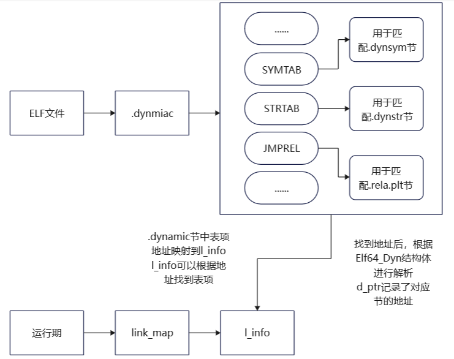
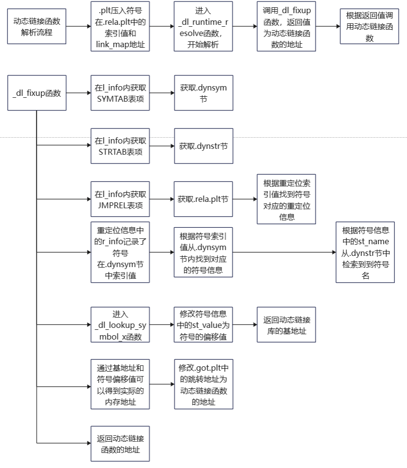
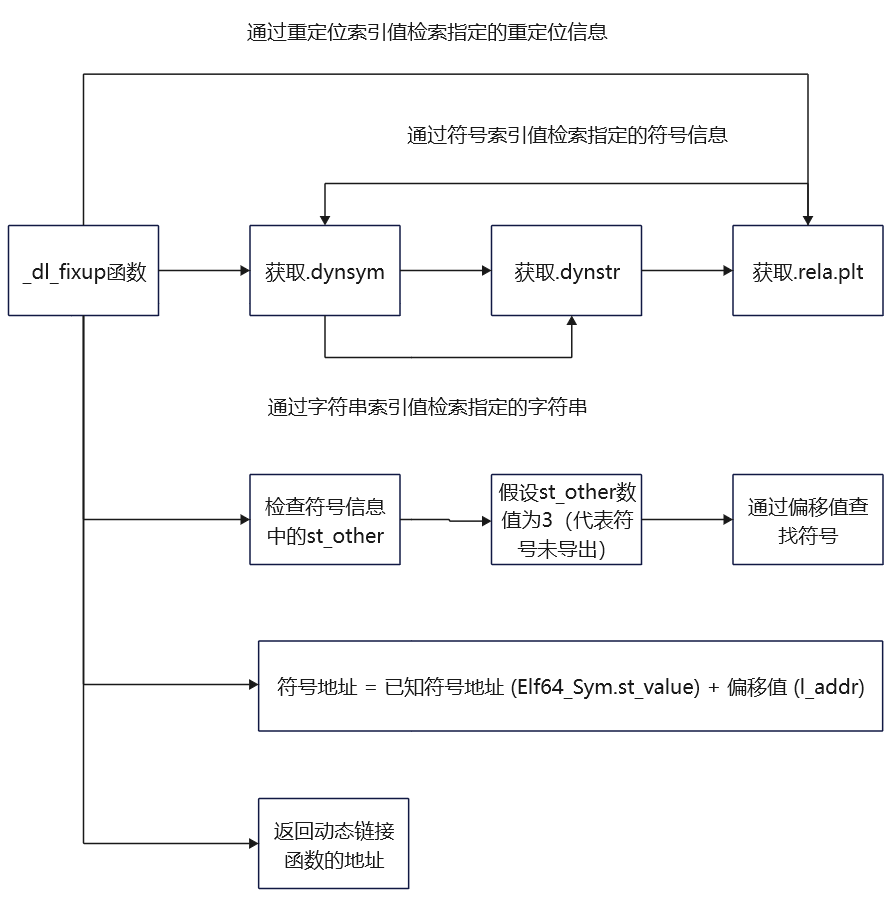

# _dl_runtime_resolve初探

当程序使用动态链接库中的函数时，由于链接器无法确定动态链接函数的地址信息，所以会将动态链接函数的绑定过程拖到运行期再进行操作，这一过程被称作是动态链接。

动态链接分成启动期链接和调用期链接两种，启动期链接指的是动态链接器LD运行时就将全部的动态链接函数地址解析好，调用期链接指的是动态链接函数首次调用时再进行解析，调用期链接的做法也被称作是延迟绑定。

在启动过程中，`lazy`变量是会决定是否在启动时对动态链接函数的地址进行解析，该变量的数值是根据`.dynamic`动态链接节中是否存在`BIND_NOW`标志进行设置的。

```
0x000000000000001e (FLAGS)              BIND_NOW
```

当程序不需要延迟绑定时，`elf_machine_runtime_setup`函数内部根据`lazy`变量的提示不会做任何的操作，紧接着会直接通过`ELF_DYNAMIC_DO_XXX`函数解析全部的动态链接函数。

当程序需要延迟绑定时，`elf_machine_runtime_setup`函数修改`.plt`节中首表项内的信息为解析函数的信息，使得首次调用时程序可以根据解析函数完成动态链接函数的解析操作，而`ELF_DYNAMIC_DO_XXX`函数则不会进行任何操作。

```
void
_dl_relocate_object (struct link_map *l, struct r_scope_elem *scope[],
		     int reloc_mode, int consider_profiling)
{
	......
	ELF_DYNAMIC_RELOCATE (l, scope, lazy, consider_profiling, skip_ifunc);
	......
}

# define ELF_DYNAMIC_RELOCATE(map, scope, lazy, consider_profile, skip_ifunc) \
  do {									      \
    int edr_lazy = elf_machine_runtime_setup ((map), (scope), (lazy),	      \
					      (consider_profile));	      \
    if (((map) != &GL(dl_rtld_map) || DO_RTLD_BOOTSTRAP))		      \
      ELF_DYNAMIC_DO_RELR (map);					      \
    ELF_DYNAMIC_DO_REL ((map), (scope), edr_lazy, skip_ifunc);		      \
    ELF_DYNAMIC_DO_RELA ((map), (scope), edr_lazy, skip_ifunc);		      \
  } while (0)
```

下面展示了调用期链接具体使用的解析函数。

```
0x0000000000401134 <+14>:    call   0x401030 <puts@plt>

(gdb) x /3i 0x401030
   0x401030 <puts@plt>: jmp    *0x2fca(%rip)        # 0x404000 <puts@got.plt>
   0x401036 <puts@plt+6>:       push   $0x0
   0x40103b <puts@plt+11>:      jmp    0x401020
```

从上面可以看到程序会根据0x404000中的地址信息决定调用的函数是什么，当解析函数完成解析工作后，0x404000中的地址一定会被修改为动态链接函数的所在地址，因此我们可以在0x404000地址上设置监测点，查看解析函数的真身是谁。

当监测点发现地址上的数据发生变动后，就会自动中断下来，通过查看调用栈可以知道`_dl_runtime_resolve_fxsave`负责解析动态链接函数。

```
(gdb) bt
#0  0x00007ffff7fd7184 in _dl_fixup (l=0x7ffff7ffe2e0, reloc_arg=<optimized out>) at dl-runtime.c:163
#1  0x00007ffff7fd9557 in _dl_runtime_resolve_fxsave () at ../sysdeps/x86_64/dl-trampoline.h:98
#2  0x0000000000401139 in main () at main.c:5
#3  0x00007ffff7dd0e08 in ?? () from /usr/lib/libc.so.6
#4  0x00007ffff7dd0ecc in __libc_start_main () from /usr/lib/libc.so.6
#5  0x0000000000401065 in _start ()
```

`_dl_runtime_resolve_fxsave`函数的顺利工作，依赖ELF中动态链接节和重定位节信息，下面会先对这些相关的节进行分析。

# ELF文件是如何支持动态链接的？

## 动态链接节

`.dynamic`动态链接节是极为重要的，因为它里面存放着程序进行动态链接的全部所需信息，所以程序只需要一个`.dynamic`节，就可以检索到所有的相关信息。

`.dynamic`节可以看作是一张表，表中有各种各样的表项，表项信息通过`Elf64_Dyn`结构体进行描述。

在`/usr/include/elf.h`头文件中，可以找到`Elf64_Dyn`结构体的定义，`d_tag`成员用于标明表项对应的动态链接属性，`d_un`成员表示属性对应的具体数值。

```
typedef struct
{
  Elf64_Sxword	d_tag;			/* Dynamic entry type */
  union
    {
      Elf64_Xword d_val;		/* Integer value */
      Elf64_Addr d_ptr;			/* Address value */
    } d_un;
} Elf64_Dyn;
```

`d_tag`的有非常多的种类，下面只列出了部分，完整的列表和解释可以在`/usr/include/elf.h`头文件中找到。

```
#define DT_NULL		0
#define DT_NEEDED	1
......
#define DT_EXTRATAGIDX(tag)	((Elf32_Word)-((Elf32_Sword) (tag) <<1>>1)-1)
#define DT_EXTRANUM	3
```

当动态链接属性是`DT_FLAGS`或`DT_FLAGS_1`时，`d_val`成员的数值会是`DF_xxx`或`DF_1_xxx`的中的某一个。

比如前面提到的`BIND_NOW`标志就是通过`DT_FLAGS`和`DT_FLAGS_1`进行描述的。

```
readelf工具解析出来的友好信息：
0x000000000000001e (FLAGS)              BIND_NOW
0x000000006ffffffb (FLAGS_1)            Flags: NOW

16进制信息：
403f18 1e000000 00000000 08000000 00000000  ................
403f28 fbffff6f 00000000 01000000 00000000  ...o............

elf文件中的定义信息：
#define DT_FLAGS	30
#define DT_FLAGS_1	0x6ffffffb

#define DF_BIND_NOW	0x00000008
#define DF_1_NOW	0x00000001
```

### 动态链接节的手工查找实战

通过readelf工具的`-d`选项可以轻松的将动态链接节中的信息解析出来，这是非常方便且利于人类阅读的信息，它这里做了两大操作，一是找到`.dynamic`节的位置，而是将`.dynamic`节中的二进制信息解析成人类可读的信息。

接下来会演示如何手动找到`.dynamic`节的位置。

```
Dynamic section at offset 0x2df8 contains 24 entries:
  Tag        Type                         Name/Value
 0x0000000000000001 (NEEDED)             Shared library: [libc.so.6]
 ......
 0x0000000000000000 (NULL)               0x0
```

第一步查看ELF头信息，获得节头表的位置0x3720、节头表中表项大小0x40以及节头表中表项数量0x24。

```
00000000  7f 45 4c 46 02 01 01 00  00 00 00 00 00 00 00 00  |.ELF............|
00000010  02 00 3e 00 01 00 00 00  40 10 40 00 00 00 00 00  |..>.....@.@.....|
00000020  40 00 00 00 00 00 00 00  20 37 00 00 00 00 00 00  |@....... 7......|
00000030  00 00 00 00 40 00 38 00  0d 00 40 00 24 00 23 00  |....@.8...@.$.#.|
```

找到节头表的位置后，可以非常轻松的将`.dynamic`节找出来（此处是21号表项），并根据节头表中表项的定义，将`.dynamic`节头的信息解析出来。

```
节头表定义：
typedef struct
{
  Elf64_Word	sh_name;		/* Section name (string tbl index) */
  Elf64_Word	sh_type;		/* Section type */
  Elf64_Xword	sh_flags;		/* Section flags */
  Elf64_Addr	sh_addr;		/* Section virtual addr at execution */
  Elf64_Off	sh_offset;		/* Section file offset */
  Elf64_Xword	sh_size;		/* Section size in bytes */
  Elf64_Word	sh_link;		/* Link to another section */
  Elf64_Word	sh_info;		/* Additional section information */
  Elf64_Xword	sh_addralign;		/* Section alignment */
  Elf64_Xword	sh_entsize;		/* Entry size if section holds table */
} Elf64_Shdr;

节头表中的21号表项对应的16进制信息：
00003c60  eb 00 00 00 06 00 00 00  03 00 00 00 00 00 00 00  |................|
00003c70  f8 3d 40 00 00 00 00 00  f8 2d 00 00 00 00 00 00  |.=@......-......|
00003c80  d0 01 00 00 00 00 00 00  07 00 00 00 00 00 00 00  |................|
00003c90  08 00 00 00 00 00 00 00  10 00 00 00 00 00 00 00  |................|

16进制信息解析：
sh_name：
	0x35b3+0xeb，0x35b3是字符串节的起始地址，0xeb是节名的索引值
	0000369e  2e 64 79 6e 61 6d 69 63  00 2e 67 6f 74 00 2e 67  |.dynamic..got..g
sh_type：
	#define SHT_DYNAMIC	  6
sh_flags：
	#define SHF_WRITE	     (1 << 0)	/* Writable */
	#define SHF_ALLOC	     (1 << 1)
	0x3 = b11 -> WA
sh_addr：0x3df8，sh_offset：0x2df8，sh_size：0x01d0
sh_link：0x7，sh_info：0x0，sh_addralign：0x8，sh_entsize：0x10

readelf中的动态链接节头信息（与手工解析结果一致）：
[21] .dynamic          DYNAMIC          0000000000403df8  00002df8
       00000000000001d0  0000000000000010  WA       7     0     8
```

查看`.dynamic`节中内容，可以发现结果和上方readelf工具的`-d`选项的解析内容一致。

```
00002df8  01 00 00 00 00 00 00 00  18 00 00 00 00 00 00 00  |................|
00002e08  0c 00 00 00 00 00 00 00  00 10 40 00 00 00 00 00  |..........@.....|
......
00002f58  f0 ff ff 6f 00 00 00 00  ee 04 40 00 00 00 00 00  |...o......@.....|
00002f68  00 00 00 00 00 00 00 00  00 00 00 00 00 00 00 00  |................|
```

## 动态链接符号节与动态链接字符串节

程序使用的函数和全局变量往往被称作是符号，`.symtab`节中会存储着全部的符号信息，而`.dynsym`节则会专门存储与动态链接相关的符号信息，`.dynsym`节与`.symtab`节共用同一个结构描述信息。

```
typedef struct
{
  Elf64_Word	st_name;		/* Symbol name (string tbl index) */
  unsigned char	st_info;		/* Symbol type and binding */
  unsigned char st_other;		/* Symbol visibility */
  Elf64_Section	st_shndx;		/* Section index */
  Elf64_Addr	st_value;		/* Symbol value */
  Elf64_Xword	st_size;		/* Symbol size */
} Elf64_Sym;

Symbol table '.dynsym' contains 6 entries:
   Num:    Value          Size Type    Bind   Vis      Ndx Name
     0: 0000000000000000     0 NOTYPE  LOCAL  DEFAULT  UND 
     1: 0000000000000000     0 FUNC    GLOBAL DEFAULT  UND _[...]@GLIBC_2.34 (2)
     2: 0000000000000000     0 NOTYPE  WEAK   DEFAULT  UND _ITM_deregisterT[...]
     3: 0000000000000000     0 FUNC    GLOBAL DEFAULT  UND puts@GLIBC_2.2.5 (3)
     4: 0000000000000000     0 NOTYPE  WEAK   DEFAULT  UND __gmon_start__
     5: 0000000000000000     0 NOTYPE  WEAK   DEFAULT  UND _ITM_registerTMC[...]
```

`.dynstr`节是专门为`st_name`成员设立的，作为索引值辅助`.dynsym`节匹配符号名。

```
[ 7] .dynstr           STRTAB           0000000000400470  00000470
       000000000000007e  0000000000000000   A       0     0     1

00000470  00 70 75 74 73 00 5f 5f  6c 69 62 63 5f 73 74 61  |.puts.__libc_sta|
......
000004e0  72 54 4d 43 6c 6f 6e 65  54 61 62 6c 65 00 00 00  |rTMCloneTable...|
```

## 哈希节

GLibC通过`.gnu.hash`节加快符号的查找过程，关于`.gnu.hash`节是如何进行工作的问题，这里暂时不会进行解析。

```
[ 5] .gnu.hash         GNU_HASH         00000000004003c0  000003c0
       000000000000001c  0000000000000000   A       6     0     8

000003c0  01 00 00 00 01 00 00 00  01 00 00 00 00 00 00 00  |................|
000003d0  00 00 00 00 00 00 00 00  00 00 00 00 00 00 00 00  |................|
```

## 重定位节

在ELF文件中，重定位节分成`.rela.dyn`和`.rela.plt`两类，它们的区别在于重定位时修正地址的位置不同，其中`.rela.dyn`修正的信息位于`.got`节，`.rela.plt`节修正的信息位于`.got.plt`节。

至于`.got`节和`.got.plt`节，它们的区别在于完成重定位工作后，是否会被`GNU_RELRO`段设置为只读状态。

```
Relocation section '.rela.dyn' at offset 0x530 contains 4 entries:
  Offset          Info           Type           Sym. Value    Sym. Name + Addend
000000403fc8  000100000006 R_X86_64_GLOB_DAT 0000000000000000 __libc_start_main@GLIBC_2.34 + 0
000000403fd0  000200000006 R_X86_64_GLOB_DAT 0000000000000000 _ITM_deregisterTM[...] + 0
000000403fd8  000400000006 R_X86_64_GLOB_DAT 0000000000000000 __gmon_start__ + 0
000000403fe0  000500000006 R_X86_64_GLOB_DAT 0000000000000000 _ITM_registerTMCl[...] + 0

Relocation section '.rela.plt' at offset 0x590 contains 1 entry:
  Offset          Info           Type           Sym. Value    Sym. Name + Addend
000000404000  000300000007 R_X86_64_JUMP_SLOT 0000000000000000 puts@GLIBC_2.2.5 + 0
```

重定位节的作用可以从下面结构体的定义中略窥一二，其中`r_offset`成员指示出了需要修改的重定位信息位置，`r_info`成员则指示出了重定位类型和符号索引值，这里的索引值用于在`.dynsym`节内检索符号，`r_addend`成员显示的将加数指了出来（`Elf64_Rel`中使用隐式加数），`r_addend`和`r_offset`共同指明了待修改的重定位信息位置。

```
typedef struct
{
  Elf64_Addr	r_offset;		/* Address */
  Elf64_Xword	r_info;			/* Relocation type and symbol index */
} Elf64_Rel;

typedef struct
{
  Elf64_Addr	r_offset;		/* Address */
  Elf64_Xword	r_info;			/* Relocation type and symbol index */
  Elf64_Sxword	r_addend;		/* Addend */
} Elf64_Rela;
```

# 重定位是如何工作的

在上面我们介绍了与动态链接相关的各种节信息，但是目前我们只是知道它们会辅助动态链接函数调用的顺利进行，但是还并不知道它们之间是如何协同工作的，下面就会对此进行解析。

## 进入解析函数

首次调用动态链接函数时，PLT中首条指令`jmp`会带我们前往第二条指令`push`，`push`会将符号在`.rela.plt`中的索引值压入栈内，最后一条`jmp`指令会带我们前往`.plt`节中的首表项。

```
(gdb) 
0x0000000000401030 in puts@plt ()
1: x/i $rip
=> 0x401030 <puts@plt>: jmp    *0x2fca(%rip)        # 0x404000 <puts@got.plt>
(gdb) x /gx 0x404000
0x404000 <puts@got.plt>:        0x0000000000401036
(gdb) si
0x0000000000401036 in puts@plt ()
1: x/i $rip
=> 0x401036 <puts@plt+6>:       push   $0x0
```

`.plt`节中的首表项中存储着`_dl_runtime_resolve_fxsave`函数的地址，该函数进行重定位操作的关键函数。

`push`指令会将当前`link_map`信息所在地址压入栈内。

0x403ff0中保存的`link_map`信息地址和0x403ff8中保存的`_dl_runtime_resolve_fxsave`函数地址位于`.got`节，并由LD在启动时修改。

```
(gdb) x /gx 0x403ff8
0x403ff8:       0x00007ffff7fd9510
(gdb) info symbol 0x00007ffff7fd9510
_dl_runtime_resolve_fxsave in section .text of /lib64/ld-linux-x86-64.so.2

0000000000401020 <puts@plt-0x10>:
  401020:       ff 35 ca 2f 00 00       push   0x2fca(%rip)        # 403ff0 <_GLOBAL_OFFSET_TABLE_+0x8>
  401026:       ff 25 cc 2f 00 00       jmp    *0x2fcc(%rip)        # 403ff8 <_GLOBAL_OFFSET_TABLE_+0x10>
  40102c:       0f 1f 40 00             nopl   0x0(%rax)
```

## 解析函数的操作

`_dl_runtime_resolve_fxsave`函数的反汇编如下所示，同时下方也写明了对汇编代码的解释。

从汇编代码中可以看到，函数由序言、获取动态链接函数、结语、调用动态链接函数四大部分组成。

首先看到的是序言部分，它的主要作用是分配栈空间。

在之前的PLT中，两个`push`指令先后向栈上压入了符号索引值以及`link_map`信息的地址，它们会提供给`_dl_fixup`函数使用，不将它们交给调用者寄存器传递，是因为调用者寄存器已经被用于放置动态链接函数的形参了。

这里会先将旧的`rsp`保存到`rbx`内，以便`_dl_fixup`函数获取参数。

```
函数序言：
0x00007ffff7fd9510 <+0>:     endbr64
0x00007ffff7fd9514 <+4>:     push   %rbx
保存rbx寄存器数值，腾出rbx寄存器空间
0x00007ffff7fd9515 <+5>:     mov    %rsp,%rbx
保存rsp到rbx
0x00007ffff7fd9518 <+8>:     and    $0xfffffffffffffff0,%rsp
清零rsp中的低4个比特位，跟0x10对齐
0x00007ffff7fd951c <+12>:    sub    $0x240,%rsp
分配栈空间
```

动态链接函数最多接收六个参数作为形参，它们通过调用者寄存器进行保存，但由于接下来会使用`_dl_fixup`函数获取动态链接函数，该函数会使用新的形参，动态链接函数也需要在`_dl_fixup`函数运行后操作，所以这里会先将调用者寄存器中的参数保存到栈上，等到动态链接函数真被调用时再从栈上放出来。

这里还有一个特殊的寄存器`rax`，它并不在传递形参的寄存器范围之内，但它也是一个特殊的寄存器，会被用于存储返回值，同时也会被用于存储系统调用号。

保存好动态链接函数的参数后，就会从`rbx`中取出符号索引值以及`link_map`信息的地址，交给`_dl_fixup`函数，最后对`_dl_fixup`函数进行调用。

当函数返回之后，因为`rax`在后面会被使用，所以它会将返回值交给`r11`。

```
0x00007ffff7fd9523 <+19>:    mov    %rax,(%rsp)
0x00007ffff7fd9527 <+23>:    mov    %rcx,0x8(%rsp)
0x00007ffff7fd952c <+28>:    mov    %rdx,0x10(%rsp)
0x00007ffff7fd9531 <+33>:    mov    %rsi,0x18(%rsp)
0x00007ffff7fd9536 <+38>:    mov    %rdi,0x20(%rsp)
0x00007ffff7fd953b <+43>:    mov    %r8,0x28(%rsp)
0x00007ffff7fd9540 <+48>:    mov    %r9,0x30(%rsp)
保存寄存器数值到栈上，腾出寄存器空间
0x00007ffff7fd9545 <+53>:    fxsave 0x40(%rsp) # mov (LOCAL_STORAGE_AREA + 8)(%BASE), %RSI_LP
保存上下文信息
0x00007ffff7fd954a <+58>:    mov    0x10(%rbx),%rsi
0x00007ffff7fd954e <+62>:    mov    0x8(%rbx),%rdi
准备形参给_dl_fixup
0x00007ffff7fd9552 <+66>:    call   0x7ffff7fd6ff0 <_dl_fixup>
调用_dl_fixup
0x00007ffff7fd9557 <+71>:    mov    %rax,%r11
保存返回值到r11
```

函数结语的作用是恢复栈空间和寄存器空间数据。

```
函数结语：
0x00007ffff7fd955a <+74>:    fxrstor 0x40(%rsp)
恢复上下文信息
0x00007ffff7fd955f <+79>:    mov    0x30(%rsp),%r9
0x00007ffff7fd9564 <+84>:    mov    0x28(%rsp),%r8
0x00007ffff7fd9569 <+89>:    mov    0x20(%rsp),%rdi
0x00007ffff7fd956e <+94>:    mov    0x18(%rsp),%rsi
0x00007ffff7fd9573 <+99>:    mov    0x10(%rsp),%rdx
0x00007ffff7fd9578 <+104>:   mov    0x8(%rsp),%rcx
0x00007ffff7fd957d <+109>:   mov    (%rsp),%rax
0x00007ffff7fd9581 <+113>:   mov    %rbx,%rsp
0x00007ffff7fd9584 <+116>:   mov    (%rsp),%rbx
恢复之前保存的寄存器数值，让后续的使用者使用的数值仍是正确的
0x00007ffff7fd9588 <+120>:   add    $0x18,%rsp
```

恢复好栈空间和寄存器数据后，动态链接函数有了正确被调用的基础，最后就是通过`r11`中保存的动态链接函数地址进行跳转，实现动态链接函数的调用。

```
调用动态链接函数：
0x00007ffff7fd958c <+124>:   jmp    *%r11
跳转到r11寄存器保存的地址
```

从上面分析的反汇编结果中可以看到，`_dl_runtime_resolve_fxsave`函数的主要操作就是调用`_dl_fixup`函数，然后根据`_dl_fixup`函数的返回值进行跳转，那么接下来就让我们将视线转移到`_dl_fixup`函数的内部。

## 重定位信息修正

进入到`_dl_fixup`函数后，就会开始修正重定位信息。

### 函数序言

函数内部首先出现的就是函数序言，其主要作用在于分配栈空间。

其中`rbx`、`r12`、`r13`、`r14`、`r15`位于被调用者寄存器范围内，它们的数值放入栈内，寄存器空间留给其他被调用者使用。

`rdi`中存储的是`link_map`的地址，这里会在`rbx`内再保存一份。

```
0x00007ffff7fd6ff0 <+0>:     endbr64
0x00007ffff7fd6ff4 <+4>:     push   %rbp
保存调用者栈底指针
0x00007ffff7fd6ff5 <+5>:     xor    %r9d,%r9d
0x00007ffff7fd6ff8 <+8>:     mov    %rsp,%rbp
设置当前函数的栈底指针
0x00007ffff7fd6ffb <+11>:    push   %r15
0x00007ffff7fd6ffd <+13>:    push   %r14
0x00007ffff7fd6fff <+15>:    push   %r13
0x00007ffff7fd7001 <+17>:    push   %r12
0x00007ffff7fd7003 <+19>:    push   %rbx
腾出寄存器空间
0x00007ffff7fd7004 <+20>:    mov    %rdi,%rbx
0x00007ffff7fd7007 <+23>:    sub    $0x18,%rsp
分配栈空间
```

### 动态链接符号节获取

完成设置栈空间的操作后，首先会准备参数，其中`r8`寄存器中存储着`.dynsym`的地址，不过它是怎么取到的呢？

```
0x00007ffff7fd700b <+27>:    mov    0x70(%rdi),%rax
根据形参传递的地址，取出偏移0x70处的数据给rax
0x00007ffff7fd700f <+31>:    mov    (%rdi),%rdx
将rdi保存地址上的数值传给rdx
0x00007ffff7fd7012 <+34>:    mov    0x8(%rax),%r8
0x00007ffff7fd7016 <+38>:    testb  $0x20,0x356(%rdi)
0x00007ffff7fd701d <+45>:    je     0x7ffff7fd7025 <_dl_fixup+53>
```

程序及动态链接库所需的链接信息由`link_map`结构体进行管理，在该结构体内存在着一个名为`l_info`的成员，该成员的作用是动态链接信息（根据`.dynamic`节获取），我们知道`.dynamic`节是一张表，每个表项都会占据一段空间，`l_info`中存储的就是表项的内存地址信息。

`l_info`成员位于偏移0x40处，大小为0x280，此处偏移0x70是为了寻找`SYMTAB`表项（`.dynsym`节）。

检索到`SYMTAB`表项的地址后，然后根据表项的定义，偏移0x8处就是`.dynsym`节的地址。

```
.dynamic节：
 ......
 0x0000000000000006 (SYMTAB)             0x4003e0
 ......
.dynsym节：
[ 6] .dynsym           DYNSYM           00000000004003e0  000003e0
       0000000000000090  0000000000000018   A       7     1     8

rax：
(gdb) info registers rdi
rdi            0x7ffff7ffe2e0      140737354130144
(gdb) x /gx 0x7ffff7ffe2e0+0x70
0x7ffff7ffe350: 0x0000000000403e88
(gdb) x /gx 0x403e88
0x403e88:       0x0000000000000006
r8：
(gdb) x /gx 0x403e88+0x8
0x403e90:       0x00000000004003e0
```

参与比较运算的数值分别是0x20和`rdi+0x356`地址上存储的数据，这里GLibC中使用了一个特别的用法，就是在变量名后添加`:`和数字，作用是指定变量占用的比特位，其中`rdi+0x356`对应着`link_map`中的`l_audit_any_plt`到`l_find_object_processed`成员，0x20就是用于判断`l_find_object_processed`成员的值是否为1。

```
unsigned int l_audit_any_plt:1;
unsigned int l_removed:1;
unsigned int l_contiguous:1;
unsigned int l_free_initfini:1;
unsigned int l_ld_readonly:1;
unsigned int l_find_object_processed:1;
```

`test`指令和`je`指令是较为常见的比较运算指令，其中的也逻辑并不复杂，`test`指令在进行完与运行后，会根据运算结果设置`eflags`标志位寄存器中的ZF标志位（`Zero Flag`），`je`指令会根据ZF标志位决定是否跳转（ZF为1时跳转），下面展示了`test`指令运行前后的`eflags`寄存器信息。

```
运行前：
(gdb) info registers eflags 
eflags         0x10202             [ IF RF ]
运行后：
(gdb) info registers eflags 
eflags         0x10246             [ PF ZF IF RF ]
```

这里如果判断`l_find_object_processed`为1，就代表`lt_library`不需要处理，反之则进行处理，一般情况下都是不需要进行处理的。

`rdx`存储着`link_map`结构体中存储的基地址`l_addr`成员，之前`mov (%rdi),%rdx`操作将`l_addr`赋给`rdx`。

```
0x00007ffff7fd701f <+47>:    add    %rdx,%r8
0x00007ffff7fd7022 <+50>:    mov    %rdx,%r9
```

### 动态链接字符串节获取

获得`.dynsym`节的真实地址后，就会再获取`.dynstr`节的真实地址，`r9`经过函数序言内的`xor %r9d,%r9d`后已经被置零，不管`l_find_object_processed`将是不是修正值交给了`r9`，程序使用`r9`进行加法运行产生的结果始终是正确的。

```
0x00007ffff7fd7025 <+53>:    mov    0x68(%rbx),%rax
......
0x00007ffff7fd7030 <+64>:    mov    0x8(%rax),%rdi
....
0x00007ffff7fd703f <+79>:    add    %r9,%rdi
```

`STRTAB`表项位于`l_info`成员的0x68位置，这里取出`STRTAB`表项后，会将表项中存放的`.dynstr`节的地址放入`rdi`内。

```
偏移0x68的元素为.dynmaic节中.dynstr节：
(gdb) x /gx $rbx
0x7ffff7ffe2e0: 0x0000000000000000
(gdb) x /gx $rbx+0x68
0x7ffff7ffe348: 0x0000000000403e78
(gdb) x /gx 0x403e78+0x8
0x403e80:       0x0000000000400470

.dynamic节中存储的.dynstr节信息：
 0x0000000000000005 (STRTAB)             0x400470
.dynstr节信息：
   [ 7] .dynstr           STRTAB           0000000000400470  00000470
       000000000000007e  0000000000000000   A       0     0     1
```

### 重定位信息获取

获取完`.dynstr`节后，会接着按照上面的套路获取`.rela.plt`节信息。

`rsi`寄存器中存放的是`_dl_runtime_resolve_fxsave`函数寄过来的符号索引值，符号索引值值会先后通过`lea`指令扩张24倍。

`l_info`偏移0xf8处是`JMPREL`表项，该表项对应着`.rela.plt`节，偏移0x8可以获取`.rela.plt`节的地址，因为`.rela.plt`节也可以被看作是一张表，每个表项通过`Elf64_Rela`结构体描述，所以想要使用符号索引值检索重定位符号信息，就相当于索引值乘`Elf64_Rela`结构体大小。

不难知道`Elf64_Rela`结构体大小是24，此时就解开了`lea`指令将符号索引值扩张24倍的原因。

```
Elf64_Rela结构体大小：
(gdb) p sizeof(Elf64_Rela)
$11 = 24
```

`.rela.plt`节的基地址加上索引偏移数值后，就可以得到指定重定位信息的地址，该地址位于`r13`寄存器内。

```
0x00007ffff7fd7029 <+57>:    mov    %esi,%r12d
0x00007ffff7fd702c <+60>:    lea    (%r12,%r12,2),%rcx
0x00007ffff7fd7034 <+68>:    mov    0xf8(%rbx),%rax
0x00007ffff7fd703b <+75>:    mov    0x8(%rax),%rax
0x00007ffff7fd7042 <+82>:    lea    (%rax,%rcx,8),%r13
0x00007ffff7fd7046 <+86>:    add    %r9,%r13
```

### 动态链接符号获取

找到重定位信息中，可以在偏移0x0处找到`r_offset`成员，偏移0x8处找到`r_info`成员。

```
0x00007ffff7fd7049 <+89>:    mov    0x8(%r13),%rsi
0x00007ffff7fd704d <+93>:    mov    0x0(%r13),%r14
0x00007ffff7fd7051 <+97>:    mov    %rsi,%rax
0x00007ffff7fd7054 <+100>:   add    %rdx,%r14
```

`r_info`表述的数值分成符号索引值和重定位类型两部分，高位是符号索引值，低位是重定位类型，`shr`指令右移32位取出符号索引值给`rax`，随后会利用`lea`指令将符号索引值乘24倍，24是`Elf64_Sym`结构体的大小。

```
(gdb) p sizeof(Elf64_Sym)
$12 = 24
```

`r8`中存储的是`.dynsym`节基地址，基地址加符号索引值乘符号表大小，就可以获取动态链接符号的信息了。

接下来`cmp`指令会将`r_info`的低位字节与0x7进行比较，定位方式`ELF_MACHINE_JMP_SLOT`对应的数值就是0x7，`jne`指令如果发现运行结果不是0（ZF为0），那么就会跳转到偏移0x663的位置，执行退出动作。

```
0x00007ffff7fd7057 <+103>:   shr    $0x20,%rax
0x00007ffff7fd705b <+107>:   lea    (%rax,%rax,1),%rcx
0x00007ffff7fd705f <+111>:   add    %rcx,%rax
0x00007ffff7fd7062 <+114>:   lea    (%r8,%rax,8),%rax
0x00007ffff7fd7066 <+118>:   mov    %rax,-0x40(%rbp)
0x00007ffff7fd706a <+122>:   cmp    $0x7,%esi
0x00007ffff7fd706d <+125>:   jne    0x7ffff7fd7287 <_dl_fixup+663>

r8+24=0x400428
下面通过Elf64_Sym结构体对该地址上的数据进行解释：
(gdb) p *(Elf64_Sym*)(0x400428)
$16 = {st_name = 1, st_info = 18 '\022', st_other = 0 '\000', st_shndx = 0, 
  st_value = 0, st_size = 0}

st_name索引值刚好可以和下方0x400471对应（0x400470 + 1）
rdi对应.dynstr节：
(gdb) x /s $rdi
0x400470:       ""
(gdb) 
0x400471:       "puts"

st_info数值对应二进制格式为：0001 0010
#define STB_GLOBAL	1；#define STT_FUNC	2
高4个比特位数值为1，对应STB_GLOBAL，低4字节为2，对应STT_FUNC
上面分析的结果与readelf工具解析的结果一致：
3: 0000000000000000     0 FUNC    GLOBAL DEFAULT  UND puts@GLIBC_2.2.5 (3)
```

### 确认符号已经导出

得到待重定位的符号信息后，会从符号信息中取出`st_other`成员（偏移0x5，`st_name`占4字节，`st_info`占1字节），然后`st_other`成员将与0x3进行比较，判断符号是否被导致，如果符号是导出的，那么就需要执行查找操作。

```
与0x3进行比较的来源：
#define STV_PROTECTED	3
#define ELF32_ST_VISIBILITY(o)	((o) & 0x03)
#define ELF64_ST_VISIBILITY(o)	ELF32_ST_VISIBILITY (o)

0x00007ffff7fd7073 <+131>:   testb  $0x3,0x5(%rax)
0x00007ffff7fd7077 <+135>:   jne    0x7ffff7fd7260 <_dl_fixup+624>
```

如果符号是未导出的，那么它对我们来讲就是已知的，就会直接跳转到偏移0x624处，不会执行查找操作。

### 版本信息判断

执行符号查找操作时，会先从`l_info`成员中偏移0x208处取出`VERSYM`表项，如果发现符号信息为空就会跳转到0x199处，不对符号信息进行处理，反之则会进行处理。

```
0x00007ffff7fd707d <+141>:   mov    0x208(%rbx),%rdx
0x00007ffff7fd7084 <+148>:   xor    %r8d,%r8d
0x00007ffff7fd7087 <+151>:   test   %rdx,%rdx
0x00007ffff7fd708a <+154>:   je     0x7ffff7fd70b7 <_dl_fixup+199>

0x00007ffff7fd708c <+156>:   add    %r9,%rcx
0x00007ffff7fd708f <+159>:   add    0x8(%rdx),%rcx
0x00007ffff7fd7093 <+163>:   movzwl (%rcx),%edx
0x00007ffff7fd7096 <+166>:   and    $0x7fff,%edx
0x00007ffff7fd709c <+172>:   lea    (%rdx,%rdx,2),%rcx
0x00007ffff7fd70a0 <+176>:   mov    0x320(%rbx),%rdx
0x00007ffff7fd70a7 <+183>:   lea    (%rdx,%rcx,8),%r8
0x00007ffff7fd70ab <+187>:   mov    0x8(%r8),%r10d
0x00007ffff7fd70af <+191>:   test   %r10d,%r10d
0x00007ffff7fd70b2 <+194>:   jne    0x7ffff7fd70b7 <_dl_fixup+199>
0x00007ffff7fd70b4 <+196>:   xor    %r8d,%r8d
```

当程序不进行跳转时，就会根据`VERSYM`表项地址偏移0x8找到`.gnu.version`节的地址。

```
VERSYM对应的.gnu.version节结构体定义：
typedef struct
{
  Elf64_Half	vd_version;		/* Version revision */
  Elf64_Half	vd_flags;		/* Version information */
  Elf64_Half	vd_ndx;			/* Version Index */
  Elf64_Half	vd_cnt;			/* Number of associated aux entries */
  Elf64_Word	vd_hash;		/* Version name hash value */
  Elf64_Word	vd_aux;			/* Offset in bytes to verdaux array */
  Elf64_Word	vd_next;		/* Offset in bytes to next verdef entry */
} Elf64_Verdef;
```

然后再偏移6字节（前面`lea (%rax,%rax,1),%rcx`，先扩大了3倍）得到`vd_cnt`成员给`edx`，最后与0x7fff进行与运算，可以发现该数值就是重定位符号的版本信息索引值。

```
获取的版本信息：
(gdb) info registers rdx
rdx            0x3                 3

.gnu.version中记录的版本信息：
Version symbols section '.gnu.version' contains 6 entries:
 Addr: 0x00000000004004ee  Offset: 0x000004ee  Link: 6 (.dynsym)
  000:   0 (*local*)       2 (GLIBC_2.34)    1 (*global*)      3 (GLIBC_2.2.5)
  004:   1 (*global*)      1 (*global*)   

符号对应的版本信息：
Relocation section '.rela.plt' at offset 0x590 contains 1 entry:
  Offset          Info           Type           Sym. Value    Sym. Name + Addend
000000404000  000300000007 R_X86_64_JUMP_SLO 0000000000000000 puts@GLIBC_2.2.5 + 0
```

在此之后，会从`l_info`偏移0x320的位置取出`l_versions`成员（记录了所有的版本信息），借助刚刚找到的版本信息索引值（乘8是因为当前单位是字节，占8比特），可以将重定位符号对应的版本信息找出来。

最后如果发现版本信息中哈希值是控制，就会直接将清空整个版本信息。

```
(gdb) info registers r8
r8             0x7ffff7f9c5c8      140737353729480
(gdb) p *(struct r_found_version*)0x7ffff7f9c5c8
$36 = {name = 0x400492 "GLIBC_2.2.5", hash = 157882997, hidden = 0, filename = 0x400488 "libc.so.6"}
```

### 多线程处理

```
0x00007ffff7fd70b7 <+199>:   mov    %fs:0x18,%ecx
0x00007ffff7fd70bf <+207>:   mov    $0x1,%edx
0x00007ffff7fd70c4 <+212>:   test   %ecx,%ecx
0x00007ffff7fd70c6 <+214>:   je     0x7ffff7fd70d9 <_dl_fixup+233>
0x00007ffff7fd70c8 <+216>:   movl   $0x1,%fs:0x1c
0x00007ffff7fd70d4 <+228>:   mov    $0x5,%edx
```

设置完版本信息后，程序会从`fs`寄存器偏移0x18处取出数值给`ecx`，`fs`是为了保存局部线程信息而存在的，其中偏移0x18对应着`multiple_threads`，显然这里使用判断程序是否是多线程，如果发现`multiple_threads`为0，就会跳转到0x233的位置，不针对多线程进行设置。反之，则会设置偏移0x1c处的`gscope_flag`成员，避免不同线程间发生冲突。

```
p *(tcbhead_t*)$fs_base
$39 = {tcb = 0x7ffff7da8740, dtv = 0x7ffff7da90e0, self = 0x7ffff7da8740, multiple_threads = 0, gscope_flag = 0, sysinfo = 0, stack_guard = 15852976144659649792, 
  pointer_guard = 7034873935951137108, unused_vgetcpu_cache = {0, 0}, feature_1 = 0, __glibc_unused1 = 0, __private_tm = {0x0, 0x0, 0x0, 0x0}, 
  __private_ss = 0x0, ssp_base = 0, __glibc_unused2 = {{{i = {0, 0, 0, 0}}, {i = {0, 0, 0, 0}}, {i = {0, 0, 0, 0}}, {i = {0, 0, 0, 0}}}, {{i = {0, 0, 0, 0}}, {
        i = {0, 0, 0, 0}}, {i = {0, 0, 0, 0}}, {i = {0, 0, 0, 0}}}, {{i = {0, 0, 0, 0}}, {i = {0, 0, 0, 0}}, {i = {0, 0, 0, 0}}, {i = {0, 0, 0, 0}}}, {{i = {0, 
          0, 0, 0}}, {i = {0, 0, 0, 0}}, {i = {0, 0, 0, 0}}, {i = {0, 0, 0, 0}}}, {{i = {0, 0, 0, 0}}, {i = {0, 0, 0, 0}}, {i = {0, 0, 0, 0}}, {i = {0, 0, 0, 
          0}}}, {{i = {0, 0, 0, 0}}, {i = {0, 0, 0, 0}}, {i = {0, 0, 0, 0}}, {i = {0, 0, 0, 0}}}, {{i = {0, 0, 0, 0}}, {i = {0, 0, 0, 0}}, {i = {0, 0, 0, 0}}, {
        i = {0, 0, 0, 0}}}, {{i = {0, 0, 0, 0}}, {i = {0, 0, 0, 0}}, {i = {0, 0, 0, 0}}, {i = {0, 0, 0, 0}}}}, __padding = {0x0, 0x0, 0x0, 0x0, 0x0, 0x0, 0x0, 
    0x0}}
```

### 动态链接库基地址查找

确保多线程不会惹来麻烦的前提下，程序会开始通过`_dl_lookup_symbol_x`函数寻找符号，首先要做的是准备`_dl_lookup_symbol_x`函数需要的形参。

从汇编代码中可以看出函数接收8个参数，前6个通过寄存器传递，后2个通过栈空间传递，首先第一个参数`rdi`内存放的是之前通过`.dynstr`获得的重定位符号名，第二个参数`rsi`内存放是之前一直使用的`link_map`基地址，第三个参数`rdx`存储的是`.dynsym`节中的动态链接符号信息，第四个参数`rcx`是刚刚从`link_map`偏移0x3c8处取出的`l_scope_mem`成员，第五个参数`r8`是动态链接符号的版本信息，第六个参数`r9`存放1，第七个参数`rsp+0x0`存放的是1（它是前面根据多线程属性设置的数值），第八个参数`rsp+0x8`存放的是0。

```
0x00007ffff7fd70d9 <+233>:   mov    0x3c8(%rbx),%rcx
0x00007ffff7fd70e0 <+240>:   mov    (%rax),%eax
0x00007ffff7fd70e2 <+242>:   push   $0x0
0x00007ffff7fd70e4 <+244>:   lea    -0x40(%rbp),%rsi
0x00007ffff7fd70e8 <+248>:   push   %rdx
0x00007ffff7fd70e9 <+249>:   mov    $0x1,%r9d
0x00007ffff7fd70ef <+255>:   mov    %rsi,%rdx
0x00007ffff7fd70f2 <+258>:   mov    %rbx,%rsi
0x00007ffff7fd70f5 <+261>:   add    %rax,%rdi
0x00007ffff7fd70f8 <+264>:   call   0x7ffff7fd0970 <_dl_lookup_symbol_x>
0x00007ffff7fd70fd <+269>:   mov    %rax,%r15

(gdb) info registers rdi rsi rdx rcx r8 r9
rdi            0x400471            4195441
rsi            0x7ffff7ffe2e0      140737354130144
rdx            0x7fffffffdb70      140737488345968
rcx            0x7ffff7ffe680      140737354131072
r8             0x7ffff7f9c5c8      140737353729480
r9             0x1                 1
(gdb) x /gx $rsp
0x7fffffffdb60: 0x0000000000000001
(gdb) 
0x7fffffffdb68: 0x0000000000000000
```

`_dl_lookup_symbol_x`函数内部具体的操作暂时不从汇编代码的角度进行解析，这里暂时只需要知道它会根据符号名进行检索，返回对应动态链接库的基地址，并修改提供的动态链接符号信息。

```
(gdb) info registers rax
rax            0x7ffff7f9c000      140737353728000
(gdb) x /gx 0x7ffff7f9c000
0x7ffff7f9c000: 0x00007ffff7dab000

7ffff7dab000-7ffff7dcf000 r--p 00000000 08:01 7351314                    /usr/lib/libc.so.6
```

找到动态链接的基地址后，首先做的从TLS中取出`gscope_flag`，判断是否是多线程，如果是多线程就会跳转到0x424处，反之则会继续执行。

```
0x00007ffff7fd7100 <+272>:   mov    %fs:0x18,%eax
0x00007ffff7fd7108 <+280>:   pop    %r8
0x00007ffff7fd710a <+282>:   pop    %r9
0x00007ffff7fd710c <+284>:   test   %eax,%eax
0x00007ffff7fd710e <+286>:   jne    0x7ffff7fd7198 <_dl_fixup+424>
```

由于当前程序是单线程的，所以会继续前往0x292处执行。

### 动态链接符号地址获取

```
0x00007ffff7fd7114 <+292>:   mov    -0x40(%rbp),%rax
0x00007ffff7fd7118 <+296>:   test   %rax,%rax
0x00007ffff7fd711b <+299>:   je     0x7ffff7fd71e0 <_dl_fixup+496>
0x00007ffff7fd7121 <+305>:   cmpw   $0xfff1,0x6(%rax)
0x00007ffff7fd7126 <+310>:   je     0x7ffff7fd7208 <_dl_fixup+536>
0x00007ffff7fd712c <+316>:   test   %r15,%r15
0x00007ffff7fd712f <+319>:   je     0x7ffff7fd7208 <_dl_fixup+536>
```

当程序在0x292处继续执行时，会先从`rbp-0x40`处取出`.dynsym`节中的动态链接符号信息，然后判断它是否为空值，为空值就前往0x496处。

当程序继续正常运行时，会在偏移0x6的位置的`st_shndx`成员，并于`SHN_ABS`进行比较，如果相等就跳转到0x536的位置，`SHN_ABS`代表符号是绝对的。

接下来做的是判断`_dl_lookup_symbol_x`函数返回的动态链接库基地址（`r15`存储）是否为空，如果为空也会跳转到0x536的位置。

```
rbp-0x40存储0x7ffff7db1af0，下面通过Elf64_Sym进行解释：
(gdb) p *(Elf64_Sym*)0x7ffff7db1af0
$3 = {st_name = 27823, st_info = 34 '"', st_other = 0 '\000', st_shndx = 15, 
  st_value = 527328, st_size = 518}
0x7ffff7dc2c98是libc.so.6中.dynstr节的地址：
(gdb) x /s 0x7ffff7dc2c98+27823
0x7ffff7dc9947: "puts"

#define SHN_ABS 0xfff1
```

上面做的判断主要是为了下面的操作，首先会将`r15`存储的`libc.so.6`基地址加上`.dynsym`节中`puts`符号信息的偏移值（这里偏移值已经被`_dl_lookup_symbol_x`函数修改），得到`puts`函数的最终地址，该最终地址会存储在`rbp-0x38`位置。

```
0x00007ffff7fd7135 <+325>:   mov    (%r15),%rdx
0x00007ffff7fd7138 <+328>:   add    0x8(%rax),%rdx
0x00007ffff7fd713c <+332>:   mov    %rdx,-0x38(%rbp)
```

在完成取到`puts`函数真实地址的任务后，程序会对符号信息中的`st_info`成员跟`STT_GNU_IFUNC`0xa进行判断，如果相等就跳转到0x648的位置。

```
#define STT_GNU_IFUNC	10

0x00007ffff7fd7140 <+336>:   movzbl 0x4(%rax),%eax
0x00007ffff7fd7144 <+340>:   and    $0xf,%eax
0x00007ffff7fd7147 <+343>:   cmp    $0xa,%al
0x00007ffff7fd7149 <+345>:   je     0x7ffff7fd7278 <_dl_fixup+648>
```

### PLT中的跳转地址修改

接下来要判断的是偏移0x378的`l_reloc_result`成员，只有当模块提供`la_symbind`时才会生效，当然这是小概率情况（0x367-0x387的区域会暂时忽略），所以它会先跳转到0x520，到达0x520后，会先将`puts`函数地址放入`rax`内，然后再跳回0x391的位置。

```
0x00007ffff7fd714f <+351>:   mov    0x378(%rbx),%rax
0x00007ffff7fd7156 <+358>:   test   %rax,%rax
0x00007ffff7fd7159 <+361>:   je     0x7ffff7fd71f8 <_dl_fixup+520>
0x00007ffff7fd715f <+367>:   shl    $0x5,%r12
0x00007ffff7fd7163 <+371>:   add    %rax,%r12
0x00007ffff7fd7166 <+374>:   mov    0x1c(%r12),%eax
0x00007ffff7fd716b <+379>:   test   %eax,%eax
0x00007ffff7fd716d <+381>:   je     0x7ffff7fd7210 <_dl_fixup+544>
0x00007ffff7fd7173 <+387>:   mov    (%r12),%rax
```

此时解析函数进入最后阶段，首先会判断`_dl_bind_not`的数值，确定PLT是应该更新的，最后将`rax`中的`puts`函数地址返回，由于`r14`中存放的一直是PLT的地址，所以`mov %rax,(%r14)`操作就相当于修改PLT中的地址为`puts`函数的地址，使得下次调用时可以之间前往`puts`函数。

```
p *(struct rtld_global_ro*)0x7ffff7ffca80
$19 = {_dl_debug_mask = 0, _dl_platform = 0x7fffffffe439 "x86_64", _dl_platformlen = 6, _dl_pagesize = 4096,
  ......
}

0x00007ffff7fd7177 <+391>:   mov    0x25953(%rip),%edx        # 0x7ffff7ffcad0 <_rtld_global_ro+80>
0x00007ffff7fd717d <+397>:   test   %edx,%edx
0x00007ffff7fd717f <+399>:   jne    0x7ffff7fd7184 <_dl_fixup+404>
0x00007ffff7fd7181 <+401>:   mov    %rax,(%r14)
0x00007ffff7fd7184 <+404>:   lea    -0x28(%rbp),%rsp
0x00007ffff7fd7188 <+408>:   pop    %rbx
0x00007ffff7fd7189 <+409>:   pop    %r12
0x00007ffff7fd718b <+411>:   pop    %r13
0x00007ffff7fd718d <+413>:   pop    %r14
0x00007ffff7fd718f <+415>:   pop    %r15
0x00007ffff7fd7191 <+417>:   pop    %rbp
0x00007ffff7fd7192 <+418>:   ret
```

### 忽略的部分

从0x419到0x689之间存在着上面各种判断异常然后跳转的地址，由于这部分是小概率的情况，所以在这里不会进行解析。

```
0x00007ffff7fd7193 <+419>:   nopl   0x0(%rax,%rax,1)
0x00007ffff7fd7198 <+424>:   xor    %eax,%eax
......
0x00007ffff7fd71f8 <+520>:   mov    -0x38(%rbp),%rax
0x00007ffff7fd71fc <+524>:   jmp    0x7ffff7fd7177 <_dl_fixup+391>
......
0x00007ffff7fd72a1 <+689>:   call   0x7ffff7fe1970 <__GI___assert_fail>
```

回到`_dl_runtime_resolve_fxsave`首先做的就是将`puts`函数地址交给`r11`，然后对之前占用的寄存器数值进行恢复，然后就是调用`r11`中的地址，实现`puts`函数的调用。

### 总结

首先`_dl_runtime_resolve_fxsave`函数是解析的第一步，它的作用是调用实际进行解析的`_dl_fixup`函数，并等待`_dl_fixup`函数返回，由于`_dl_fixup`函数返回的就是动态链接函数的地址，所以可以直接根据返回值进行调用，实现先解析后调用的操作。

负责解析的`_dl_fixup`函数依赖`.dynamic`节，`.dynamic`节内含有`.dynsym`节、`.dynstr`节以及`.rela.plt`节等动态链接所需的信息，因此只要包含一个`.dynamic`节就可以了，在`link_map`结构体中含有`l_info`成员，这个成员涵括`.dynamic`节中各个表项的地址。

不管是`.dynsym`节、`.dynstr`节还是`.rela.plt`节中的任意一个，它们都可以看作是一张表，里面可能具有非常多的表项，因此PLT阶段的`push xxx`会将索引值压入栈内，等待后续使用，该索引值是专门为PLT准备的，所以根据该索引值可用从`.rela.plt`节中检索到正确的表项，此时可以获取需要重定位的符号，由于`.rela.plt`节中的`r_info`高字节（右数4字节），存储着`.dynsym`节中符号的索引值，因此重定位符号的具体信息也有了，`.dynsym`节中的`st_name`成员存储的索引值可以从`.dynstr`节内检索到符号对应的字符串。

`.dynsym`节、`.dynstr`节以及`.rela.plt`节中的信息已经足够程序知道如何对符号进行重定位，但是符号的所在地还是未知的，只有在正确的动态链接库中找到符号才可以完成动态链接。在`.dynamic`节还保存着`NEEDED`和`VERSYM`信息，`NEEDED`指明了程序依赖的动态链接库，动态`link_map`结构体通过`l_version`成员专门保存这些信息，`.gnu.version`节提供了抓专门的索引值用于检索正确的动态链接库。

```
0x0000000000000001 (NEEDED)             Shared library: [libc.so.6]
.....
0x000000006ffffff0 (VERSYM)             0x4004ee
0x0000000000000000 (NULL)               0x0
```

此时进入收尾阶段，首先会准备参数交给`_dl_lookup_symbol_x`函数用于检索符号所在动态链接库的基地址，并修改动态链接符号信息，然后获取动态链接函数的地址并修改PLT，最后对函数进行调用。

#### 静态链接文件与动态链接信息的关系



#### 动态链接函数的解析流程概览 - 解析未知符号



#### 动态链接函数的解析流程概览 - 解析已知知符号



# 利用思路

## 动态链接节可写

在延迟绑定的过程中，`_dl_lookup_symbol_x`函数的操作至关重要的，它查找符号的依据是`.dynstr`中的符号名，如果我们可以控制`.dynstr`节，那么就可以劫持`_dl_runtime_resolve`到我们期望的函数内部。

因为`.dynstr`节始终都是只读的，不能进行篡改，所以我们不得不将主意打到`.dynamic`节中，当程序是`No RelRO`属性时，`.dynamic`节就是可写可读的，如果我们修改`.dynamic`节中存储的`.dynstr`节地址，并且在新地址上构造假的`.dynstr`节，那么我们就可以完成劫持。

## 动态链接节不可写 - 基于已知的link_map地址

虽然`.dynamic`动态链接节变得不可写了，但是我们还有`_dl_fixup`函数接收的两个参数`link_map l`和`int reloc_arg`可以控制，这两个变量较为特殊，动态链接函数的调用占用了全部的调用者寄存器，使得它们只能通过栈进行保存，这对于我们是十分有利的，因为不再需要通过`pop`指令向栈上传输数据了。

首先我们要寻找一块空闲的可写可读内存（`.bss`段的上方是十分合适的，这一点在栈迁移中进行过解释），在这段内存区域中，我们需要向其中填充构造的重定位信息（参考`.rela.plt`定义）、符号信息（参考`.dynsym`定义）、字符串信息。

`_dl_fixup`函数首先会通过`reloc_arg`检索重定位信息，基地址是`.rela.plt`的起始地址，因此`reloc_arg`等价于假重定位信息起始地址减去`.rela.plt`的起始地址再除以24（单个表项对应的`Elf64_Rela`的大小），重定位信息中的`r_info`可用于检索符号信息，符号信息中的`st_name`可用于检索字符串，参考`reloc_arg`就可以构造出这些偏移值。

此时`_dl_fixup`函数会通过“坏的”`reloc_arg`一步步的逼迫函数需要从我们构造的“坏”数据中检索重定位相关的信息（`Elf64_Rela`、`Elf64_Sym`结构体内的其他信息则需要按需填充）。

检索到我们构造的假信息后，`_dl_fixup`函数会对版本信息进行检查，这个检查是可有可无的，因此这里我们需要泄露`link_map`的地址，将`link_map`上记录版本信息的数值设置为空值。

最后我们就可以让`_dl_lookup_symbol_x`函数根据我们指定的信息检索符号了。

## 动态链接节不可写 - 基于已知符号地址并构造link_map

`_dl_fixup`函数一共只依赖两个参数，而且这两个参数都是我们可以控制的，那么我们把这两个参数全部都伪造了不就可以吗，不一定需要泄露地址啊！

理想是很丰满的，但现实是更残酷的，`_dl_fixup`函数的内部虽然只用`link_map`的一小部分，但是借助`_dl_lookup_symbol_x`函数检索符号时，也会用到`link_map`中不少的内容，`link_map`是一个非常庞大的结构体，想要把它完全伪造好并不是一个简单的事情。

上面解析`_dl_fixup`函数时，我们发现当函数发现符号未导出时，就会采用已知符号地址加上修正值`l_addr`对符号进行检索，这种方式有一种好处，就是不需要大量使用`link_map`中的信息，减少了我们伪造的难度。

```
#define LOOKUP_VALUE_ADDRESS(map, set) ((set) || (map) ? (map)->l_addr : 0)
#define SYMBOL_ADDRESS(map, ref, map_set)				\
  ((ref) == NULL ? 0							\
   : (__glibc_unlikely ((ref)->st_shndx == SHN_ABS) ? 0			\
      : LOOKUP_VALUE_ADDRESS (map, map_set)) + (ref)->st_value)

value = DL_FIXUP_MAKE_VALUE (l, SYMBOL_ADDRESS (l, sym, true));
```

这时我们只需要构造`link_map`中的`SYMTAB`、`STRTAB`、`JMPREL`、`l_addr`几个部分。

# 示例讲解

由于代码比较简单，这里不会从反汇编的角度进行分析，下面直接给出了源代码。

```
#include <stdio.h>
#include <stdlib.h>
#include <unistd.h>
#include <string.h>

#define MAX_LEN	0x100

static void vuln(void)
{
	char buf[100];

	setbuf(stdin, buf);
	read(STDIN_FILENO, buf, MAX_LEN);
}

int main(void)
{
	char msg[] = "hello world\n";

    write(STDOUT_FILENO, msg, strnlen(msg, MAX_LEN));
	vuln();

	return 0;
}
```

## 特供的gadget

此处利用的gadget是`_libc_csu_init`函数提供的，但我当前使用的GLibC版本是2.36，已经超出了2.33，GLibC不会再向ELF文件中插入`_libc_csu_init`函数。

为了使用`_libc_csu_init`函数提供的gadget，这里手动编译了GLibC的2.31版本，因为`_libc_csu_init`函数位于`libc_nonshared.a`的内部，所以可以利用ar工具解包静态链接库，得到保护`_libc_csu_init`函数的`elf-init.oS`文件，当可执行程序编译时将该文件加入链接，就可以得到`_libc_csu_init`函数了。

```
ar -x libc_nonshared.a

atexit.oS	at_quick_exit.oS	elf-init.oS	fstat64.oS	fstatat64.oS
fstatat.oS	fstat.oS			lstat64.oS	lstat.oS	mknodat.oS
mknod.oS	pthread_atfork.oS	stack_chk_fail_local.oS	stat64.oS
stat.oS		warning-nop.oS

readelf -s ./elf-init.oS
Symbol table '.symtab' contains 14 entries:
......
    8: 0000000000000000    93 FUNC    GLOBAL DEFAULT    1 __libc_csu_init
......
```

如果想要查看GCC在编译过程的详细信息，可以添加`--verbose`参数进行查看。

## 奇怪的崩溃

假如上方exploit中的payload的占位字符不使用`\x00`进行填充，而是使用普通字符填充，那么当exploit运行时，我们就会可能无法获取Shell，因为这个时候程序就崩溃了。

```
def csu_rop_chain_get(
	r12_arg1, r13_arg2, r14_arg3, r15_call_addr_base,
	rbx_call_addr_append, rbp_val, ret_addr
):
	.......
	payload += b'D' * target_info['addr_len'] # fix [add $0x8,%rsp]
	payload += b'E' * (target_info['csu_pop_count'] * target_info['addr_len'])
	payload += pwn.p64(ret_addr)
	return payload
```

程序崩溃的原因是，`ret`指令取出一个异常地址进行返回，进而导致崩溃。

这一问题出现的根源在于，GLibC通过`__clone_internal`函数创建进行时返回了错误码，这个错误码是内核返回的（`syscall`指令后出现），是内核出现错误了，还是我们的payload出现错误了呢？

```
do_system -> __spawni -> __spawnix

__spawnix:
	__clone_internal (&clone_args, __spawni_child, &args);
```

要知道Linux内核是经过千锤百炼的，创建进程更是被大量使用的功能，出错的概率非常小，那么问题在我们这边？

如果仔细观察`__clone_internal`接收的参数可以知道，它的参数依赖于`__spawnix`函数接收的参数。

```
static int
__spawnix (pid_t * pid, const char *file,
	   const posix_spawn_file_actions_t * file_actions,
	   const posix_spawnattr_t * attrp, char *const argv[],
	   char *const envp[], int xflags,
	   int (*exec) (const char *, char *const *, char *const *))
{
  ......
  args.err = 0;
  args.file = file;
  args.exec = exec;
  args.fa = file_actions;
  args.attr = attrp ? attrp : &(const posix_spawnattr_t) { 0 };
  args.argv = argv;
  args.argc = argc;
  args.envp = envp;
  args.xflags = xflags;
  ......
  struct clone_args clone_args =
    {
      .flags = CLONE_VM | CLONE_VFORK,
      .exit_signal = SIGCHLD,
      .stack = (uintptr_t) stack,
      .stack_size = stack_size,
    };
  ......
}
```

`__spawnix`函数接收的参数中，有一个非常特别的参数`envp`，它是程序的环境变量参数，被放置在栈上，因此它是非常容易被我们的payload影响的。

观察`envp`参数可以确认这一猜想，它里面的数据的确是payload里面用来填充的普通字符，但如果我们用`\x00`进行填充，那么`envp`就会被视作是空值，不会产生问题。
